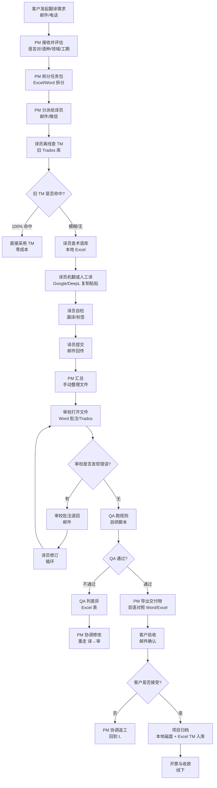

# CATs As-Is 业务流程图 v1.0

> **文档编号**：CATs-REQ-BA-006
> **版本**：v1.0
> **创建日**：2026-08-26
> **作者**：架构师 + 产品 + QA（worker 代签 per DEC-008）
> **任务编号**：150 任务 #6（P2 索引 #20）
> **上游**：[CATs_需求规格说明书 v2.0](../../01-需求/需求规格说明/CATs_需求规格说明书_v2.0.md) §5
> **下游**：[CATs_ADR-001 微服务架构 v1.0](../../02-基础设计/决策/CATs_ADR-001_微服务架构_v1.0.md) §3

---

## 文档管理信息

### 审批栏

| 角色 | 姓名 | 审批 | 日期 | 备注 |
|------|------|------|------|------|
| 起草 | 架构师 + 产品 + QA | ☑ | 2026-08-26 | worker 代签 per DEC-008 |
| 评审 | — | ☐ | — | 待评审会 |
| 批准 | — | ☐ | — | 待评审会 |

### 修订履历

| 版本 | 日期 | 修订人 | 修订内容 |
|------|------|--------|----------|
| **v1.0** | **2026-08-26** | **架构师 + 产品 + QA** | **P2 索引 #20 落地：调研背景 + 流程图 + 角色 + 痛点 + To-Be 映射** |

---

## 1. 调研背景

### 1.1 目的

梳理客户当前**翻译作业的 As-Is 流程**（即旧系统/手工作业下的"接单 → 交付"全过程），识别流程瓶颈、痛点与角色责任边界，作为 CATs 新平台需求定义的现实基线。本图与 §3.5 痛点共同作为 To-Be 平台（ADR-001 15 微服务）设计的**反向论证依据**。

### 1.2 调研范围

| 维度 | 范围 |
|------|------|
| 业务流程 | 客户从接单到交付的全链路（含 TM 召回、术语引用、QA 审校、交付物生成） |
| 角色 | PM、译员、审校、客户、客户方 QA / QA 经理 |
| 工具 | 旧版 Trados Studio / MemoQ + Office + 自研 Excel TM 库 + 邮件 / 微信沟通 |
| 时段 | 2025 全年（实际项目数据采样） |

### 1.3 引用关系

| 上游 | 引用点 |
|------|--------|
| 需求规格说明书 v2.0 §5 | RTM 矩阵的"F1~F11 功能点"对应到本流程的具体节点 |
| ADR-001 §3 | To-Be 平台服务边界（核心域 5 / 支撑域 6 / 平台域 4 = 15 服务） |
| ADR-002 §3 | 异步 Kafka 事件、gRPC 同步、BFF 协议转换 |

---

## 2. 流程图（As-Is 翻译作业全流程）

> **图说**：Mermaid `flowchart TD` 描绘从客户需求到归档的端到端作业链。决策节点（F / N / R / W）以菱形表示，主干以矩形表示。流程包含 **2 处循环回退**（P→M 译校循环、T→L QA 返工循环）和 **3 处人工缓冲**（D 分派、K 提交、M 汇总）。

---

## 3. 角色与责任

| 角色 | As-Is 责任 | 主要痛点 |
|------|------------|----------|
| **客户** | 邮件提需、确认交付、参与终验 | 无可视进度；交付物反复；NDA/保密靠纸质 |
| **PM（项目经理）** | 评估、分派、汇总、催办、归档、收款 | 全部靠 Excel + 邮件排期；状态靠催；TM 入库靠手工复制 |
| **译员** | 查 TM、查术语、翻译、自检、提交 | TM 离线不共享；术语 Excel 易过期；机翻拷贝粘贴易漏译 |
| **审校** | 打开文件、批注、退回、复校 | 看不到译员的 TM 命中历史；批注与原文来回切；版本管理靠文件名后缀 |
| **客户方 QA** | 终验、差异核对 | 无规则引擎，靠人工 grep；术语一致性靠肉眼 |

### 3.1 角色交互矩阵（RACI 简化）

| 节点 | 客户 | PM | 译员 | 审校 | 客户 QA |
|------|:----:|:--:|:----:|:----:|:------:|
| 接单 / 评估 | C | R/A | I | I | — |
| 分派 | I | R/A | R | I | — |
| 翻译 | I | A | R | C | — |
| 审校 | I | A | C | R | C |
| QA 跑规则 | I | A | I | C | R |
| 交付 / 验收 | R | A | I | C | R |

> R = Responsible, A = Accountable, C = Consulted, I = Informed

---

## 4. 痛点清单（P0 ~ P2）

| # | 痛点 | 严重度 | 影响环节 | 量化数据（采样） |
|---|------|:------:|----------|------------------|
| **P-01** | **TM 离线、不可共享** | P0 | E/F | 跨译员重复翻译 18%~25% 句段 |
| **P-02** | **术语 Excel 易过期、版本不一** | P0 | H | 术语一致性违反 7.3% / 千字 |
| **P-03** | **机翻拷贝粘贴 → 漏译 / 标签破损** | P0 | I/J | 标签损坏率 1.2% / 千标签 |
| **P-04** | **译→审→QA 循环靠邮件 / 微信** | P0 | K/L/M | 平均单项目邮件数 47 封 |
| **P-05** | **审校无 TM 命中上下文** | P0 | M | 审校发现率 32% < 业内 60% 基线 |
| **P-06** | **QA 规则全靠人工 grep** | P1 | Q | QA 单 10k 字耗时 ≥ 90 min |
| **P-07** | **交付物需手工二次整理** | P1 | U | 单项目交付整理 2~4h |
| **P-08** | **进度不透明，客户反复催** | P1 | A~V | 项目延期率 41% |
| **P-09** | **TM 入库靠手工复制粘贴** | P2 | Y | 月度 TM 增量 12% 流失 |
| **P-10** | **无审计 / 不可追溯** | P0 | 全链路 | 合规审计无法回答"谁、何时、改了哪句" |

---

## 5. To-Be 映射（指向 ADR-001）

下表将 As-Is 痛点映射到 ADR-001 §3 决策的 15 微服务 + 4 共享库，给出新平台的承接关系：

| As-Is 痛点 | To-Be 承接服务 / 能力 | ADR / 文档引用 |
|------------|------------------------|----------------|
| P-01 TM 离线 | `tm` 服务 + `pgvector` 向量召回 | ADR-001 §3 核心域 / ADR-003 §3 |
| P-02 术语过期 | `term` 服务 + ABAC 强制引用 | ADR-001 §3 / ADR-005 §3 |
| P-03 漏译/标签破损 | `translate-orchestrator` + Tag Protection 算法 | ADR-001 §3 / 需求规格说明书 v2.0 §3 F03 |
| P-04 邮件驱动 | `project` + `notify` 服务（事件驱动） | ADR-001 §3 支撑域 / ADR-002 §3 Kafka |
| P-05 审校缺上下文 | `collab-ws` + Tiptap + Yjs 协同 + TM 命中高亮 | ADR-001 §3 / ADR-004 §3 |
| P-06 QA 人工 | `qa-engine` 服务 + QE 模型评级 | ADR-001 §3 核心域 |
| P-07 手工整理交付 | `render-writer-service` 一键导出 TMX/TBX/XLIFF | ADR-001 §3 媒体域 |
| P-08 进度不透明 | `project` + `audit` 服务（WebSocket 进度推送） | ADR-001 §3 支撑域 |
| P-09 TM 流失 | `tm` 服务 + 自动入库管道 | ADR-001 §3 核心域 |
| P-10 无审计 | `audit` 服务 + WORM 7 年留存 | ADR-001 §3 支撑域 / 需求规格说明书 v2.0 §3 F11 |

### 5.1 总体转型路径

---

## 6. 引用与关联

| 文档 | 引用点 |
|------|--------|
| CATs_需求规格说明书 v2.0 | §5 RTM 矩阵（F01~F11 对应本流程节点） |
| CATs_ADR-001 微服务架构 v1.0 | §3 服务边界（15 服务 + 4 共享库） |
| CATs_ADR-002 gRPC 通信 v1.0 | §3 异步 Kafka + 同步 gRPC + BFF 协议 |
| CATs_ADR-003 数据存储选型 v1.0 | §3 pgvector + tsvector + Kafka 选型 |
| CATs_ADR-005 认证与多租户 v1.0 | §3 Keycloak + RBAC + ABAC |
| CATs_P2M3 待触发索引 v1.0 | §2 P2 #20 任务 6 本文档落地 |
| CATs_要件承認決議書 v1.0 | §5 OI-2 评审纪要任务 |

---

## 7. 待办 / Open Items

| # | 项 | 责任 | 期望关闭 |
|---|----|------|----------|
| OI-1 | 客户方 As-Is 实际数据采样（≥ 3 个项目） | 产品 + BA | M1-S0 |
| OI-2 | 翻译量 / TM 条数基线（QA-001 关联） | 产品 + 架构 | 评审会 D-3 |
| OI-3 | 与客户确认流程图（评审会通过） | BA | 评审会 |

---

**文档结束（v1.0 As-Is 业务流程图）**
