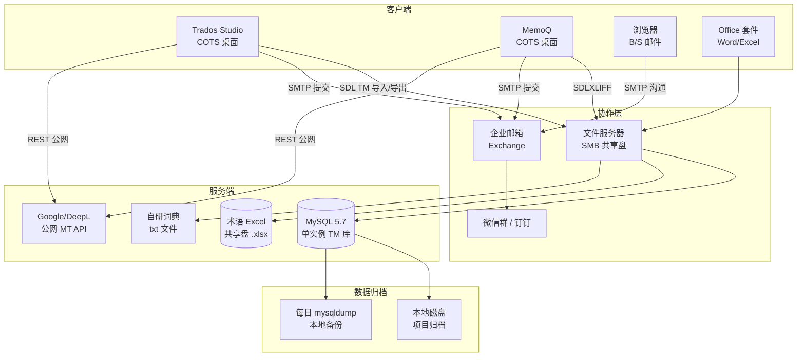
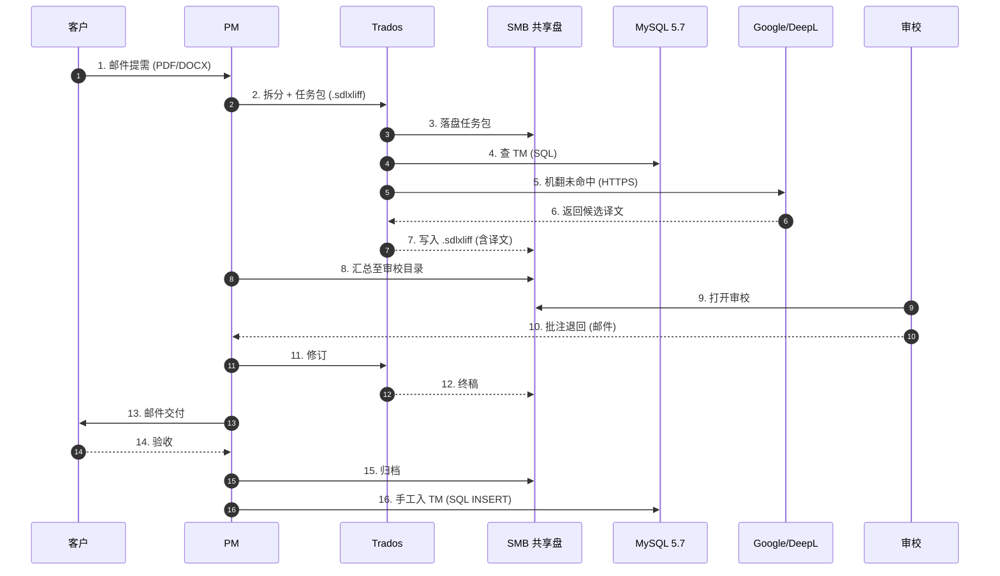

# CATs As-Is 系统构成图 v1.1

> **文档编号**：CATs-REQ-BA-007
> **版本**：v1.1
> **创建日**：2026-08-26
> **作者**：架构师 + Rust Lead + DBA（worker 代签 per DEC-008）
> **任务编号**：150 任务 #7（P2 索引 #21）
> **上游**：[CATs_微服务架构设计书 v1.0](../../02-基础设计/架构设计/CATs_微服务架构设计书_v1.0.md) §2/§3
> **下游**：[CATs_ADR-001 微服务架构 v1.0](../../02-基础设计/决策/CATs_ADR-001_微服务架构_v1.0.md) §3
> **基线引用**：[CATs_技术基线 v1.0](../../02-基础设计/技术选型/CATs_技术基线_v1.0.md) §1（**PostgreSQL 18.6 + pgvector 0.8.6**）

---

## 文档管理信息

### 审批栏

| 角色 | 姓名 | 审批 | 日期 | 备注 |
|------|------|------|------|------|
| 起草 | 架构师 + Rust Lead + DBA | ☑ | 2026-08-26 | worker 代签 per DEC-008 |
| 评审 | — | ☐ | — | 待评审会 |
| 批准 | — | ☐ | — | 待评审会 |

### 修订履历

| 版本 | 日期 | 修订人 | 修订内容 |
|------|------|--------|----------|
| v1.0 | 2026-08-26 | 架构师 + 产品 + QA | P2 索引 #21 落地：旧系统组件 + 接口 + 数据流 + To-Be 对比 |
| **v1.1** | **2026-08-26** | **架构师 + Rust Lead + DBA** | **基线升级：To-Be 对比表 + 映射表 PG 16 + pgvector → PG 18.6 + pgvector 0.8.6（引用 CATs_技术基线_v1.0 §1）** |

---

## 1. 调研背景

### 1.1 目的

刻画客户**旧版 CAT/翻译办公栈**的系统构成、组件关系、接口与数据流向，回答三个问题：

1. 旧系统由哪些组件构成？哪些是商用 COTS、哪些是自研、哪些是人工？
2. 组件之间靠什么协议 / 介质互通？
3. 哪些环节在 To-Be 平台（ADR-001 15 服务）上必须被替代、哪些可以集成？

### 1.2 范围

| 维度 | 范围 |
|------|------|
| 客户端 | 商用 CAT 工具（Trados Studio / MemoQ） + 浏览器 + Office 套件 |
| 服务端 | 单文件 TM 库（自研 MySQL 5.7）+ 术语 Excel 共享盘 + 邮件/微信 |
| 存储 | MySQL 单实例（无主从）、文件服务器（SMB）、本地 Excel |
| 网络 | 公网邮件 + 微信 + 偶尔 VPN |

### 1.3 与 To-Be 的关系

| 项 | As-Is（旧） | To-Be（新） | 依据 |
|----|------------|-------------|------|
| 客户端 | COTS 桌面 + 浏览器 | Tauri 2.x + Next.js 控制台 + WXT 扩展 | ADR-004 §3 |
| 服务架构 | 单体 / 文件共享 | 15 微服务 + 4 共享库 | ADR-001 §3 |
| 通信 | 邮件 + 文件传输 | gRPC + Kafka + BFF | ADR-002 §3 |
| 存储 | MySQL 5.7 单点 | PG 18.6 + pgvector 0.8.6 + Redis + Kafka + MinIO | ADR-003 §3 / [CATs_技术基线_v1.0 §1](../../02-基础设计/技术选型/CATs_技术基线_v1.0.md) |
| 多租户 | 1 租户 / 文件夹隔离 | Keycloak + schema 隔离 + namespace | ADR-005 §3 |

---

## 2. 系统架构图（旧系统组件）

> **图说**：Mermaid `graph TB` 描绘旧栈四层（客户端 / 协作层 / 服务端 / 数据归档）。核心特征：**单点 MySQL + 文件共享 + 公网邮件**。

### 2.1 组件清单

| # | 组件 | 类型 | 数量 | 部署位置 | 备注 |
|---|------|------|-----:|----------|------|
| C-01 | Trados Studio 2021 | COTS | 30 席位 | 译员 PC | SDL Trados，单机 TM |
| C-02 | MemoQ 9 | COTS | 8 席位 | 审校 PC | 备选 CAT 工具 |
| C-03 | Office 2019 | COTS | 全员 | PC | 文档整理 / 交付 |
| C-04 | Chrome / Edge | — | 全员 | PC | 邮件 / 微信沟通 |
| S-01 | MySQL 5.7 | 自研运维 | 1 实例 | 内网文件服务器 | TM 句段库 ~ 35 万条 |
| S-02 | 术语 Excel | 文件 | 1 份 | SMB 共享盘 | 5 个领域、版本靠文件名后缀 |
| S-03 | 自研词典 | 文件 | 1 份 | SMB | 通用词条，正则匹配 |
| S-04 | Google Translate | 公网 | — | 公网 | 译员手动复制粘贴 |
| S-05 | DeepL Pro | 公网 | 1 账号 | 公网 | 项目经理备用 |
| A-01 | 企业邮箱 | COTS | — | 集团总部 | Exchange 2016 |
| A-02 | 微信 / 钉钉 | COTS | — | 公网 | 即时沟通 |
| A-03 | SMB 共享盘 | 自研 | 1 | 内网 | 译员 / PM 共用 |
| D-01 | 本地磁盘归档 | — | 1 | 内网文件服务器 | 按月归档 |
| D-02 | mysqldump 备份 | — | 1 | 内网 | 每日 02:00 跑 |

---

## 3. 接口清单（旧系统 → To-Be 兼容）

| 接口号 | 旧接口 | 协议 | 旧用途 | To-Be 兼容策略 |
|--------|--------|------|--------|----------------|
| I-01 | TM SDLXLIFF 导入/导出 | 文件 (XML) | 译员间共享 TM | 新平台 `tm` 服务提供 SDLXLIFF 入/出 API；旧 TM 一次性导入 |
| I-02 | TMX 导出 | 文件 (XML) | 跨工具 TM 交换 | 新平台 `tm` 服务原生支持 TMX v1.4b（需求规格说明书 v2.0 §3 F10） |
| I-03 | TBX 导出 | 文件 (XML) | 跨工具术语交换 | 新平台 `term` 服务原生支持 TBX v3 |
| I-04 | XLIFF 1.2/2.0 | 文件 (XML) | 任务包标准 | 新平台原生支持，导入即开工 |
| I-05 | 邮件附件接收 | SMTP | PM 收需求 / 译员交稿 | 新平台 `notify` 服务逐步替代，但**保留 SMTP 入口**作为兜底 |
| I-06 | 文件服务器 SMB | SMBv2 | 文件交换 | 新平台用 MinIO S3 兼容 + presigned URL；旧 SMB 降为只读归档 |
| I-07 | 公网 MT API（Google/DeepL） | HTTPS REST | 机翻引用 | 新平台 `llm-gateway` 适配层保留 HTTP REST；fail-closed 走内网 |
| I-08 | MySQL 直连 ODBC | TCP 3306 | 旧报表导出 | 新平台不再暴露 MySQL 端口，统一走 `report` 服务 API |

---

## 4. 数据流（典型项目）

> **关键观察**：步骤 4、5、7、11、12、16 全部由人工 / 文件传输驱动；MySQL 5.7 是单点且无主从；机翻出口无合规拦截；无审计链。

---

## 5. To-Be 对比（指向 ADR-001 15 服务）

### 5.1 组件级映射

| 旧组件 | To-Be 替代/集成 | 服务编号 | ADR 引用 |
|--------|------------------|----------|----------|
| Trados Studio 桌面 | Tauri 2.x 客户端 + Chrome 扩展 | `gateway-bff` + `collab-ws` | ADR-004 §3 |
| MemoQ 桌面 | Tauri 客户端（多端共用） | 同上 | ADR-004 §3 |
| Office 套件 | `render-writer-service` 一键导出 | `render-writer` | ADR-001 §3 |
| MySQL 5.7 | PostgreSQL 18.6 + 多 schema 隔离 | `tm` / `term` / `project` / `auth` | ADR-001 §3 / ADR-003 §3 / [CATs_技术基线_v1.0 §1](../../02-基础设计/技术选型/CATs_技术基线_v1.0.md) |
| 术语 Excel | `term` 服务（CRUD + 版本） | `term` | ADR-001 §3 核心域 |
| SMB 共享盘 | MinIO S3 兼容 + presigned URL | `file` 域 | ADR-001 §3 支撑域 |
| 企业邮件 | `notify` 服务（站内信 + WS 推送） | `notify` | ADR-001 §3 支撑域 |
| 自研词典 txt | `tm` 服务 + pgvector 语义召回 | `tm` | ADR-001 §3 / ADR-003 §3 |
| Google/DeepL | `llm-gateway`（fail-closed 开关） | `llm-gateway` | ADR-001 §3 核心域 |
| 本地 mysqldump | CloudNativePG PITR + 异地备份 | 平台域 | ADR-001 §3 平台域 |
| 文件归档（手动） | `audit` 服务 + WORM 留存 | `audit` | ADR-001 §3 支撑域 |

### 5.2 关键能力差异

| 维度 | 旧（As-Is） | 新（To-Be） | 收益 |
|------|-------------|-------------|------|
| TM 命中率 | ~58% | 目标 ≥ 85%（向量 + 模糊） | 降本 25% |
| 术语一致性 | 7.3‰ 违反 | 目标 ≤ 1‰ | 提升质量 |
| 标签破损率 | 1.2‰ | 目标 ≤ 0.1‰ | 提质量 |
| 译→审循环 | 平均 2.4 轮 | 目标 1.3 轮 | 提速 40% |
| QA 跑规则 | 90 min/10k 字 | 目标 5 min/10k 字 | 提速 18× |
| 多租户 | 不支持 | 完整支持（ADR-005） | 商业化 |
| 审计 | 无 | WORM 7 年（ADR-001 §3 支撑域） | 合规 |

---

## 6. 引用与关联

| 文档 | 引用点 |
|------|--------|
| CATs_微服务架构设计书 v1.0 | §2 总体推荐架构、§3 完整技术栈、§4 微服务划分 |
| CATs_ADR-001 微服务架构 v1.0 | §3 服务边界、§4 影响 |
| CATs_ADR-002 gRPC 通信 v1.0 | §3 协议选型 |
| CATs_ADR-003 数据存储选型 v1.0 | §3 PG + pgvector + Kafka + MinIO |
| CATs_ADR-004 前端栈 v1.0 | §3 React + Tauri + WXT |
| CATs_ADR-005 认证与多租户 v1.0 | §3 Keycloak + schema 隔离 |
| CATs_需求规格说明书 v2.0 | §3 F10（导出格式兼容）、F11（审计） |
| CATs_AsIs 业务流程图 v1.0 | 痛点 §4 与本系统构成 §5 互为反向论证 |

---

## 7. 待办 / Open Items

| # | 项 | 责任 | 期望关闭 |
|---|----|------|----------|
| OI-1 | 客户 IT 调研（旧 MySQL 性能 / SMB 带宽 / 客户端版本分布） | 架构 + 运维 | 评审会 D-3 |
| OI-2 | 旧 TM 一次性导入评估（35 万条 SDLXLIFF → PG JSONB 容量估算） | 架构 + DBA | M1-S0 |
| OI-3 | 旧机翻 API 出口合规评估（公网调用是否触发 GDPR / 数据出境） | 合规 | 评审会 D-3 |

---

**文档结束（v1.0 As-Is 系统构成图）**
