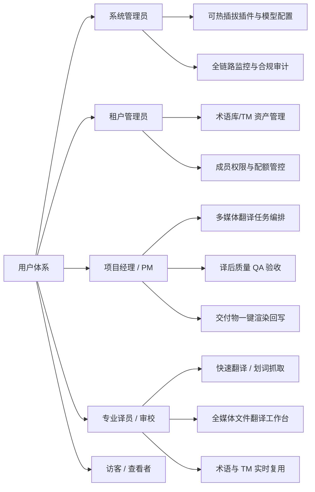

# CATs 需求规格说明书

**系统名称:** CATs — 全媒体 AI 辅助翻译 SaaS 平台

---

## 文档管理信息

| 项目 | 内容 |
|---|---|
| 文档编号 | CATs-REQ-002 |
| 文档名 | 需求规格说明书（全媒体 AI 辅助翻译 SaaS 平台版） |
| 版本 | 第 2.1 版 |
| 创建日 | 2026-08-26 |
| 作者 | 架构师 + Rust Lead + DBA（worker 代签 per DEC-008） |
| 状态 | 评审前草稿 |
| 密级 | 仅社内 |
| 上游文档 | [初版构想](../原始需求/20260625-初版构想-AI增强型CAT浏览器工作台.md)、[OFCAT 需求定义书 v1.1](./OFCAT_需求定义书_v1.1.md)（历史基线）、[CATs 命名变更说明](../../02-基础设计/架构设计/CATs_命名变更说明.md) |
| 下游文档 | [CATs 微服务架构设计书 v1.0](../../02-基础设计/架构设计/CATs_微服务架构设计书_v1.0.md)、[CATs 技术选型书 v2.0](../../02-基础设计/技术选型/CATs_技术选型书_v2.0.md)、[CATs 测试设计书 v1.0](../../04-测试/测试设计书/CATs_测试设计书_v1.0.md)、[CATs_技术基线 v1.0](../../02-基础设计/技术选型/CATs_技术基线_v1.0.md)（**§1 PostgreSQL 18.6 + pgvector 0.8.6**） |

### 修订履历

| 版本 | 日期 | 修订者 | 修订内容 |
|---|---|---|---|
| 1.0 | 2026-06-25 | 架构师 | （OFCAT）网页选区翻译单机 MVP 需求定义 |
| 2.0 | 2026-08-20 | 需求分析师 / 架构师 | 全面升级为 CATs 2.0 SaaS 平台需求规格：①新增多租户/RBAC与工作空间；②新增全媒体处理管线（ASR、OCR、PDF版面重建、Office、游戏本地化）；③新增AI多模型路由与合规Fail-closed开关；④完善端到端需求追溯矩阵（RTM） |
| **2.1** | **2026-08-26** | **架构师 + Rust Lead + DBA** | **基线升级：存储可靠性 PostgreSQL 引用统一为 PostgreSQL 18.6（引用 CATs_技术基线_v1.0 §1）** |

### 审批栏

| 角色 | 姓名 | 审批日 | 签字 |
|---|---|---|---|
| 起草 | 架构师 + Rust Lead + DBA | 2026-08-26 |  |
| 评审 | 架构师 / 测试负责人 |  |  |
| 批准 | 研发负责人 / 产品总监 |  |  |

---

## 1. 前言

### 1.1 目的
本文档正式定义 **CATs（Computer-Assisted Translation SaaS）全媒体 AI 辅助翻译 SaaS 平台** 的业务需求、功能规格卡片（F01~F12）与非功能需求，作为基础设计（`02-基础设计/`）、详细设计（`03-详细设计/`）和测试设计（`04-测试/`）的唯一权威需求输入源。

### 1.2 适用范围
本文档覆盖 CATs 平台的完整生命周期，包括：
- **客户端工作台**：Tauri 桌面端极简翻译交互与离线队列。
- **管理控制台**：Next.js Web 端多租户管理、项目编排、术语/TM 维护与审计。
- **服务端核心**：微服务架构下的全媒体解析流水线、确定性 TM/术语匹配引擎、AI 模型协同路由与质量保障体系。

### 1.3 术语定义

| 术语 | 英文/缩写 | 定义 |
|---|---|---|
| **CATs** | Computer-Assisted Translation SaaS | 全媒体 AI 辅助翻译企业级 SaaS 平台。 |
| **TM** | Translation Memory | 翻译记忆库，存储已确认的句段对（Source-Target）。 |
| **TB** | Termbase | 术语库，规定特定领域的权威术语对及翻译约束规则。 |
| **ASR** | Automatic Speech Recognition | 语音转文本技术，用于音视频原语自动分句提取。 |
| **OCR** | Optical Character Recognition | 光学字符识别与版面结构还原技术。 |
| **Tag Protection** | 标签与占位符保护 | 保证 XML/HTML 标签、`{placeholder}` 等变量在 AI 翻译后结构不损坏的算法机制。 |
| **Fail-Closed** | 合规阻断 | 敏感数据路由失败时直接拒绝上云，杜绝降级泄密风险。 |

---

## 2. 系统角色与用例全景

---

## 3. 功能需求规格清单

### F01: 多租户与工作空间管理 (Tenant & Workspace Management)
- **规格描述**：支持企业级多租户逻辑隔离，每个租户下可创建多个独立的项目工作空间（Workspace）。
- **主要能力**：
  1. 支持租户级独立配置模型密钥、专属 TM/术语库、安全合规策略与计费配额。
  2. 提供基于 RBAC 的细粒度权限控制（租户管理员、项目主管、资深审校、初级译员、只读审计员）。
  3. 租户间数据通过 `tenant_id` 严格隔离，API 网关自动校验 JWT Claims 中的租户上下文。

### F02: 极简客户端与通用输入采集 (Client & Universal Ingestion)
- **规格描述**：提供基于 Tauri 2.x 的跨平台原生客户端工作台，实现全局极简采集交互。
- **主要能力**：
  1. **快捷捕获**：支持全局快捷键划词提取、区域截图 OCR 提取、剪贴板监控解析。
  2. **批量导入**：支持拖拽上传音视频（MP4/MKV/MP3/WAV）、文档（PDF/DOCX/XLSX/PPTX/ODF）及游戏工程资源包。
  3. **离线与弱网支持**：客户端集成 SQLite 离线缓存，支持离线 TM 匹配，网络恢复后自动双向同步。

### F03: 确定性 TM 与术语优先匹配 (Deterministic TM & Termbase Engine)
- **规格描述**：在调用 AI 翻译前，执行严格的确定性算法过滤，减少模型开销并保证专业一致性。
- **主要能力**：
  1. **100% 精确匹配**：完全一致句段直接命中 TM，零 Token 消耗、即时返回。
  2. **模糊与向量混合匹配**：采用 RapidFuzz 编辑距离与 pgvector 语义向量混合检索（阈值可配置，如 >= 75%）。
  3. **术语强制注入与锁定**：高亮显示命中的权威术语，并将其构造成强约束 Prompt 规则输入大模型。

### F04: AI 多模型协同与合规网关 (AI Model Gateway & Compliance Switch)
- **规格描述**：统一接入国内外主流大语言模型（GPT-4o、Claude 3.5 Sonnet、Gemini 1.5 Pro、DeepSeek 等）及私有化本地部署模型（vLLM / Ollama）。
- **主要能力**：
  1. **多模型盲测与评审取优**：支持多模型并行生成候选译文，由评测模块或专家评分择优。
  2. **数据合规 Fail-Closed 机制**：针对标记为敏感项目的任务，强制将流量路由至内网私有模型；若内网模型不可用，直接返回错误并阻断上云。
  3. **统一限流与重试熔断**：网关层实现 Token 桶速率控制与自动化故障转移。

### F05: 音视频 ASR 与时间轴字幕流水线 (Audio/Video Pipeline)
- **规格描述**：针对多媒体音视频资产提供端到端的听翻、时间轴对齐与双语字幕生成。
- **主要能力**：
  1. 自动化音频分离与降噪，调用 Whisper 模型实现原语高精度时间轴转写。
  2. 自动断句与字幕分段算法，保证目标语言每行字数与单屏驻留时长符合广播级字幕规范。
  3. 支持导出 SRT、VTT、ASS 格式字幕，并支持将译文字幕硬烧录回原视频。

### F06: 复杂 PDF 版面保留与 OCR 引擎 (PDF & Layout Preservation)
- **规格描述**：支持学术论文、产品手册等版面复杂 PDF 的双语排版对照与原样导出。
- **主要能力**：
  1. **文字层提取**：对可编辑矢量 PDF 提取文本块坐标、字体大小与阅读顺序。
  2. **扫描件 OCR**：针对扫描版 PDF，调用 OCR 引擎识别图文边界、表格与栏目布局。
  3. **版面镜像重构**：译后按原文几何坐标与字体缩放系数重新生成双语对照或目标语言 PDF。

### F07: 办公文档全格式转换与写回 (Office Document Processing)
- **规格描述**：无损支持 Word (docx)、Excel (xlsx)、PowerPoint (pptx) 及 OpenDocument (ODF) 格式。
- **主要能力**：
  1. 针对 XML 树形结构提取可翻译节点，完整保留段落样式、超链接、公式与嵌入图表。
  2. 翻译完成后，采用高性能 Rust 渲染引擎无损回写原容器，确保文件可被原生 Office 软件正常开启。

### F08: 游戏本地化多引擎深度适配 (Game Localization Adapter)
- **规格描述**：无缝对接游戏行业主流引擎（Unity、Unreal Engine、Godot）的本地化工作流。
- **主要能力**：
  1. **资产抽取**：支持 Unity `.asset` / `.meta`、Unreal `.locres` / `.archive`、Godot `.po` / `.tres` 字符串表批量抽取。
  2. **变量与代码保护**：自动识别并保护 `{0}`、`%s`、富文本颜色代码 `<color=#FF0000>`。
  3. **UI 溢出预检**：结合字体度量（Font Metrics）在翻译阶段预判目标语言文本在游戏 UI 控件中的截断风险。

### F09: 智能质量校验体系 (Automated QA Checks)
- **规格描述**：在提交或导出前对译文进行全方位的规则化与模型化质检。
- **主要能力**：
  1. **规则质检**：漏译、数字不一致、标点错漏、大小写规范、术语未遵循检测。
  2. **标签与占位符完整性校验**：严格确保成对标签闭合且变量名未被恶意翻译。
  3. **质量评分**：基于 QE（Quality Estimation）模型对句段进行置信度评级（A/B/C/D）。

### F10: 交付物渲染与导出 (Export & Delivery)
- **规格描述**：支持将翻译完成的数据以标准行业格式或双语交付包格式导出。
- **主要能力**：
  1. 支持导出 TMX（翻译记忆交换标准）、TBX（术语库交换标准）、XLIFF 1.2/2.0 标准包。
  2. 支持一键导出双语对照文档（HTML/Word/PDF/Excel 对照视图）。

### F11: 配额控制、审计与运维管理 (Quota & Ops Management)
- **规格描述**：为系统运维人员与租户管理员提供透明的可视化运维和计量审计能力。
- **主要能力**：
  1. **用量计量**：按租户/用户精准统计 API 调用量、Token 消耗与 ASR/OCR 媒体处理分钟数。
  2. **合规审计日志**：记录所有用户登录、数据导出、敏感翻译操作的不可篡改审计追踪链。
  3. **热插拔与特性开关**：支持在管理员控制台动态启停微服务插件与灰度功能（Feature Flag）。

---

## 4. 非功能需求 (Non-Functional Requirements)

### 4.1 性能与延迟 SLO

| 指标项 | 目标基线 | 约束条件 |
|---|---|---|
| TM 100% 精确匹配响应时间 | <= 100 ms (P99) | 局域网内单服务调用 |
| 文本段向量检索 (pgvector) | <= 50 ms (P95) | 100 万句段规模 |
| ASR 语音转写处理比 | <= 0.3x 音频时长 | 标准服务器 GPU 加速模式 |
| Web 控制台首屏渲染 (LCP) | <= 1.2 s | 内网 1Gbps 环境 |
| 任务并发支撑规模 | 50 ~ 3000 并发用户 | K3s 弹性微服务集群 |

### 4.2 高可用与容灾
- **服务冗余**：K3s 控制面 3 节点 HA，核心业务微服务多副本部署并配置反亲和性（Anti-affinity）。
- **存储可靠性**：PostgreSQL 18.6（见 [CATs_技术基线_v1.0 §1](../../02-基础设计/技术选型/CATs_技术基线_v1.0.md)）采用 CloudNativePG 1.30+ 管理 1 主 2 从集群，RPO = 0，RTO <= 30 s。
- **事件可靠性**：Kafka 集群启用 Min In-Sync Replicas（`min.insync.replicas=2`），消息零丢失。

### 4.3 安全与离线局域网合规
- **完全离线私有化**：全部容器镜像、模型权重、静态前端资源可完全在无互联网连接的隔离局域网中部署运行。
- **通信加密**：局域网内部署内部根 CA，所有客户端接入强制走 HTTPS / gRPC with mTLS。
- **密钥安全**：外部大模型 API Key 在数据库中必须使用 AES-256-GCM 加密存储，仅在 Gateway 内存中解密。

---

## 5. 需求追溯矩阵 (RTM)

本矩阵将功能需求（F01~F11）映射到架构设计、详细设计及 JIS X 0129 测试级别：

| 需求编号 | 需求名称 | 承接微服务 / 模块 | 数据库表 / 逻辑库 | 测试设计对应项 (CATs-TST-001) |
|---|---|---|---|---|
| **F01** | 多租户与工作空间 | `auth-service`, `user-service` | `auth_db`, `user_db` | TS-01 (租户与安全测试) |
| **F02** | 极简客户端与采集 | `Tauri 客户端`, `ingestion-service` | `file_db`, SQLite 本地库 | TS-02 (客户端交互与离线测试) |
| **F03** | 确定性 TM 与术语 | `translation-core`, `project-service` | `project_db` (`tm_entries`, `terms`) | TS-03 (TM/术语匹配算法测试) |
| **F04** | AI 多模型协同与网关 | `translation-core`, `AI Gateway` | `project_db` (`model_configs`) | TS-04 (模型路由与合规阻断测试) |
| **F05** | 音视频 ASR 与字幕 | `asr-service`, `subtitle-service` | `task_db` (`task_media_items`) | TS-05 (音视频管线集成测试) |
| **F06** | PDF 版面保留与 OCR | `ocr-service`, `render-writer-service` | `task_db`, `file_db` | TS-06 (PDF版面与OCR测试) |
| **F07** | Office 转换与回写 | `office-converter-service`, `render-writer-service` | `file_db`, `task_db` | TS-07 (Office文档格式保真测试) |
| **F08** | 游戏本地化引擎适配 | `game-localization-service` | `task_db` (`game_assets`) | TS-08 (Unity/Unreal适配测试) |
| **F09** | 智能质量校验 QA | `translation-core` (QA 模块) | `task_db` (`qa_violations`) | TS-09 (质量检查规则测试) |
| **F10** | 交付物渲染与导出 | `render-writer-service`, `file-service` | `file_db` | TS-10 (标准包导出与交付测试) |
| **F11** | 配额、审计与运维 | `report-service`, `audit-service`, `admin-console` | `report_db`, `audit_db` | TS-11 (计量审计与运维测试) |
