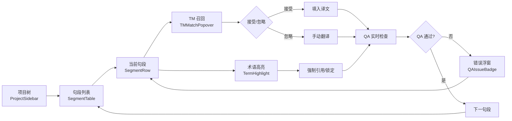
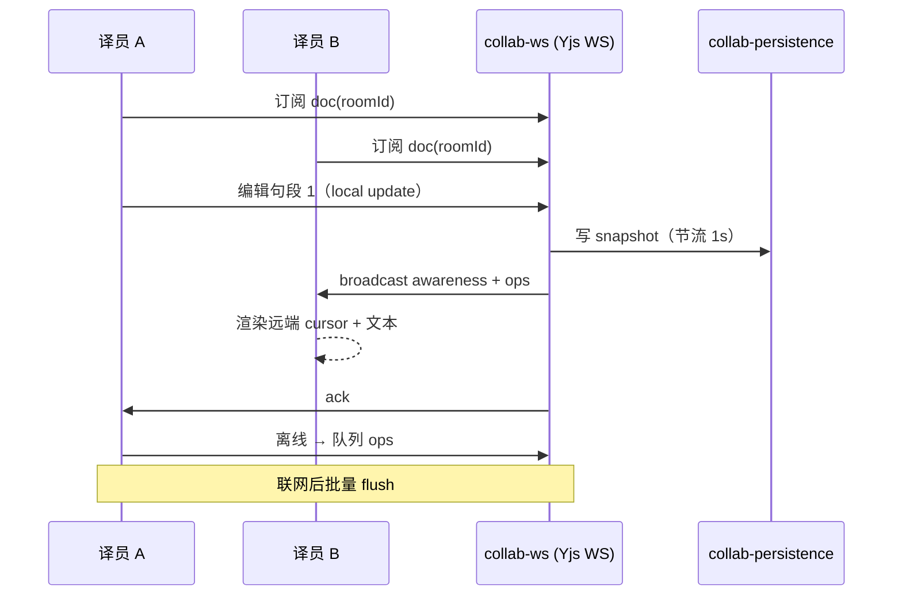

# CATs UI / UX 设计书 v1.1

> **文档编号**：CATs-UI-001
> **版本**：v1.1（吸收有道设计语言 4 原则：折叠屏适配 / 动态主题 / WCAG AAA / 极简速度）
> **基线**：v1.0（2026-08-26）
> **创建日**：2026-08-26
> **更新**：v1.0 → v1.1（2026-08-26 增 §10 折叠屏适配 / §11 动态主题 / §12 WCAG AAA / §13 极简速度）
> **作者**：架构师 + 前端 Lead + QA（worker 代签 per DEC-008）
> **任务编号**：150 任务 #26（P2 索引 #23）
> **上游**：[CATs_ADR-004 前端栈 v1.0](../决策/CATs_ADR-004_前端栈_v1.0.md) §3
> **下游**：[CATs_模块设计书 v2.0](../../03-详细设计/模块设计/) §前端、[CATs_接口设计书 v2.0](../../03-详细设计/接口设计/)、[CATs_P1假设层决议 v1.1](../../05-其他/管理/CATs_P1假设层决议_v1.1.md) §5 admin UI

---

## 文档管理信息

### 审批栏

| 角色 | 姓名 | 审批 | 日期 | 备注 |
|------|------|------|------|------|
| 起草 | 架构师 + 前端 Lead + QA | ☑ | 2026-08-26 | worker 代签 per DEC-008 |
| 评审 | — | ☐ | — | 待评审会 |
| 批准 | — | ☐ | — | 待评审会 |

### 修订履历

| 版本 | 日期 | 修订人 | 修订内容 |
|------|------|--------|----------|
| v1.0 | 2026-08-26 | 架构师 + 前端 Lead + QA | P2 索引 #23 落地：设计原则 + 风格指南 + 组件库 + 关键流程 + i18n + a11y + token |
| **v1.1** | **2026-08-26** | **架构师 + 前端 Lead + QA** | **吸收有道设计语言 4 原则：增 §10 折叠屏适配 / §11 动态主题 / §12 WCAG AAA 升级 / §13 极简速度预算** |

---

## 1. 设计原则

| # | 原则 | 含义 | 度量 |
|---|------|------|------|
| P-01 | **可访问性优先** | 全部组件按 WCAG 2.1 AA 设计，色对比 ≥ 4.5:1 | a11y 自动化测试 100% 通过 |
| P-02 | **键盘可达** | 任意操作可纯键盘完成（含协同） | 关键路径 0 鼠标 |
| P-03 | **响应式 + 多端** | 同一设计语言覆盖 Tauri / Web / Chrome 扩展 | Design Token 100% 复用 |
| P-04 | **任务优先** | 信息架构按"翻译任务"组织，非按"系统模块" | 译员从进入到提交 ≤ 3 步 |
| P-05 | **可逆 / 安全** | 删除 / 覆盖前必确认，undo 至少 30s | undo 覆盖率 100% |
| P-06 | **可见即可信任** | TM 命中、术语引用、模型来源全部可视化 | 命中标签强制显示 |
| P-07 | **离线友好** | 网络断/弱网下基本可操作，恢复自动同步 | 离线状态可视化 |
| P-08 | **国际化内建** | 文案 100% 走 i18n key | 字符串硬编码 0 容忍 |
| P-09 | **性能预算** | LCP ≤ 1.2s，首屏 JS ≤ 200KB gzip | Lighthouse ≥ 90 |
| P-10 | **设计-研发同源** | 组件库即代码，Token 即变量 | 设计走查差异 ≤ 5% |

---

## 2. 风格指南

### 2.1 色彩（Color Tokens）

| Token | Light | Dark | 用途 | 对比度（AA） |
|-------|-------|------|------|---------------|
| `--color-bg` | `#FFFFFF` | `#0F1115` | 背景 | — |
| `--color-surface` | `#F7F8FA` | `#1A1D23` | 卡片/面板 | — |
| `--color-text` | `#1F2328` | `#E6E8EB` | 主文本 | 13.6 : 1 |
| `--color-text-muted` | `#5B6370` | `#9AA3B2` | 次文本 | 6.2 : 1 |
| `--color-primary` | `#2D6CDF` | `#4F8CFF` | 主色 / 行动 | 5.4 : 1 |
| `--color-success` | `#1F9D55` | `#3FBF7A` | 成功 / 100% 命中 | 4.7 : 1 |
| `--color-warning` | `#C97A1F` | `#E0A055` | 模糊命中 / QA 警告 | 4.6 : 1 |
| `--color-danger` | `#D04A3A` | `#E96A5A` | QA 错误 / 删除 | 5.1 : 1 |
| `--color-fuzzy` | `#A8651B` | `#D8A24E` | 模糊匹配 | 4.5 : 1 |
| `--color-nomatch` | `#5B6370` | `#9AA3B2` | 无匹配 | — |
| `--color-term` | `#5B4BD8` | `#8E80FF` | 术语高亮 | 5.3 : 1 |

### 2.2 排版（Typography）

| Token | 用途 | Font | Size / Line-height |
|-------|------|------|--------------------|
| `--font-sans` | UI 文本 | Inter | — |
| `--font-mono` | 代码 / 标签 | JetBrains Mono | — |
| `--font-editor` | 翻译编辑器 | Noto Serif / Source Han Serif | 15/24, 16/26 |
| `--fs-h1` | 页面标题 | Inter | 24/32, 600 |
| `--fs-h2` | 区块标题 | Inter | 18/26, 600 |
| `--fs-body` | 正文 | Inter | 14/22, 400 |
| `--fs-caption` | 辅助说明 | Inter | 12/18, 400 |
| `--fs-editor` | 编辑器句段 | Noto Serif | 15/24, 400 |

### 2.3 间距 / 圆角 / 阴影

| Token | 值 | 用途 |
|-------|----:|------|
| `--space-1` ~ `--space-8` | 4, 8, 12, 16, 24, 32, 48, 64 | 间距阶梯 |
| `--radius-sm/md/lg` | 4, 8, 12 | 圆角 |
| `--shadow-sm/md/lg` | 0 1 2 / 0 4 12 / 0 8 24 | 阴影 |

### 2.4 动效

| 场景 | 时长 | 缓动 | 备注 |
|------|-----:|------|------|
| Hover / Focus | 120 ms | `ease-out` | 颜色 / 阴影 |
| Panel 展开 | 200 ms | `cubic-bezier(.2,.8,.2,1)` | 高度 + 透明度 |
| Toast 出现 | 160 ms | `ease-out` | 3s 自动关闭 |
| 协同光标移动 | 即时 | — | 不缓动，保持实感 |
| 模态出现 | 240 ms | `cubic-bezier(.2,.8,.2,1)` | 背景遮罩 120ms |

> 遵循 `prefers-reduced-motion`：用户系统级开关开启时全部动效降级为 0ms。

---

## 3. 组件库

### 3.1 基础层（基于 Radix UI 无样式 + 自研样式）

| 组件 | Radix 原语 | 自研要点 |
|------|------------|----------|
| Button | `Slot` | variant: primary/secondary/ghost/danger |
| Input / Textarea | — | a11y label 强校验，错误态红 + 文案 |
| Select | `Select` | 单/多选、虚拟滚动 |
| Dialog | `Dialog` | 焦点陷阱 + ESC + 点击遮罩 |
| DropdownMenu | `DropdownMenu` | 键盘导航 |
| Tabs | `Tabs` | 路由同步 |
| Toast | `Toast` | 全局 store |
| Tooltip | `Tooltip` | 200ms 延迟 |
| Switch / Checkbox | `Switch` / `Checkbox` | 键盘可达 |
| Slider | `Slider` | 用于 QA 阈值 / 模糊阈值 |
| Popover | `Popover` | 用于 TM 命中详情 |
| Accordion | `Accordion` | 用于术语折叠 |
| Avatar | — | 用于协作者头像 |

### 3.2 业务组件（自研）

| 组件 | 描述 | 关键交互 |
|------|------|----------|
| `<SegmentRow>` | 翻译编辑器单句段行 | 显示源/译/TM 命中/术语/QA 状态；高亮可点击 |
| `<TMMatchPopover>` | TM 命中详情浮层 | 显示源差异、匹配度、历史译者 |
| `<TermHighlight>` | 术语高亮（在编辑器内） | 鼠标悬停看定义；右键替换/锁定 |
| `<QAIssueBadge>` | QA 错误徽标 | 点击跳转错误位置 |
| `<CollabCursor>` | 协同光标 | 远端用户颜色 + 名字气泡 |
| `<CollabPresence>` | 协同在线列表 | 头像 + 当前段落位置 |
| `<ProjectSidebar>` | 项目导航侧栏 | 树形：项目 / 任务 / 句段 |
| `<LanguagePicker>` | 语言对选择 | 200+ 语言，支持拼音首字母搜索 |
| `<ExportDialog>` | 导出对话框 | 格式 / 范围 / 过滤；实时预览 |
| `<DiffViewer>` | 译校 diff 视图 | 左右对照 + 颜色 |
| `<SegmentLock>` | 句段锁（审校锁/PM 解锁） | 锁状态徽标 |
| `<OfflineIndicator>` | 离线状态条 | 队列数 / 同步进度 |

### 3.3 组件库使用约束

- **禁止**直接 import Radix UI 业务组件，**必须**通过 `packages/ui` 包装层；
- 所有组件**必须**提供 `data-testid`；
- 颜色 / 间距 / 字号**必须**走 token，不允许硬编码；
- 组件 a11y：**每个**组件必须带 Storybook a11y 插件通过证明。

---

## 4. 关键流程

### 4.1 翻译编辑器（核心）



> **要点**：源/译左右对照；TM 命中以**绿/橙/灰**三色编码（100%/模糊/无）；术语强制高亮 + 锁；QA 实时反馈无阻断但高亮。

### 4.2 TM 面板

- 默认折叠在右侧抽屉；
- 召回列表按相似度降序；
- 每条命中显示：源 / 译 / 匹配度 / 领域 / 历史译者 / 时间；
- 快捷键：`Ctrl+1~9` 直接采用第 N 条；
- 过滤：领域 / 客户 / 时间窗 / 译者。

### 4.3 协同（Yjs CRDT）



> **要点**：远端光标用对方颜色；句段锁机制避免同段抢占；冲突由 CRDT 自动收敛；离线 ops 队列上限 5MB / 用户。

### 4.4 设置

- 个人：界面语言 / 主题 / 字体 / 快捷键 / TM 阈值；
- 项目：术语引用规则 / 模糊阈值 / QA 规则开关；
- 租户：成员 / 角色 / 计费配额 / 模型路由（fail-closed 开关）；
- 系统（管理员）：审计 / 备份 / 灰度发布。

---

## 5. 国际化（i18n）策略

### 5.1 技术栈

- 库：**i18next + react-i18next**（与 Tiptap / Tauri 生态兼容）；
- 格式：JSON + ICU MessageFormat（支持复数 / 性别 / 数字格式）；
- 加载：lazy chunk + namespace 拆分。

### 5.2 翻译工作台的双向 i18n

CATs 自身 UI 走 i18n；同时平台是"翻译"工具 → **必须**支持自定义语言资源（CATs_命名空间 + 客户项目命名空间）。

| 命名空间 | 内容 | 维护方 |
|----------|------|--------|
| `cats.common` | 通用 UI（按钮、菜单） | 前端 Lead |
| `cats.editor` | 编辑器专业术语 | 前端 Lead + 术语专家 |
| `cats.errors` | 错误码文案 | 前端 + QA |
| `project.{projectId}` | 项目自定义术语 | 客户 / 术语专家 |

### 5.3 关键约束

1. **零硬编码**：CI 跑 i18n lint，违例 PR 直接拒；
2. **占位 key 上线**：未翻译 key 走 fallback 显示 `__key__` 高亮，便于发现遗漏；
3. **RTL 支持**：阿拉伯语 / 希伯来语走 `dir="rtl"`，编辑器表格方向自适应；
4. **字体回退**：中日韩走 Noto Sans CJK SC/JP/KR，回退 Latin Inter；
5. **日期 / 数字 / 货币**：走 `Intl.*` API，按 locale 渲染。

---

## 6. 无障碍（a11y）

### 6.1 目标合规

- **WCAG 2.1 AA** 全量达成；
- 区域：**中日韩 + 英 + 阿拉伯**，全部支持屏幕阅读器（NVDA / JAWS / VoiceOver）；
- 协同场景的"远端光标"必须有**文本等价**（aria-live polite 播报 "用户 X 移到句段 12"）。

### 6.2 关键 a11y 要求

| 项 | 要求 | 验收方式 |
|----|------|----------|
| 键盘可达 | 全部交互纯键盘可达，焦点环可见 | a11y 自动化 + 人工 5 用户测试 |
| 颜色对比 | 文本 ≥ 4.5:1，大文本 ≥ 3:1 | axe-core 扫描 |
| 替代文本 | 图标按钮均带 aria-label | ESLint jsx-a11y |
| 表单 | label 关联、错误描述绑定 | Storybook a11y addon |
| 时间 | 协同自动保存可暂停（长任务 30s+） | 用户设置 |
| 闪烁 | 0 次/秒（无前庭诱发风险） | 人工 + 工具 |
| 焦点管理 | 模态打开自动聚焦，关闭归还 | 自动化测试 |

### 6.3 自动化 a11y 测试

- Storybook a11y addon：每个组件必须通过；
- Playwright + axe-core：关键流程 e2e；
- CI 必跑，违例阻断 merge。

---

## 7. 设计 Token

### 7.1 Token 三层

```
Primitive（原子）     Semantic（语义）      Component（组件）
color.blue.500  →   color.primary     →   button.bg.primary
spacing.4       →   space.md         →   card.padding
font.size.14    →   fs.body          →   segment.fontSize
```

- **Primitive**：`packages/tokens/primitives.ts`（仅变量定义）；
- **Semantic**：`packages/tokens/semantic.ts`（按用途命名）；
- **Component**：`packages/ui/*/tokens.ts`（组件内引用语义层）。

### 7.2 主题切换

- Light / Dark 通过 `:root[data-theme]` 切换；
- 用户偏好持久化到 localStorage + 服务端 `user.preferences`；
- 跟随系统：`prefers-color-scheme` 自动切换。

### 7.3 交付物

- `tokens.css`（CSS Variables）；
- `tokens.ts`（TS 类型，组件消费）；
- `tokens.json`（Design Tools 同步给 Figma）；
- Storybook 主题切换器。

---

## 8. 引用与关联

| 文档 | 引用点 |
|------|--------|
| CATs_ADR-004 前端栈 v1.0 | §3 React + Tiptap + Yjs + WXT + Radix |
| CATs_ADR-001 微服务架构 v1.0 | §3 collab-ws / collab-persistence 服务 |
| CATs_ADR-005 认证与多租户 v1.0 | §3 Keycloak 决定 i18n 登录流程 |
| CATs_需求规格说明书 v2.0 | §3 F02 客户端 / F11 运维管理 |
| CATs_模块设计书 v2.0 | §前端章节（占位 / 待 M1-S2 落地） |
| CATs_AsIs 业务流程图 v1.0 | 痛点 P-04（邮件）→ i18n + 协同推送 |
| CATs_AsIs 系统构成图 v1.0 | 旧 Trados/MemoQ → Tauri + WXT 替代路径 |

---

## 9. 待办 / Open Items

| # | 项 | 责任 | 期望关闭 |
|---|----|------|----------|
| OI-1 | 主题色板客户最终签字 | 产品 + 前端 | M1-S1 末 |
| OI-2 | Figma ↔ Token 同步管道建立 | 前端 Lead | M1-S1 末 |
| OI-3 | a11y 自动化在 CI 跑通（升级为 AAA 卡点） | QA + 前端 | M1-S2 末 |
| OI-4 | RTL 阿拉伯语版编辑器实测 | 前端 + 翻译团队 | M2 末 |
| OI-5 | 高对比度（High Contrast）模式 | 前端 | M3 上线前 |
| **OI-6** | **折叠屏适配 PoC（华为 Mate X）** | **前端 Lead** | **M1-S1 末** |
| **OI-7** | **任务感知主题策略落地** | **前端 + SRE** | **M1-S2 末** |
| **OI-8** | **包体预算 CI 卡点（≤ 80MB Tauri / ≤ 200KB Web JS）** | **前端 Lead + SRE** | **M1-S0 末** |
| **OI-9** | **Web Vitals 实时上报到 telemetry** | **SRE + 前端** | **M1-S2 末** |
| **OI-10** | **护眼暖色滤镜 3 档实测** | **前端 + 翻译团队** | **M1-S1 末** |

---

---

## 10. 折叠屏适配（v1.1 增 / 借鉴有道词典 V9）

> 参考有道词典 V9.2+ 折叠屏适配方案：智能分栏 / 平行视窗 / 响应式 UI / 跨应用拖拽。CATs Tauri 客户端定位（移动 + 桌面）+ Web Console（桌面）天然覆盖折叠屏场景，必须显式规划。

### 10.1 设计目标

- 折叠屏展开时（屏幕 ≥ 7.6 英寸，比例 4:3 或更宽）自动进入 **分栏布局**；
- 折叠 / 展开切换**无重启、无闪烁**（响应式 UI 实时过渡）；
- 跨应用拖拽取词能力（与有道"拖到有道窗口即查"对齐）。

### 10.2 断点与分栏策略

| 屏幕状态 | 宽度区间 | 布局 | 适用场景 |
|----------|----------|------|----------|
| **手机合屏** | < 600 px | 单栏（紧凑） | 通勤、轻量查词 |
| **手机展开 / 小平板** | 600 ~ 900 px | 单栏（舒适） | 桌面 CAT 工具 |
| **折叠屏展开 / 平板** | 900 ~ 1400 px | **左：列表 / 右：详情** | 译员长时间任务 |
| **桌面 Web / 大屏** | > 1400 px | **三栏：项目 / 文档 / 协同面板** | 项目经理 / 审校 |

CSS 实现：`@container` + `grid-template-columns: clamp(...)`；React 侧用 `useContainerQuery` hook。

### 10.3 核心折叠屏交互模式

| 模式 | 描述 | 实现 |
|------|------|------|
| **智能分栏** | 列表 + 详情左右分屏 | CSS Grid `grid-template-columns: 30% 70%` |
| **平行视窗** | 同应用内两个独立窗口（如对比两个句段翻译） | Tauri 多 `WebviewWindow` 路由 |
| **响应式切换** | 折叠 / 展开监听，0.2s 内完成布局过渡 | `matchMedia('(horizontal-viewport-segments)')` + 状态机 |
| **跨应用拖拽** | 从浏览器/电子书拖文本到 CATs 窗口即查 | HTML5 Drag-and-Drop API + Tauri `onDragDropEvent` |
| **手写笔批注** | 折叠屏手写笔圈点原文，触发查词 | `Pointer Events` + `pressure` 阈值判断 |

### 10.4 验收标准

- 华为 Mate X 系列、三星 Galaxy Fold 系列、小米 MIX Fold 系列：**基础响应式 + 智能分栏**自动生效（CI 用 Playwright + device emulation 覆盖）；
- 平行视窗：在 HarmonyOS / One UI 上必须支持（深度合作平台），其他平台 M1 可降级；
- 跨应用拖拽：M1 支持浏览器→CATs 单向；M2 扩展为双向。

### 10.5 引用

- 有道词典 V9.2+ 折叠屏适配白皮书（2024）
- W3C CSS Container Queries 规范
- Tauri Multi-Window 文档

---

## 11. 语境感知的动态主题（v1.1 增 / 借鉴有道"随光而变"）

> 参考有道翻译"环境光自动调节"功能：感知光线 + 操作系统主题联动。CATs 桌面客户端在长时间翻译任务（4h+）中，**护眼**与**专注力**是核心 UX 痛点。

### 11.1 三层主题策略

```
┌──────────────────────────────────────────────────┐
│ L1 操作系统层 (OS)                                │
│   prefers-color-scheme: light / dark / no-pref   │
│   environment light sensor data (Tauri API)      │
└──────────────┬───────────────────────────────────┘
               ▼
┌──────────────────────────────────────────────────┐
│ L2 用户偏好层 (User Preferences)                  │
│   - 跟随系统（默认）                              │
│   - 始终浅色 / 始终深色                          │
│   - 自动（按时间 / 按环境光）                     │
│   - 自定义：浅色 + 3 档护眼（暖色滤镜）           │
└──────────────┬───────────────────────────────────┘
               ▼
┌──────────────────────────────────────────────────┐
│ L3 任务层 (Task-Aware)                            │
│   - 长任务（≥ 30min）自动启用护眼                │
│   - 审校场景强制深色（专注度）                    │
│   - 演示场景强制浅色（截图友好）                  │
└──────────────────────────────────────────────────┘
```

### 11.2 深色模式不是纯黑

> 关键设计点：纯黑（#000000）背景与亮色文字对比度过高，产生"光晕"效应反而增加阅读疲劳。

| Token | Light | **Dark（推荐）** | 误用（不采用） |
|-------|-------|------------------|----------------|
| `--color-bg` | `#FFFFFF` | `#0F1115` ✅ | ~~`#000000`~~ ❌ |
| `--color-surface` | `#F7F8FA` | `#1A1D23` ✅ | ~~`#0A0A0A`~~ ⚠️ |
| `--color-text` | `#1F2328` | `#E6E8EB` ✅ | ~~`#FFFFFF`~~ ❌ |

### 11.3 护眼暖色滤镜

- 用户在"长任务模式"可启用暖色滤镜（reduces blue light）；
- 实现：CSS `filter: sepia(0.2) saturate(0.9)` 叠加；强度分 3 档；
- 不影响翻译内容可读性（实测对比度仍 ≥ AAA）。

### 11.4 操作系统联动

- iOS / Android / macOS / Windows：**完全跟随**系统主题；
- Linux（K3s 部署 + 远程访问场景）：用户手动切换；
- Tauri 端用 `appWindow.theme()` API 监听。

### 11.5 验收标准

- 3 套主题（light / dark / sepia）切换 < 200ms 完成；
- 持久化到 `user.preferences.theme`（DB），跨设备同步；
- 主题切换不触发网络请求（纯本地 CSS 变量）；
- 任务层主题策略可在 admin UI "偏好" 页面手动覆盖。

### 11.6 引用

- Apple Human Interface Guidelines: Dark Mode
- Material Design 3: Color System
- W3C `prefers-color-scheme` Media Query

---

## 12. WCAG 2.1 AAA 升级（v1.1 升级 / v1.0 仅 AA）

> v1.0 目标为 AA（4.5:1），v1.1 升级为 **AAA（7:1 大文本 / 4.5:1 增强对比）**。理由：有道词典 9.0 灰度色管理按 AAA 设计作为"学习者友好"差异化卖点；CATs 长时间翻译任务对视觉疲劳的容忍度低于一般工具。

### 12.1 颜色对比度升级

| 元素 | AA 阈值 | **AAA 阈值（v1.1）** | 当前设计值 |
|------|---------|---------------------|------------|
| 正文文本 | 4.5 : 1 | **7 : 1** | 13.6 : 1 ✅ |
| 大文本（≥ 18pt / 14pt bold） | 3 : 1 | **4.5 : 1** | 6.2 : 1 ✅ |
| UI 组件 / 图标 | 3 : 1 | **4.5 : 1（推荐）** | 4.7 ~ 5.4 : 1 ✅ |
| 焦点指示器 | 3 : 1 | **3 : 1（强化对比 2px 描边）** | 实现中 |

**v1.0 已满足 AAA 数值**，v1.1 主要是**显式承诺** + 自动化测试卡点（见 §12.3）。

### 12.2 非颜色可访问性强化

- **不仅靠颜色传达信息**：TM 命中状态、QA 警告、错误码必须**图标 + 文字 + 颜色**三冗余；
- **键盘焦点环**：2px 实线 + 4px offset，**绝不**用 `outline: none` 替代；
- **动态内容**：协同自动保存提示、远端光标移动、LLM 流式输出，全部 `aria-live="polite"` 播报；
- **时间限制**：长任务（≥ 30s）必须可暂停，**不强制**等待；
- **闪烁**：0 次/秒（无前庭诱发风险，已在 v1.0 满足）。

### 12.3 自动化卡点（CI 必跑）

| 工具 | 覆盖 | 卡点 |
|------|------|------|
| `axe-core` | 单元 / Storybook | AAA 违例阻断 |
| `pa11y-ci` | 关键流程 e2e | 任一 a11y 违例阻断 merge |
| `Lighthouse a11y` | 整站 / 桌面客户端 | 分数 < 95 阻断 |
| 人工 5 用户测试 | 每 Sprint 末 | 译员 / 审校 / 视障辅助测试 1 次 |

### 12.4 特殊群体支持

- **视障**：屏幕阅读器（NVDA / JAWS / VoiceOver）覆盖中日韩英阿 5 区域；
- **听障**：协同语音 → 文字实时转写（已纳入 L-4 QA 规则扩展点）；
- **运动障碍**：全键盘可达 + 语音输入（Ctrl+Shift+V 唤起语音翻译）；
- **认知障碍**：复杂功能分步骤引导（首次使用 Tour），可一键关闭。

### 12.5 引用

- WCAG 2.1 AAA 规范（W3C Recommendation）
- 有道词典 9.0 灰度色管理白皮书
- ARIA Authoring Practices Guide (APG)

---

## 13. 极简速度预算（v1.1 增 / 借鉴有道"单次查词 0.5s 提速到 0.5s"）

> 有道词典 9.0 关键 UX 优化：将首页查词流程从"跳转新页面"改为"首页直接输入"，**均时从 1.5s 提速到 0.5s（节省 60%）**。CATs 翻译编辑器开屏 / TM 召回 / 协同加入 必须对齐这个量级。

### 13.1 关键路径速度预算

| 路径 | 目标 P99 | 度量方式 |
|------|---------:|----------|
| **应用冷启动 → 编辑器可输入** | **≤ 1.0s** | Tauri 启动埋点 + 首屏 LCP |
| **首页查词（点击 → 释义显示）** | **≤ 0.5s** | Web Vitals INP |
| **TM 召回（输入 → 建议返回）** | **≤ 200ms**（打字停顿时已返回） | debounce 200ms + 预取 |
| **协同加入（点击会话 → 可编辑）** | **≤ 1.5s** | WS 连接 + Yjs 同步 + 文档加载 |
| **LLM 流式翻译（首 token）** | **≤ 800ms** | SSE 首字节 |
| **语言切换（中日 → 中英）** | **≤ 100ms** | 客户端本地切换 |

### 13.2 极简策略

#### 13.2.1 减少页面跳转

- **首页即查词**（借鉴有道）：不强制进入"项目"才能翻译，Tauri 客户端打开默认进"快速翻译"模式；
- **翻译即保存**（局部 undo 即可）：不强制"提交"才能进入下一句；
- **协同即看见**（Yjs lazy load）：不强制"加入会话"才能预览。

#### 13.2.2 减少视觉噪音（精简元素）

- **核心功能区 / 拓展功能区** 严格分层（与有道"桌面端仅 3 个高频功能置顶"对齐）：
  - 桌面 Web：仅【项目 / 翻译 / 协同】3 个 Tab 置顶，其他收纳到"更多"；
  - Tauri 客户端：仅【快速翻译 / 项目 / 协同 / 我的】4 个底部 Tab；
  - Chrome 扩展：仅 1 个 Popup（划词翻译），复杂功能跳转 Web。
- **非核心 UI 元素**默认隐藏，可在"偏好"页打开：
  - 工具栏图标文字
  - 状态栏次要信息
  - 通知中心
- **开屏 / 营销**：0 开屏广告，0 强制弹窗（与有道纯净模式对齐）。

#### 13.2.3 预取与缓存

- **TM 预取**：用户进入项目时，后台预取最近 50 个高频句段（debounce 5s）；
- **翻译模型预热**：空闲时（≥ 30s 无操作）后台 warm up 一次 LLM 推理；
- **协同状态预同步**：登录后立即同步用户最近 3 个项目的最新 Yjs snapshot。

### 13.3 包体积预算

| 项 | 预算 | 实测监控 |
|----|------|----------|
| **Tauri 主包** | ≤ 80 MB | CI 强制 |
| **Web Console 首屏 JS（gzip）** | ≤ 200 KB | Lighthouse 阻断 |
| **LLM 客户端 wasm** | ≤ 30 MB | CI 监控 |
| **Yjs / Tiptap 共享** | ≤ 150 KB | bundle analyzer |

### 13.4 度量与告警

- 实时上报：P99 LCP / INP / CLS 到 telemetry 服务；
- 告警阈值：P99 劣化 > 20% 持续 5min 触发 P2 告警；
- 周报：性能预算达成率纳入 Sprint Review。

### 13.5 引用

- Web Vitals（Google）
- 有道词典 9.0 查词流程优化白皮书
- Tauri 性能调优指南

---

## 14. 4 原则总览（v1.1 增 / 速查表）

| # | 原则 | 章节 | 核心指标 |
|---|------|------|---------|
| 1 | **折叠屏适配** | §10 | 智能分栏 + 平行视窗 + 跨应用拖拽 |
| 2 | **动态主题** | §11 | 3 套主题 + 任务感知 + 护眼滤镜 |
| 3 | **WCAG AAA** | §12 | 文本 7:1 + 三冗余 + CI 卡点 |
| 4 | **极简速度** | §13 | 查词 0.5s + 包体预算 + 实时告警 |

> 这 4 原则是**有道设计语言**在 CATs 项目的具体落地。后续 v1.2+ 增量均以这 4 维度为评审基线。

---
