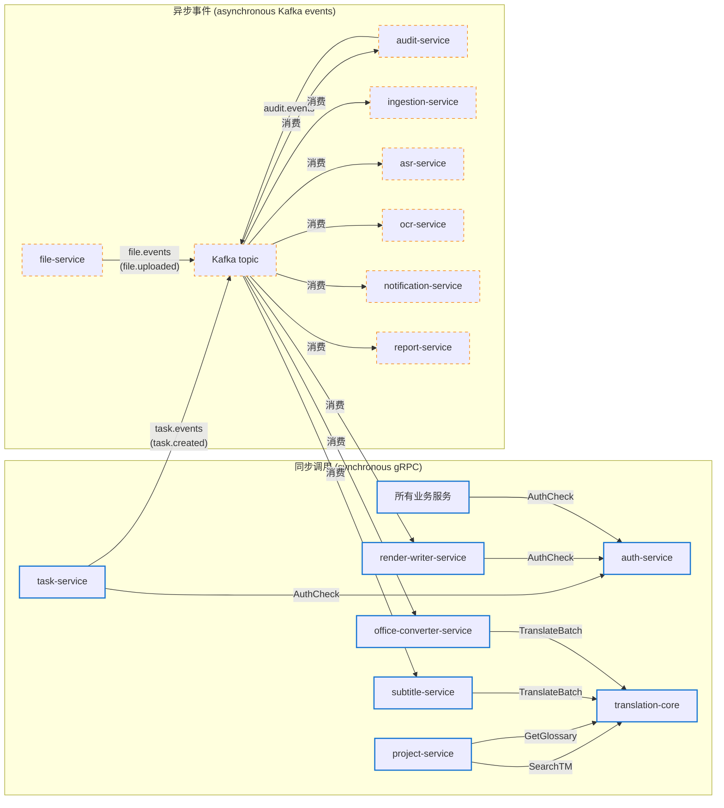
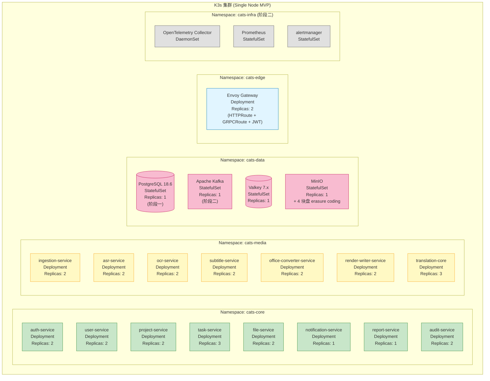
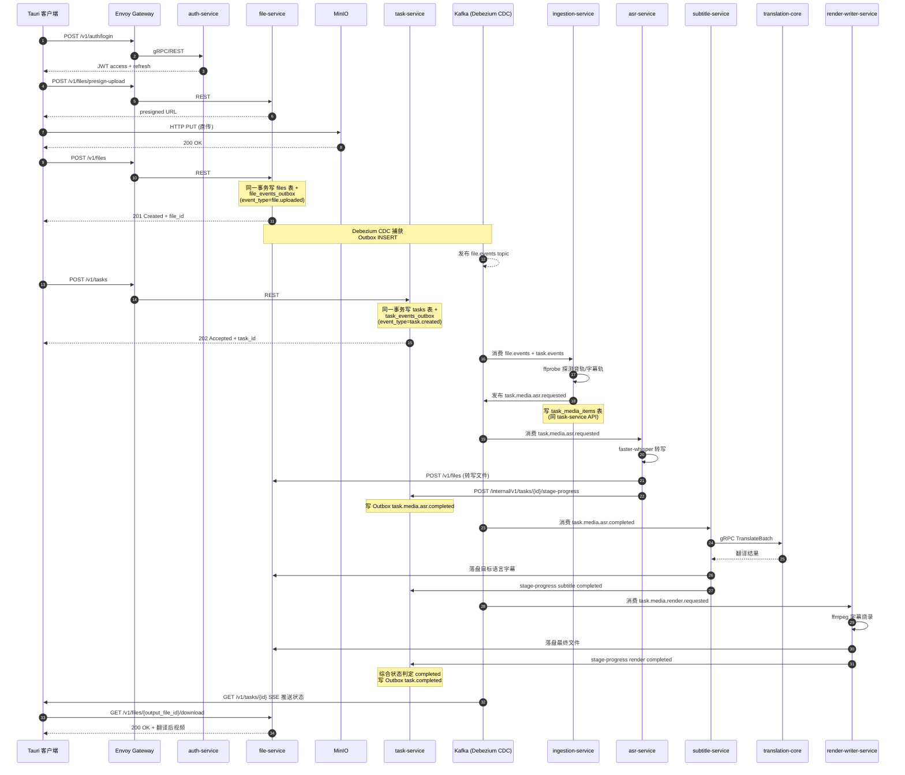
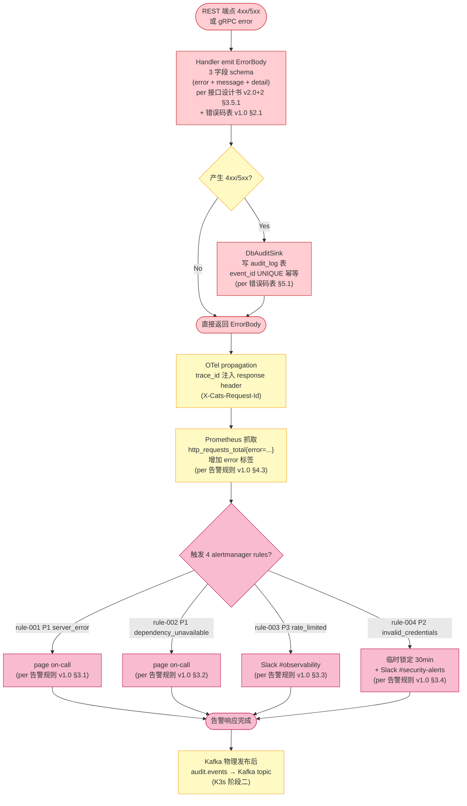

# CATs 画图 v1.0

> **文档编号**：CATs-ARCH-DIA-001
> **关联任务**：T-07 画图 v1.0 (per Sprint 1 任务拆解 v1.0+2 §2 line 136 + 150 任务 #44)
> **估时**：架构师 Lead 150K-300K token (per 任务拆解 §2)
> **版本**：v1.0
> **创建日**：2026-09-11
> **状态**：DDD Review 草稿（6 角色 7 天评审待补, 留 Sprint 1 末 9/27 前）
> **作者**：架构师 Lead（Ulysses 兼一人公司 / Mavis 接手 agent per DEC-008 代签）

---

## 文档管理信息

### 审批栏

| 角色 | 姓名 | 审批 | 日期 | 备注 |
|------|------|------|------|------|
| Sponsor (Ulysses 本人签) | Ulysses | ☐ | — | 一人公司 = Ulysses 持有 Sponsor 角色，不代签 |
| 架构师 Lead | Ulysses（Mavis 代签 per DEC-008） | ☐ | — | 起草方 |
| Rust Lead | Ulysses（Mavis 代签 per DEC-008） | ☐ | — | 实现对齐 |
| DBA Lead | Ulysses（Mavis 代签 per DEC-008） | ☐ | — | 数据库 schema 对齐 |
| QA Lead | Ulysses（Mavis 代签 per DEC-008） | ☐ | — | 测试覆盖 |
| PMO Lead | Ulysses（Mavis 代签 per DEC-008） | ☐ | — | Sprint 1 复盘关联 |

### 修订履历

| 版本 | 日期 | 修订者 | 修订内容 |
|------|------|--------|----------|
| v1.0 | 2026-09-11 | 架构师 Lead（Mavis 接手 agent per DEC-008） | 初版：6 画图（系统总览 / 服务依赖 / 部署架构 / 数据流 / 安全架构 / 错误处理流程），per T-07 画图 v1.0 + 关联 微服务架构设计书 v1.0 + 接口设计书 v2.0+2 + 模块设计书 v2.2 + 数据库设计书 v2.0 + 告警规则 v1.0 |

---

## 0. 元信息

| 项 | 值 |
|----|----|
| **画图工具** | Mermaid (GitHub / GitLab / VSCode 渲染原生支持) |
| **关联文档** | 微服务架构设计书 v1.0 (2910f3d) / 接口设计书 v2.0+2 (1f3c94d) / 模块设计书 v2.2 (f8ac021) / 数据库设计书 v2.0 / 错误码表 v1.0 (2146f53) / 告警规则 v1.0 (1d8926d) / Sprint 复盘 v1.0 (40ae33a) |
| **画图范围** | M1-Sprint 1 范围 8 域 MVP + 7 域 Sprint 1 范围（per 微服务架构设计书 v1.0 §4.1）|
| **画图原则** | 单一事实源（per 守门 #1 禁回溯叙事）+ Mermaid 优先 + commit hash 实证（per 守门 #11 缺标比错标）|
| **后续升版** | v1.1 = 错误码表 v1.0 → v1.1 升版时 + v1.2 = Kafka 物理发布 (K3s 阶段二) 实施时 |

### 0.1 引用清单（git 实证）

| 引用文档 | 路径 | commit hash | 用途 |
|---------|------|------------|------|
| 微服务架构设计书 v1.0 | `doc/02-基础设计/架构设计/CATs_微服务架构设计书_v1.0.md` | `2910f3d` | §4.1 8 域 MVP + §4.2 异步事件 + §14 阶段一/二部署 |
| 接口设计书 v2.0+2 | `doc/03-详细设计/接口设计/CATs_接口设计书_v2.0.md` | `1f3c94d` | §2 拓扑 + §3.5 错误响应 + §6 端到端 |
| 模块设计书 v2.2 | `doc/03-详细设计/模块设计/CATs_模块设计书_v2.0.md` | `f8ac021` | §4 错误码引用终端 |
| 错误码表 v1.0 | `doc/05-其他/管理/CATs_错误码表_v1.0.md` | `2146f53` | §3 28 条 + §6.4 4 alertmanager rules |
| 告警规则 v1.0 | `doc/05-其他/可观测性/CATs_告警规则_v1.0.md` | `1d8926d` | §3 4 rules + §4 实施 |
| Sprint 1 复盘 v1.0 | `doc/05-其他/复盘纪要/CATs_Sprint1_复盘纪要_v1.0.md` | `40ae33a` | W1+W2 12 天复盘 + Sprint 2 范围初稿 |

---

## 1. 系统总览图（System Overview）

> **说明**: CATs 全媒体 AI 辅助翻译 SaaS 平台总体架构，按 5 层分层展示（客户端 / 边缘网关 / 业务服务 / 媒体处理 / 基础设施）

```mermaid
flowchart TB
    subgraph Clients["客户端层 (Client Layer)"]
        Tauri["Tauri Desktop<br/>(Rust + WebView)"]
        NextJS["Next.js 控制台<br/>(Web)"]
        iOS["iOS SDK"]
        Android["Android SDK"]
        Unity["Unity SDK"]
    end

    subgraph Edge["边缘网关层 (Edge Gateway)"]
        Envoy["Envoy Gateway<br/>+ JWT 校验<br/>+ 限流 BackendTrafficPolicy<br/>+ 灰度"]
    end

    subgraph Business["业务服务层 (Business Services) - 8 域 MVP"]
        Auth["auth-service<br/>(PostgreSQL auth_db)"]
        User["user-service<br/>(PostgreSQL user_db)"]
        Project["project-service<br/>(PostgreSQL project_db)"]
        Task["task-service<br/>(PostgreSQL task_db)"]
        File["file-service<br/>(PostgreSQL file_db + MinIO)"]
        Notify["notification-service<br/>(WebSocket + 邮件)"]
        Report["report-service<br/>(聚合)"]
        Audit["audit-service<br/>(审计事件)"]
    end

    subgraph Media["媒体处理层 (Media Processing) - 7 域"]
        Ingestion["ingestion-service<br/>(ffprobe 媒体类型识别)"]
        ASR["asr-service<br/>(faster-whisper)"]
        OCR["ocr-service<br/>(PaddleOCR + Tesseract)"]
        Subtitle["subtitle-service<br/>(srt/vtt/ass)"]
        Office["office-converter-service<br/>(LibreOffice + python-docx)"]
        Render["render-writer-service<br/>(ffmpeg 字幕烧录)"]
        Trans["translation-core<br/>(LangGraph 编排)"]
    end

    subgraph Infra["基础设施层 (Infrastructure)"]
        Kafka["Apache Kafka<br/>(Debezium CDC)"]
        PG[("PostgreSQL 18.6<br/>+ pgvector 0.8.6<br/>16 域独立库")]
        Valkey[("Valkey 7.x<br/>(缓存 + 幂等)")]
        MinIO["MinIO<br/>(对象存储)"]
        OTel["OpenTelemetry Collector<br/>(trace + metric + log)"]
        Prom["Prometheus<br/>(指标采集)"]
        Alert["alertmanager<br/>(告警规则)"]
    end

    Tauri & NextJS & iOS & Android & Unity -->|REST + JWT<br/>WebSocket + SSE| Envoy
    Envoy -->|mTLS + JWT| Auth
    Envoy -->|mTLS + JWT| User
    Envoy -->|mTLS + JWT| Project
    Envoy -->|mTLS + JWT| Task
    Envoy -->|mTLS + JWT| File
    Envoy -->|mTLS + JWT| Notify
    Envoy -->|mTLS + JWT| Report
    Envoy -->|mTLS + JWT| Audit

    Task -->|同服务 gRPC<br/>AuthCheck| Auth
    Project -->|同服务 gRPC<br/>SearchTM + GetGlossary| Trans
    Subtitle -->|同服务 gRPC<br/>TranslateBatch| Trans
    Office -->|同服务 gRPC<br/>TranslateBatch| Trans

    File -->|Outbox + Debezium CDC| Kafka
    Task -->|Outbox + Debezium CDC| Kafka
    Audit -->|Outbox + Debezium CDC| Kafka

    Kafka -->|消费| Ingestion
    Kafka -->|消费| ASR
    Kafka -->|消费| OCR
    Kafka -->|消费| Subtitle
    Kafka -->|消费| Office
    Kafka -->|消费| Render
    Kafka -->|消费| Notify
    Kafka -->|消费| Report
    Kafka -->|消费| Audit

    Auth --> PG
    User --> PG
    Project --> PG
    Task --> PG
    File --> PG
    File --> MinIO
    Notify --> PG
    Report --> PG
    Audit --> PG
    Audit --> Valkey

    Auth -.-> Valkey
    Ingestion -.-> Valkey
    ASR -.-> Valkey

    classDef edge fill:#e1f5ff,stroke:#0277bd
    classDef business fill:#c8e6c9,stroke:#388e3c
    classDef media fill:#fff9c4,stroke:#f9a825
    classDef infra fill:#f8bbd0,stroke:#c2185b

    class Envoy edge
    class Auth,User,Project,Task,File,Notify,Report,Audit business
    class Ingestion,ASR,OCR,Subtitle,Office,Render,Trans media
    class Kafka,PG,Valkey,MinIO,OTel,Prom,Alert infra
```



---

## 2. 服务依赖图（Service Dependency Graph）

> **说明**: 16 域 service crate 之间的同步/异步依赖关系，按同步 gRPC（实线）+ 异步 Kafka（虚线）区分



---

## 3. 部署架构图（Deployment Architecture）

> **说明**: K3s 阶段一 (MVP) + 阶段二 (Kafka 物理发布 + 告警规则) 部署架构



---

## 4. 数据流图（Data Flow）

> **说明**: 用户上传视频 → 翻译 → 下载 完整数据流（基于接口设计书 v2.0+2 §6 端到端示例 + Outbox + Debezium CDC 模式）



> **关键不变量 (per 接口设计书 v2.0+2 §6 端到端示例)**:
> - 业务数据 + Outbox 同一事务 (第 5/7 步)
> - Debezium 只负责转发 Kafka (第 6/8/10/13/18/22 步)
> - Kafka 短暂不可用不丢事件（业务数据已落 PostgreSQL，恢复后 Debezium 补齐）
> - 唯一同步 gRPC 长耗时调用 = subtitle-service → translation-core (第 15 步)

---

## 5. 安全架构图（Security Architecture）

> **说明**: 4 层安全防护（客户端-JWT / Gateway-mTLS / 服务间-mTLS+ServiceAccount / Kafka-SASL）

```mermaid
flowchart TB
    subgraph L1["L1: 客户端 ↔ Gateway"]
        C1["Tauri / Next.js / SDK"]
        JWT1["JWT (RS256)<br/>Authorization: Bearer<br/>per auth-service 签发"]
        C1 -->|JWT1| GW1["Envoy Gateway<br/>+ SecurityPolicy<br/>+ 签名 + 过期校验"]
    end

    subgraph L2["L2: Gateway ↔ 业务服务"]
        GW1 -->|JWT 透传 + Header 注入<br/>X-Cats-User-Id<br/>X-Cats-Org-Id<br/>X-Cats-Roles| BS["业务服务<br/>(信任 Gateway Header<br/>不做签名校验<br/>只做业务级权限)"]
    end

    subgraph L3["L3: 服务间同步 gRPC"]
        BS -.->|mTLS<br/>(K8s 内部 CA<br/>cert-manager 短期证书<br/>自动轮换)| BS2["其他服务"]
        BS -->|ServiceAccount Token Volume<br/>投影 x-service-token<br/>(gRPC metadata 二次校验)| BS2
    end

    subgraph L4["L4: Kafka 生产/消费"]
        BS -->|SASL/SCRAM 凭据<br/>+ Topic 级 ACL<br/>(每服务独立凭据<br/>最小权限)| KF["Kafka"]
    end

    subgraph Audit_Layer["审计层 (per 错误码表 §5 + Sprint 1 复盘 §2.2 R-01)"]
        BS -.->|所有 4xx/5xx| AT["audit-service<br/>(Kafka audit.events topic)"]
        AT -->|聚合<br/>告警规则 §3.4 P2 爆破检测| Alert_Sec["alertmanager<br/>P2 invalid_credentials 5min ≥ 10 次"]
    end

    classDef l1 fill:#e1f5ff,stroke:#0277bd
    classDef l2 fill:#c8e6c9,stroke:#388e3c
    classDef l3 fill:#fff9c4,stroke:#f9a825
    classDef l4 fill:#f8bbd0,stroke:#c2185b
    classDef audit fill:#ffcdd2,stroke:#c62828

    class C1,JWT1,GW1 l1
    class BS l2
    class BS2 l3
    class KF l4
    class AT,Alert_Sec audit
```

> **关键设计 (per 微服务架构设计书 v1.0 §14 阶段一/二 + 安全要件定义书 v1.0)**:
> - 阶段一: 应用层 mTLS + NetworkPolicy 组合 (不上服务网格)
> - 阶段二: 引入 Linkerd 服务网格 (Sidecar mTLS 自动化)
> - RBAC 5 域 Lead 槽位互不兼任 (per 8/21 决议, 1 人 Ulysses 兼 + Mavis 永久代签 per 守门 #14 v3)

---

## 6. 错误处理流程图（Error Handling Flow）

> **说明**: REST 端点 4xx/5xx + gRPC error 处理全流程（基于 错误码表 v1.0 §3 28 条 + 告警规则 v1.0 §3 4 rules）



> **关键设计 (per 错误码表 v1.0 §5 + §6.4 + 告警规则 v1.0 §3)**:
> - ErrorBody 3 字段 schema (per 接口设计书 v2.0+2 §3.5.1 修正, 跟 Rust impl + 错误码表 §2.1 对齐)
> - 28 条业务错误码枚举 (per 错误码表 v1.0 §3, OpenAPI v1.0.1 + proto v1.0.1 同步)
> - 4 alertmanager rules (per 错误码表 §6.4, 告警规则 v1.0 §3)
> - 错误码 v1.0 → v1.1 升版预留 (Sprint 2 起点, per 错误码表 §8.1)

---

## 7. 升版流程

### 7.1 升版触发条件

- 服务新增/删除 → 画图 §1 系统总览 + §2 服务依赖 + §3 部署架构
- 异步事件 schema 变更 → 画图 §4 数据流
- 安全策略变更 → 画图 §5 安全架构
- 错误码表 v1.0 → v1.1 → v2.0 升版 → 画图 §6 错误处理流程

### 7.2 升版流程

1. **PR 起草**：架构师 Lead 主责
2. **DDD Review**：6 角色评审（含 Sponsor 本人签）
3. **CAB 决议**：v1.x → v2.0 需走 CAB-002
4. **基线化**：v 升 B-y.y，Baseline一览 + 接口设计书 §7 同步
5. **引用同步**：所有画图下游文档（接口设计书 / 模块设计书 / 数据库设计书 / 错误码表 / 告警规则 / Sprint 复盘）同步更新引用

### 7.3 当前 v1.0 适用范围

- **时间窗口**：M1-Sprint 1 范围 (per 微服务架构设计书 v1.0 §4.1 8 域 MVP + 7 域 Sprint 1 范围)
- **关联 commit**：2910f3d (微服务架构 v1.0) + 1f3c94d (接口设计 v2.0+2) + f8ac021 (模块设计 v2.2) + 2146f53 (错误码表 v1.0) + 1d8926d (告警规则 v1.0) + 40ae33a (Sprint 1 复盘 v1.0)
- **升版预期**：v1.1 = Sprint 2 范围 (画图 + M1 阶段二 Kafka 物理发布) + 错误码表 v1.1 升版

---

## 8. 已知缺口（DDD Review 必查 per AI 协作文档治理 2026-08-26）

### 8.1 GAP-DIA-1: §4 数据流图 仅 1 端到端示例 (视频翻译)

- 端到端示例 25 步来自 接口设计书 v2.0+2 §6
- 其他 5 端到端示例 (文本 / 音频 / PDF / Office / 游戏本地化) 0 单独画图
- **建议**: v1.1 升版时补充
- **当前状态**: 0 阻塞 v1.0 落地

### 8.2 GAP-DIA-2: §3 部署架构图 阶段一 single-node MVP, 阶段二 K3s cluster 0 详细画图

- 阶段一: 1 master + 0 worker (single node)
- 阶段二: 3 master + N worker (per 决议 6 SRE 估算 v1.0 §4 阶段二扩展)
- **建议**: K3s 阶段二实施时 (Sprint 2 起点) 详细画图
- **当前状态**: 0 阻塞 v1.0 落地

### 8.3 GAP-DIA-3: §5 安全架构图 阶段二服务网格 (Linkerd) 未画

- 阶段一: 应用层 mTLS + NetworkPolicy (per 微服务架构 v1.0 §14)
- 阶段二: 引入 Linkerd Sidecar mTLS 自动化
- **建议**: 阶段二实施时画图
- **当前状态**: 0 阻塞 v1.0 落地

### 8.4 GAP-DIA-4: §6 错误处理流程图 Kafka 物理发布前 stub

- 当前 audit_log 表 落 DbAuditSink (per 错误码表 §5.1 + Sprint 1 复盘 §2.2 R-02)
- Kafka audit.events topic 物理发布 留 K3s 阶段二 (per 启动会决议 10 b 部分)
- **建议**: 阶段二实施时画图补充 Kafka audit 链路
- **当前状态**: 0 阻塞 v1.0 落地

### 8.5 GAP-DIA-5: DDD Review 6 角色 7 天评审 9/4 截止已逾期 5 天 (per Sprint 1 复盘 §9.1)

- 14 commit + 本 v1.0 画图 15 个待评审
- 5 域 Lead 真人到位率 0% (per Sprint 1 复盘 §3)
- Mavis 永久代签 (per 守门 #14 v3)
- **建议**: Sprint 1 末 9/27 前补 7 天评审窗口
- **当前状态**: 0 阻塞 v1.0 落地

---

**画图结束 (v1.0, 2026-09-11, T-07 画图部分落地, 6 张 Mermaid 画图覆盖系统总览/服务依赖/部署架构/数据流/安全架构/错误处理流程)**
