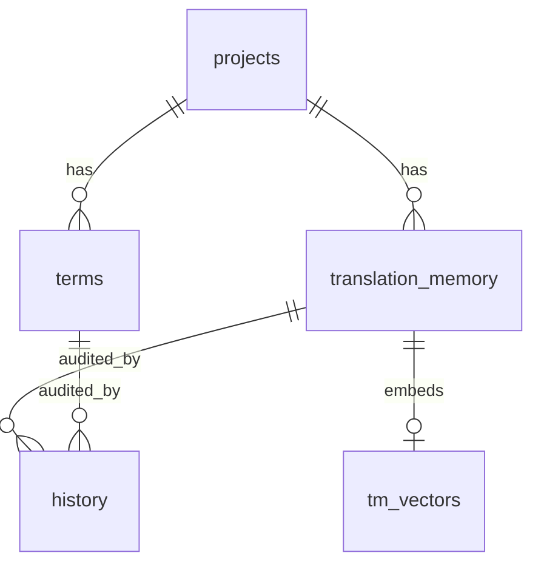

# OFCAT 基础设计书

**系统名称:** OFCAT — AI 增强型 CAT 浏览器工作台

---

## 文档管理信息

| 项目 | 内容 |
|---|---|
| 文档编号 | OFCAT-BD-001 |
| 文档名 | 基础设计书（方式设计 / 组件设计 / 数据设计 / 接口设计 / 非功能设计 / 安全设计） |
| 版本 | 第 1.0 版（草稿） |
| 创建日 | 2026-06-25 |
| 作者 | 架构师 |
| 状态 | 评审前草稿 |
| 密级 | 仅社内 |
| 上游文档 | [需求定义书 v1.1](../../01-需求/需求规格说明/OFCAT_需求定义书_v1.1.md) |

### 修订履历

| 版本 | 日期 | 修订者 | 修订内容 |
|---|---|---|---|
| 1.0 | 2026-06-25 | 架构师 | 初版。确立薄扩展+本地引擎方式、组件分解、数据模型、接口、非功能与安全设计 |

### 审批栏

| 角色 | 姓名 | 审批日 | 签字 |
|---|---|---|---|
| 起草 | | | |
| 评审 | | | |
| 批准 | | | |

---

## 1. 前言

### 1.1 目的
本书基于[需求定义书 v1.1](../../01-需求/需求规格说明/OFCAT_需求定义书_v1.1.md)，确立 OFCAT 的**整体方式设计**，作为详细设计（`03-详细设计/`）与实现的输入。技术栈的选型理由见配套的[技术选型书](../技术选型/OFCAT_技术选型书_v1.0.md)。

### 1.2 范围
覆盖系统方式设计、组件分解、数据设计、接口设计、画面设计（概要）、非功能设计、安全设计、错误处理方针、部署构成。**功能详细规格以 MVP（F1–F11）为主**，后续阶段功能仅给出扩展点。

### 1.3 设计前提（针对未确定课题的假设）

> 以下为推进设计所作的**默认假设**，待 O1–O6 确定后回填，不影响主体架构。

| 关联课题 | 设计前提（假设） |
|---|---|
| O1 团队规模/TM 规模 | 假设单库 TM ≤ 50 万条、术语 ≤ 10 万条。索引方案在此量级下用 SQLite + 内存候选过滤即可，超出再引入分片。 |
| O2 浏览器目标 | 假设 **Edge + Chrome 双支持**（均 Chromium/MV3，同一套代码）。 |
| O6 敏感界定 | 假设采用**「域名白/黑名单 + 项目敏感标记」混合策略**，默认 fail-closed（未知一律按可云端，敏感项强制本地——具体默认值待 O6）。 |

### 1.4 设计原则
1. **确定性优先**：TM/术语/标签的正确性由确定性逻辑保证，不依赖模型自觉。
2. **分层延迟**：能本地即时解决的（L0/L1）绝不调用云端；AI 仅用于必要环节。
3. **合规 fail-closed**：合规判定失败或本地模型不可达时，宁可中止也不外泄敏感内容。
4. **薄扩展**：浏览器侧只做捕获/渲染/写回，所有重逻辑下沉本地引擎，便于独立升级。
5. **接口契约稳定**：扩展↔引擎、引擎↔模型均以稳定契约解耦。

---

## 2. 系统方式设计

### 2.1 总体架构

```
┌───────────────────────────────────────────────────────────┐
│ 浏览器（Edge / Chrome, MV3）                                 │
│  ┌──────────────┐  ┌───────────────┐  ┌─────────────────┐  │
│  │ Content Script│  │ Service Worker │  │ Options/Popup UI │  │
│  │ 选区捕获/overlay│◀▶│ 消息路由/会话    │  │ 设置·术语·合规    │  │
│  │ /写回(F1,F7,F8)│  │ /SSE 中转       │  └─────────────────┘  │
│  └──────────────┘  └───────┬───────┘                        │
└──────────────────────────────┼────────────────────────────-┘
                               │ 127.0.0.1 HTTP + Bearer Token + SSE
┌──────────────────────────────▼─────────────────────────────┐
│ 本地引擎（Local Engine, FastAPI / Python）                   │
│  ┌──────────────────────────────────────────────────────┐ │
│  │ API 层（鉴权 / Origin 校验 / 路由 / SSE 流式）           │ │
│  ├──────────────────────────────────────────────────────┤ │
│  │ 编排层 Orchestrator（LangGraph）                        │ │
│  │   TM匹配→术语匹配/注入→标签保护→翻译→术语校验→QA          │ │
│  ├───────────┬───────────┬───────────┬────────────┬──────┤ │
│  │ TM Service │ Term Svc   │ Protector  │ QA Service │ ...  │ │
│  ├───────────┴───────────┴───────────┴────────────┴──────┤ │
│  │ AI 网关（LiteLLM + 合规路由）  │ 导入管道  │ 同步客户端    │ │
│  ├──────────────────────────────────────────────────────┤ │
│  │ 存储层 SQLite（+ sqlite-vec）  权威副本                  │ │
│  └──────────────────────────────────────────────────────┘ │
└───────┬──────────────────────────────────────────┬─────────┘
        │ OpenAI 兼容                                │ REST（可选/异步）
┌───────▼────────────────────┐          ┌───────────▼──────────┐
│ 模型 Providers              │          │ 中心同步服务（可选）   │
│  云端: OpenAI/Claude/...     │          │  术语库 / 核心 TM 同步 │
│  本地: Qwen(Ollama/vLLM)    │          └──────────────────────┘
└────────────────────────────┘
```

### 2.2 方式选定要点（详见技术选型书）

| 层 | 方式 | 一句话理由 |
|---|---|---|
| 扩展 | MV3 + TypeScript + Svelte + Vite/CRXJS | overlay 渲染轻快；双浏览器同源码 |
| 通信 | localhost HTTP + Bearer Token + SSE | 简单、可流式；令牌+Origin 防越权 |
| 引擎 | Python + FastAPI | 兼容 PaddleOCR/LangGraph/嵌入模型生态 |
| 编排 | LangGraph | MVP 即用，平滑演进到多 Agent |
| 存储 | SQLite + sqlite-vec | 本地、零运维、可向量；去掉 Qdrant |
| TM 匹配 | RapidFuzz（主）+ bge-m3 嵌入（辅） | 经典模糊算法准确；语义召回补充 |
| AI 网关 | LiteLLM + 合规路由 | 统一多家协议；合规仅切 base_url |
| 本地模型 | Qwen 系（Ollama/vLLM） | 中日英强、指令遵循好 |

### 2.3 部署构成

| 节点 | 部署物 | 说明 |
|---|---|---|
| 用户 PC | 浏览器扩展（store/sideload） | 薄扩展 |
| 用户 PC | 本地引擎（PyInstaller 打包，开机自启/托盘） | 监听 `127.0.0.1:<port>` |
| 用户 PC 或内网 | 本地 LLM（Ollama 单机 / vLLM 内网共享） | 合规路径 |
| 内网/云 | 中心同步服务（可选） | 术语/核心 TM 异步同步 |
| 外网 | 云端模型 API | 非敏感内容 |

---

## 3. 组件设计

### 3.1 组件一览

| 组件ID | 组件名 | 所属 | 职责 | 关联功能 |
|---|---|---|---|---|
| CMP-01 | Content Script | 扩展 | 选区捕获、overlay 注入与编辑、写回页面 | F1,F7,F8 |
| CMP-02 | Service Worker | 扩展 | 消息路由、与引擎会话、SSE 中转、快捷键/右键 | F1,F6 |
| CMP-03 | Options/Popup UI | 扩展 | 模型/合规/语言对/术语·TM 路径设置 | F10,UI2 |
| CMP-04 | API 层 | 引擎 | 鉴权、Origin 校验、REST/SSE 端点 | 全部 |
| CMP-05 | Orchestrator | 引擎 | LangGraph 编排翻译管道 | F2–F6 |
| CMP-06 | TM Service | 引擎 | 精确/模糊匹配、回存 | F2,F9 |
| CMP-07 | Term Service | 引擎 | 术语匹配、注入、强制校验 | F3,F4 |
| CMP-08 | Tag/Placeholder Protector | 引擎 | 标签/占位符哨兵化与回填校验 | F5 |
| CMP-09 | QA Service | 引擎 | 数量/标签/术语一致性 QA | F4,F5 |
| CMP-10 | AI Gateway | 引擎 | 模型路由、合规开关、流式 | F6,F10 |
| CMP-11 | Storage | 引擎 | SQLite + 向量、事务、迁移 | F2,F9,F11 |
| CMP-12 | Import Pipeline | 引擎 | 存量清洗/映射/去重/导入 | F11 |
| CMP-13 | Sync Client | 引擎 | 与中心同步服务的异步同步 | C4 |
| CMP-14 | 中心同步服务 | 服务端 | 术语/核心 TM 的服务端同步 API | C4 |

### 3.2 编排管道（CMP-05, LangGraph 节点）

```
[capture] → [tm_match] ──L0/L1──▶ [respond]（即时/确认）
               │
               └─miss─▶ [term_match] → [protect] → [translate(stream)] 
                              → [term_enforce] → [qa] → [respond] → [persist]
```

- 节点失败按 §7 错误处理方针处理；`protect`/`term_enforce`/`qa` 为确定性节点，不调用模型。

---

## 4. 数据设计

### 4.1 实体一览

| 实体 | 物理表 | 说明 | 关键维度 |
|---|---|---|---|
| 项目 | `projects` | 项目/语言对/领域/敏感策略 | — |
| 术语 | `terms` | 术语库条目 | source_lang,target_lang,domain |
| 翻译记忆 | `translation_memory` | TM 句段对 | source_lang,target_lang,domain |
| TM 向量 | `tm_vectors` | 句段语义向量（sqlite-vec） | tm_id |
| 历史 | `history` | 变更/操作审计 | — |
| 同步状态 | `sync_state` | 各实体同步游标 | entity |
| 设置 | `settings` | 键值设置 | key |

### 4.2 ER 概要



### 4.3 主要表字段（概要，详细见详细设计）

**translation_memory**

| 字段 | 类型 | 说明 |
|---|---|---|
| id | INTEGER PK | 主键 |
| source_lang / target_lang | TEXT | 语言对（C5），如 `ja`/`zh-CN` |
| domain | TEXT | 领域（游戏/反馈/技术…） |
| source_text | TEXT | 原文 |
| source_hash | TEXT | 原文规范化哈希（精确匹配索引用） |
| target_text | TEXT | 译文 |
| context | TEXT | 上下文/来源 URL |
| project_id | INTEGER FK | 所属项目 |
| origin | TEXT | 来源（human/import/mt） |
| quality | INTEGER | 质量等级 |
| created_at / updated_at | TEXT | 时间戳 |

**terms**

| 字段 | 类型 | 说明 |
|---|---|---|
| id | INTEGER PK | 主键 |
| source_lang / target_lang | TEXT | 语言对 |
| domain | TEXT | 领域 |
| source_term | TEXT | 原术语 |
| target_term | TEXT | 约定译法 |
| forbidden | TEXT(JSON) | 禁止译法列表（供 F4 校验） |
| note | TEXT | 备注 |
| status | TEXT | 状态（启用/停用） |
| updated_at | TEXT | 时间戳 |

### 4.4 索引设计（概要）
- `translation_memory(source_hash)`：L0 精确匹配 O(1)。
- `translation_memory(source_lang,target_lang,domain)`：候选集过滤。
- 模糊匹配：先按语言对+长度区间+（可选）trigram 预过滤候选，再用 RapidFuzz 算相似度；语义召回走 `tm_vectors`（sqlite-vec KNN）。
- `terms(source_lang,target_lang,domain,source_term)`：术语命中。

---

## 5. 接口设计

### 5.1 扩展 ↔ 本地引擎（127.0.0.1，Bearer Token）

| 接口ID | 方法 路径 | 用途 | 关联功能 |
|---|---|---|---|
| API-01 | `GET /health` | 引擎健康检查、版本、能力探测 | — |
| API-02 | `POST /session/handshake` | 令牌校验、能力协商 | 安全 |
| API-03 | `POST /tm/match` | TM 精确/模糊匹配 | F2 |
| API-04 | `POST /translate`（SSE） | 完整翻译管道（含术语/保护/QA），流式返回 | F3–F6 |
| API-05 | `POST /tm/commit` | 确认译文回存 TM | F9 |
| API-06 | `POST /qa/check` | 独立 QA 校验（标签/术语/数量） | F4,F5 |
| API-07 | `GET/PUT /settings` | 设置读写（模型/合规/语言对） | F10 |
| API-08 | `POST /import`（job） | 存量导入任务（异步，返回 job_id） | F11 |
| API-09 | `GET /import/{job_id}` | 导入进度/结果报告 | F11 |
| API-10 | `POST /sync/pull` `POST /sync/push` | 与中心同步服务对接（经引擎代理） | C4 |

### 5.2 `POST /translate` 请求/响应（要点）

请求（JSON）：
```json
{
  "segment": "原文…（含 <b> {count} 等）",
  "source_lang": "ja", "target_lang": "zh-CN",
  "domain": "game", "project_id": 12,
  "url": "https://jira.example.com/...",
  "mode": "default"   // default(L2) | high_quality(L3)
}
```
SSE 事件流：`tm_hit`（若 L0/L1）→ `terms`（命中术语）→ `delta`（流式译文）→ `qa`（QA 结果）→ `done`（最终译文+元数据）。

### 5.3 引擎 ↔ 模型（AI Gateway）
- 统一 **OpenAI 兼容协议**（chat/completions, stream）。
- 合规路由：依据 `url`/`project_id` 的敏感判定切换 `base_url`/模型；敏感且本地不可达 → 返回 `409 ComplianceBlocked`（fail-closed）。

### 5.4 引擎 ↔ 中心同步服务（可选）
- REST，异步拉/推；冲突策略：术语库以中心为准（管理者维护），TM 以「后写优先 + 保留双方」合并，详细见详细设计。

---

## 6. 画面设计（概要）

| 画面ID | 画面名 | 触发 | 主要元素 | 关联 |
|---|---|---|---|---|
| UI1 | 翻译 overlay | 选区翻译触发 | 原文、流式译文、术语提示条、QA 警告、接受/编辑/取消、相似度标识（L0/L1/L2） | F2,F4,F5,F7 |
| UI2 | 设置页（Options） | 扩展设置入口 | 模型与密钥、合规策略（域名清单/项目标记）、语言对、术语/TM 路径、引擎连接状态 | F10 |
| UI3 | 导入向导 | 设置页内 | 文件选择、字段映射、预览、去重策略、导入报告 | F11 |
| UI4 | Popup（快捷面板） | 工具栏图标 | 引擎状态、当前项目/语言对快切、近期记录 | — |

overlay 交互要点：键盘可完成全流程（触发→`Enter` 接受→关闭）；L0 直接填充态、L1 高亮差异、L2 流式态三种视觉区分。

---

## 7. 错误处理方针

| 区分 | 场景 | 处理方针 | 用户可见 |
|---|---|---|---|
| E-01 | 引擎未启动/不可达 | 扩展提示「本地引擎未运行」并提供启动指引；不降级到云端旁路 | 是 |
| E-02 | 令牌失效 | 重新握手（API-02）；失败则提示重置 | 是 |
| E-03 | 模型超时/失败 | 重试 N 次→回退备用模型（非敏感时）；仍失败则报错 | 是 |
| E-04 | 合规阻断 | 敏感内容且本地模型不可达 → `409`，中止并说明 | 是 |
| E-05 | 标签/占位符回填失败 | QA 标红，禁止自动写回，要求人工确认 | 是 |
| E-06 | TM 写入失败 | 本地队列重试；不阻塞当前翻译 | 否（后台） |
| E-07 | 导入非法行 | 跳过并记入导入报告 | 是（报告） |
| E-08 | 同步冲突 | 按 §5.4 合并策略处理，冲突项标记待人工 | 部分 |

---

## 8. 非功能设计（实现方针）

| NFR | 需求 | 实现方针 |
|---|---|---|
| NFR-03/04 | L0/L1 即时、不调 API | `source_hash` 索引精确命中；模糊用候选预过滤+RapidFuzz，全程本地 |
| NFR-05 | L2 ~1s 首字 | SSE 流式；术语/保护为轻量本地预处理，不阻塞首字 |
| NFR-06 | L3 高质量 | 独立路径并行多模型+评审，手动触发，不进默认链 |
| NFR-01/02 | 离线/同步故障可用 | 本地 SQLite + 本地模型；同步为异步旁路，断网不影响主流程 |
| NFR-08/09 | 可维护/接口稳定 | 扩展与引擎分进程、契约化 API；引擎可独立升级 |
| NFR-10/11 | 迁移/备份 | 导入管道（CMP-12）；SQLite 文件可备份/迁移 |
| NFR-12/13 | 合规/加密 | 合规 fail-closed（§5.3）；同步通道 TLS；本地数据本地保管 |

---

## 9. 安全设计

| 项 | 设计 |
|---|---|
| 本地引擎暴露面 | 仅绑定 `127.0.0.1`，不监听外网接口 |
| 越权访问防护 | 启动生成随机 Bearer Token（存扩展+引擎本地），每请求校验；校验 `Origin`/扩展 ID 白名单，拒绝任意网页直连 |
| CSRF/DNS rebinding | 校验 `Host`/`Origin` 头；令牌不可被网页脚本读取（仅扩展持有） |
| 密钥管理 | 云端 API Key 存本地引擎侧（非扩展），不下发到页面上下文 |
| 合规 | 敏感判定在网关强制执行，fail-closed；敏感内容永不出本地 |
| 数据 | 本地 SQLite；同步链路 TLS + 鉴权；可选静态加密（详细设计评估） |
| 审计 | `history` 表记录关键变更，支持追溯 |

---

## 10. 与详细设计的衔接

| 详细设计文档（计划） | 承接本书章节 |
|---|---|
| `03-详细设计/模块设计/` | §3 组件、§5.2 管道节点的内部逻辑（TM 算法、术语校验、保护算法、QA 规则） |
| `03-详细设计/接口设计/` | §5 各 API 的完整请求/响应/错误码契约 |
| `03-详细设计/数据库设计/` | §4 表的完整 DDL、索引、迁移脚本 |

---

## 11. 未决事项（承接需求 O1–O6）

| ID | 对基础设计的影响 | 当前默认假设 |
|---|---|---|
| O1 | TM 索引/同步规格 | ≤50 万条，SQLite 直接索引 |
| O2 | 扩展打包目标 | Edge + Chrome 双支持 |
| O3 | 默认云端模型/成本 | 网关多 provider，默认值待定 |
| O4 | 同步服务运维/部署 | 设为可选组件，内网优先 |
| O5 | 导入字段映射 | 管道支持自定义映射，模板待样本 |
| O6 | 敏感判定默认策略 | 域名清单+项目标记，fail-closed |
