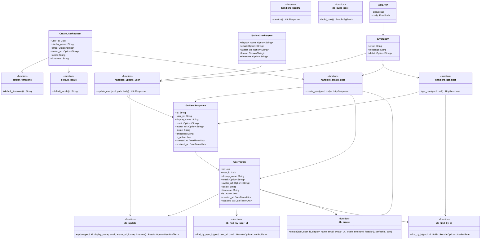
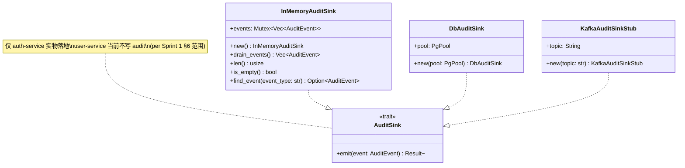

# CATs 模块设计书

**系统名称:** CATs — 全媒体 AI 辅助翻译 SaaS 平台

---

## 文档管理信息

| 项目 | 内容 |
|---|---|
| 文档编号 | CATs-DD-MOD-002 |
| 文档名 | 模块设计书（微服务内部分层 / 客户端 / 控制台 / 媒体管线 / M1-Sprint 1 服务特化模块设计） |
| 版本 | 第 2.2 版 |
| 创建日 | 2026-08-26（v2.0/v2.1 原文）/ 2026-09-01（v2.2 升版 patch） |
| 作者 | 架构师 Lead + Rust Lead + DBA（Mavis 接手 agent per DEC-008，2026-08-27 19:39 JST Ulysses 授权代签） |
| 状态 | 评审前草稿（v2.2 patch 9/13 DDD Review 截止 per 启动会决议 2） |
| 密级 | 仅社内 |
| 上游文档 | [CATs 微服务架构设计书 v1.0](../../02-基础设计/架构设计/CATs_微服务架构设计书_v1.0.md)、[CATs 技术选型书 v2.0](../../02-基础设计/技术选型/CATs_技术选型书_v2.0.md)、[CATs 接口设计书 v2.0+1](../接口设计/CATs_接口设计书_v2.0.md)（per 启动会决议 1+7 commit `0eb1e9f`）、[CATs 数据库设计书 v2.0](../数据库设计/CATs_数据库设计书_v2.0.md)、[CATs_技术基线 v1.0](../../02-基础设计/技术选型/CATs_技术基线_v1.0.md)（**§1 PostgreSQL 18.6 + pgvector 0.8.6 + Rust 1.98.0**）、[CATs 错误码表 v1.0](../../05-其他/管理/CATs_错误码表_v1.0.md)（per 决议 2 §4 错误码引用终端 commit `2146f53`）、[CATs M1-Sprint 1 启动会决议纪要 v1.0](../../05-其他/会议记录/CATs_M1_Sprint1_启动会决议纪要_v1.0.md)（决议 2 commit `1b27b2b`）、[OFCAT 模块设计书 v1.0（历史/旧架构参考，格式沿用）](./OFCAT_模块设计书_v1.0.md) |

### 修订履历

| 版本 | 日期 | 修订者 | 修订内容 |
|---|---|---|---|
| 1.0 | 2026-06-25 | 架构师 | （OFCAT）浏览器扩展 + 本地引擎模块划分，见历史文档 |
| 2.0 | 2026-08-18 | 架构师 | 全面重做：微服务内部分层、Tauri 客户端、Next.js 控制台、媒体管线各阶段、公共基础库设计，承接《CATs 微服务架构设计书 v1.0》§21 |
| **2.1** | **2026-08-26** | **架构师 + Rust Lead + DBA** | **基线升级：PostgreSQL / Rust 引用统一引用 CATs_技术基线_v1.0 §1（PostgreSQL 18.6 + Rust 1.98.0 + pgvector 0.8.6）** |
| **2.2** | **2026-09-01** | **架构师 Lead（Mavis 接手 agent per DEC-008）** | **M1-Sprint 1 服务特化升版（per 启动会决议 2 commit `1b27b2b`）**：§6 目的与范围 + §7 auth-service 模块结构（5 端点 + JWT 实物）+ §8 错误码引用（错误码表 v1.0 §3 28 条 + §4 端点矩阵 + REST→gRPC 映射）+ §9 模块结构定义（trait + DTO + AppError + config loader）+ §10 类图（Mermaid 3 块：auth / user / 共享 trait）+ §11 user-service 模块结构（4 端点 + cats-common 引用）+ §12 cats-common crate 结构 + §13 已知缺口 5 项；与决议 1 接口设计书 v2.0+1 同步升版（commit `0eb1e9f`） |

### 审批栏

| 角色 | 姓名 | 审批日 | 签字 |
|---|---|---|---|
| 起草 | 架构师 + Rust Lead + DBA | 2026-08-26 |  |
| 评审 |  |  |  |
| 批准 |  |  |  |

---

## 0. 阅读指南

本书是《CATs 微服务架构设计书 v1.0》§21 承诺的模块详细设计文档，覆盖：①后端各微服务内部代码分层与目录/crate 结构，②Tauri 客户端内部模块，③Next.js Web 控制台目录结构，④媒体处理管线各阶段的输入输出契约与失败重试/幂等设计，⑤跨服务共享的公共基础库/SDK。接口契约见《CATs 接口设计书 v2.0》，数据表结构见《CATs 数据库设计书 v2.0》。涉及技术栈版本（PostgreSQL / pgvector / Rust toolchain 等）一律以 [CATs_技术基线_v1.0 §1](../../02-基础设计/技术选型/CATs_技术基线_v1.0.md) 为准。

---

## 1. 后端微服务内部分层通用规范

### 1.1 分层原则（不分实现语言，统一约束）

```
API 层（REST Handler / gRPC Service Impl / Kafka Consumer Handler）
   │  仅做：请求解析校验、鉴权上下文提取、调用领域层、组装响应/错误信封
   ▼
领域层（Domain / Service）
   │  业务规则、状态机迁移校验、跨聚合编排（如 task 状态机推进逻辑）
   │  不感知 HTTP/gRPC/Kafka 细节，不直接拼 SQL
   ▼
仓储层（Repository）
   │  唯一允许写 SQL/调用 sqlx-query 的层，向上暴露领域对象，不暴露行级 DB Row 结构
   ▼
基础设施层（Infra）
      DB 连接池、Kafka Producer/Consumer 客户端、外部 gRPC Client Stub、对象存储 SDK
```

- 领域层不得直接依赖任何 Web 框架类型（如 Rust 的 `axum::Json`、Python 的 `fastapi.Request`），保证领域逻辑可脱离框架单元测试。
- 仓储层方法签名以领域对象为出入参（如 `fn find_task(id: TaskId) -> Result<Task>`），不返回裸 `sqlx::Row`/ORM Model，避免领域层反向感知持久化细节。
- Outbox 写入固定放在仓储层的同一事务方法内（如 `TaskRepository::create_with_outbox_event(...)`），杜绝业务写与 Outbox 写分散在两次独立调用中破坏事务边界（架构设计书 §7.3 的事务流程必须在代码层面被这一模式强制收口，而非依赖开发者每次手写 BEGIN/COMMIT）。

### 1.2 Rust 服务的 crate 结构（适用于 render-writer-service 等对性能敏感的服务，以及未来考虑用 Rust 重写的核心服务）

以 `render-writer-service` 为例：
```
render-writer-service/
├── Cargo.toml                     # workspace 根
├── crates/
│   ├── api/                       # API 层：Kafka Consumer Handler、内部 gRPC/REST Client 调用封装
│   │   └── src/lib.rs
│   ├── domain/                    # 领域层：render_kind 分发逻辑、渲染策略接口 trait
│   │   └── src/{model.rs, service.rs, ports.rs}   # ports.rs 定义 trait，供 infra 实现（依赖倒置）
│   ├── infra/                     # 基础设施层：ffmpeg 子进程封装、file-service gRPC/REST Client、Kafka Producer/Consumer
│   │   └── src/{ffmpeg_runner.rs, file_client.rs, kafka.rs}
│   └── shared/                    # 引用公共基础库 cats-sdk-rs（见 §5）
└── src/main.rs                    # 组装依赖注入、启动 Consumer Loop + 健康检查 HTTP Server
```
`domain::ports` 定义 `trait Renderer { fn render(&self, job: RenderJob) -> Result<RenderOutput>; }`，`infra` 层提供 `SubtitleBurnInRenderer`/`PdfRelayoutRenderer`/`GifReencodeRenderer` 等具体实现，`main.rs` 按 `render_kind` 注入对应实现——这是媒体处理服务"可插拔处理器"设计（架构设计书 §2 拓扑图标注"媒体处理域"为可插拔）在代码层面的落地方式。

### 1.3 Python 服务的目录结构（适用于 translation-core、asr-service、ocr-service、subtitle-service、office-converter-service）

以 `translation-core` 为例（FastAPI）：
```
translation-core/
├── pyproject.toml
├── app/
│   ├── api/                       # API 层
│   │   ├── grpc/translation_service.py   # gRPC Servicer 实现，仅做 protobuf<->领域对象转换
│   │   └── http/internal_routes.py       # 内部管理端点（缓存统计等）
│   ├── domain/                    # 领域层：LangGraph 编排图定义（沿用 OFCAT 编排逻辑迁移）
│   │   ├── pipeline.py            # TM匹配→术语注入→标签保护→模型翻译→术语校验→QA 的 LangGraph StateGraph
│   │   ├── tm_matcher.py
│   │   ├── term_injector.py
│   │   ├── tag_protector.py
│   │   └── qa_checker.py
│   ├── repository/                # 仓储层：project_db 的 TM/术语查询（本服务只读，project-service 是写权威）
│   │   └── tm_repository.py
│   ├── infra/
│   │   ├── db.py                  # SQLAlchemy engine/session
│   │   ├── project_client.py      # gRPC 调用 project-service（架构设计书 §4.2 同步 gRPC）
│   │   ├── model_gateway.py       # LiteLLM AI 网关封装（沿用 OFCAT）
│   │   └── kafka_consumer.py      # 消费 project.events 失效本地缓存
│   └── shared/                    # 引用公共基础库 cats-sdk-py（见 §5）
└── migrations/                    # Alembic
```
`domain/pipeline.py` 是 OFCAT LangGraph 编排逻辑的直接迁移承接点（架构设计书 §18.4 步骤 S2），节点函数签名保持稳定，仅将原本直连 SQLite 的部分替换为调用 `repository/tm_repository.py`。

### 1.4 Worker/无状态处理器服务的目录结构（asr/ocr/office-converter，Python 实现示例）

```
asr-service/
├── app/
│   ├── consumer/                  # API 层：Kafka Consumer 入口，消费 task.media.asr.requested
│   │   └── asr_requested_handler.py
│   ├── domain/
│   │   ├── transcribe.py          # faster-whisper 推理封装（领域逻辑：模型选择/分段策略）
│   │   └── idempotency.py         # event_id 去重判定（Valkey SETNX + 业务表兜底，见 §4.2）
│   ├── infra/
│   │   ├── whisper_runtime.py     # CTranslate2/faster-whisper 底层调用
│   │   ├── file_client.py         # 调用 file-service 存取文件
│   │   ├── task_client.py         # 调用 task-service stage-progress 上报
│   │   └── kafka.py
│   └── shared/                    # cats-sdk-py
└── Dockerfile                     # 基于 GPU 基础镜像（cats-3rdparty 缓存），媒体处理服务统一约定见架构设计书 §12.1
```

---

## 2. Rust 原生前端客户端（Tauri）模块设计

### 2.1 整体分层

```
┌─────────────────────────────────────────────────────┐
│ WebView 前端（Svelte 5 + TypeScript）                  │
│  - 翻译工作台 UI（对照编辑器/字幕时间轴/文档预览）           │
│  - 通过 Tauri `invoke()` / `Channel` 调用 Rust 核心命令  │
└───────────────────────┬───────────────────────────────┘
                         │ Tauri IPC（invoke/emit，进程内，非网络调用）
┌───────────────────────▼───────────────────────────────┐
│ Rust 核心层（tauri::App 主进程）                          │
│  ┌─────────────┐ ┌──────────────┐ ┌──────────────────┐ │
│  │ commands/   │ │ api_client/   │ │ local_cache/      │ │
│  │ (IPC 命令入口)│ │ (REST/gRPC/  │ │ (SQLite 本地缓存/  │ │
│  │              │ │  WS 客户端)   │ │  离线队列)          │ │
│  └─────────────┘ └──────────────┘ └──────────────────┘ │
│  ┌─────────────┐ ┌──────────────┐ ┌──────────────────┐ │
│  │ system/     │ │ auth/         │ │ updater/          │ │
│  │ (托盘/文件监│ │ (Token 存储/  │ │ (签名校验自动更新)  │ │
│  │  控/通知)    │ │  刷新)        │ │                   │ │
│  └─────────────┘ └──────────────┘ └──────────────────┘ │
└─────────────────────────────────────────────────────────┘
```

### 2.2 Rust 核心层职责细分

| 模块 | 职责 |
|---|---|
| `commands/` | 定义所有 `#[tauri::command]`，是 WebView 唯一可调用的入口，每个 command 做参数校验后转发给对应领域模块，不含业务逻辑本身 |
| `api_client/` | 封装对后端微服务的 REST（`reqwest`）/gRPC（`tonic`）/WebSocket（`tokio-tungstenite`）调用；统一注入 `Authorization` Header、`traceparent`（OpenTelemetry，架构设计书 §13.2 要求客户端也参与统一 Trace）、超时与重试策略 |
| `local_cache/` | 本地 SQLite（`rusqlite`/`sqlx-sqlite`）存储：最近查看的项目/任务列表缓存、术语库本地只读快照（供离线时对照编辑器仍可查词）、**离线操作队列**（见 §2.3） |
| `auth/` | Token 安全存储（依赖操作系统级密钥库：Windows Credential Manager / macOS Keychain / Linux Secret Service，通过 `keyring` crate），access_token 过期自动用 refresh_token 刷新 |
| `system/` | 系统托盘图标与菜单、本地文件系统监控（如"监控文件夹自动导入待翻译文档"功能）、原生桌面通知 |
| `updater/` | Tauri 内置 Updater 插件封装，校验发布签名后拉取更新包，对应技术选型书 ADR-14"客户端安全"要求 |

### 2.3 本地缓存 / 离线队列设计

**设计目标**：客户端断网（局域网内网络抖动/后端集群维护窗口）时，用户仍可继续编辑已加载的翻译任务，编辑操作先落本地队列，恢复联网后自动同步，不丢失用户输入。

```sql
-- 客户端本地 SQLite（非 PostgreSQL，与服务端数据库设计书无关，仅存于用户本机）
CREATE TABLE offline_queue (
    id              INTEGER PRIMARY KEY AUTOINCREMENT,
    op_type         TEXT NOT NULL,          -- 'segment_edit' / 'term_add' / ...
    payload_json    TEXT NOT NULL,
    idempotency_key TEXT NOT NULL UNIQUE,   -- 客户端生成 UUID，与后端接口的 Idempotency-Key 语义一致（接口设计书 §1.1）
    created_at      TEXT NOT NULL,
    sync_status     TEXT NOT NULL DEFAULT 'pending' CHECK (sync_status IN ('pending','syncing','synced','failed')),
    retry_count     INTEGER NOT NULL DEFAULT 0
);
```

**同步策略**：
1. 网络恢复检测（定时心跳 `GET /v1/health` 或 WebSocket 重连成功事件触发）后，按 `created_at` 顺序逐条重放 `offline_queue` 中 `pending`/`failed` 记录。
2. 每条记录携带其 `idempotency_key` 作为 `Idempotency-Key` 请求头，即使因网络问题重复提交也不会在服务端产生重复副作用（接口设计书 §1.1 幂等键约定）。
3. 单条重放失败（非网络原因，如 409 冲突——服务端数据已被其他端更新）标记 `failed` 并弹出冲突提示 UI，交由用户人工决策"保留本地版本/放弃本地版本/查看差异"，不做自动覆盖式合并（避免翻译内容被静默覆盖丢失）。
4. 成功同步的记录保留 7 天后本地清理（供排障回溯），非永久保留。

### 2.4 与后端 API 的通信层设计

- REST 调用统一走 `api_client::rest::RestClient`，内部用 `reqwest::Client` 单例（连接池复用），所有请求自动附加：`Authorization`、`X-Client-Version`、`traceparent`。
- 流式翻译（`translation-core.Translate`）与任务进度（`GET /v1/tasks/{id}/events` SSE）分别走 `api_client::grpc`（`tonic` 流式客户端，经 Envoy Gateway GRPCRoute）与 `api_client::sse`，二者产出统一转换为 Rust `mpsc::channel`，再经 `commands/` 用 Tauri `Channel`/`emit` 推给前端 WebView，前端以事件订阅方式消费，避免轮询。
- WebSocket（`notification-service`）常驻连接由 `system/` 模块在应用启动时建立，断线自动重连（指数退避，上限 30s），收到通知后调用 `system::notify` 弹桌面通知并 `emit` 给前端更新站内信角标。

---

## 3. Next.js 后台管理控制台模块设计

### 3.1 App Router 目录结构

```
web-console/
├── app/
│   ├── (auth)/
│   │   ├── login/page.tsx
│   │   └── oidc/callback/route.ts        # OIDC 回调 Route Handler，换取后端 JWT 后写入 Cookie
│   ├── (dashboard)/
│   │   ├── layout.tsx                    # 鉴权中间件保护的布局，含侧边导航
│   │   ├── projects/
│   │   │   ├── page.tsx                  # 项目列表（Server Component，SSR 首屏）
│   │   │   └── [projectId]/
│   │   │       ├── glossary/page.tsx     # 术语库管理
│   │   │       └── tm/page.tsx           # TM 检索/管理
│   │   ├── tasks/
│   │   │   ├── page.tsx                  # 任务列表
│   │   │   └── [taskId]/page.tsx         # 任务详情（Client Component，订阅 SSE 实时进度）
│   │   ├── org/
│   │   │   ├── members/page.tsx
│   │   │   └── billing/page.tsx
│   │   ├── reports/page.tsx
│   │   └── admin/                        # 仅 platform_admin 角色可见（中间件二次校验）
│   │       ├── audit-logs/page.tsx
│   │       └── dlq/page.tsx              # Kafka DLQ 消息查看/重放（架构设计书 §6.4 提及的管理页面）
│   └── api/                              # BFF Route Handlers（聚合层，见 §3.3）
│       └── bff/
│           ├── tasks/route.ts
│           └── projects/route.ts
├── middleware.ts                         # 鉴权中间件（见 §3.2）
├── lib/
│   ├── api-client/                       # 从 OpenAPI/Protobuf 生成的 TypeScript 类型 + fetch 封装（技术选型 ADR-15 契约共享）
│   ├── auth/session.ts                   # Cookie Session 读写（Auth.js 封装）
│   └── ws/notification-client.ts         # 复用与 Tauri 客户端相同的通知协议
└── components/                           # UI 组件库（Design Token 与 Tauri 客户端共享视觉规范，非强制共享组件代码，架构设计书 §19 风险 #9）
```

### 3.2 鉴权中间件

```ts
// middleware.ts（简化示意）
export async function middleware(req: NextRequest) {
  const session = await getSession(req);           // 读取 Cookie 中的 JWT
  if (!session && !isPublicPath(req.nextUrl.pathname)) {
    return NextResponse.redirect(new URL('/login', req.url));
  }
  if (req.nextUrl.pathname.startsWith('/admin') && !session?.roles.includes('platform_admin')) {
    return NextResponse.redirect(new URL('/403', req.url));
  }
  return NextResponse.next();
}
export const config = { matcher: ['/((?!_next|api/public).*)'] };
```
- Session 存储：Auth.js（NextAuth）JWT 策略，Cookie `httpOnly + secure + sameSite=lax`，Token 本体为 auth-service 签发的 JWT（与 Tauri 客户端使用同一套 auth-service，不做重复认证体系）。
- 角色/权限校验二次防线：中间件层做粗粒度路由保护（如 `/admin/*` 仅 `platform_admin`），页面/Route Handler 内部仍需对具体资源做细粒度校验（如"这个项目是否属于当前用户所在 org"），不能仅依赖中间件。

### 3.3 与后端 API 网关的对接方式

- **BFF 模式**：`app/api/bff/*` Route Handlers 作为服务端聚合层，Server Component 优先直接在服务端调用 Route Handler 内部逻辑（同进程函数调用，不产生额外网络跳转），Client Component 交互（如任务列表分页/筛选）则通过 `fetch('/api/bff/tasks?...')` 调用。
- **直连 vs BFF 的选择原则**：单一资源的简单读取（如项目详情）Server Component 直接 `fetch` 后端微服务 REST API（经内部集群 DNS 或专用 BFF-to-backend 出口，不经过 Envoy Gateway 面向公网的路径，减少一次网络跳转）；需要**聚合多个微服务**响应的场景（如任务详情页需要同时展示 task-service 状态 + file-service 文件信息 + report-service 相关用量）才经 BFF Route Handler 聚合，避免 Client Component 直接并发调用多个后端服务、暴露过多内部服务端点给浏览器。
- 鉴权透传：BFF Route Handler 从 Cookie 取出 JWT，转换为 `Authorization: Bearer` Header 转发给后端微服务（浏览器侧不直接持有可被 XSS 窃取的 Token，Token 只存在于 httpOnly Cookie，安全性优于客户端直存）。
- WebSocket 通知：浏览器侧直接与 `notification-service` 建立 WebSocket 连接（经 Envoy Gateway WS 升级支持），不经过 BFF 中转（长连接不适合走 Serverless/Route Handler 模式）。

---

## 4. 媒体处理管线各阶段模块设计

> 本节为架构设计书 §2.2「异步媒体处理」请求路径与接口设计书 §6 端到端示例流程的模块层落地细化，每阶段给出输入契约、输出契约、失败重试策略、幂等设计四要素。

### 4.1 ingestion（ingestion-service）

| 要素 | 设计 |
|---|---|
| 输入契约 | Kafka `file.events`(`file.uploaded`) + `task.events`(`task.created`)，见接口设计书 §4.1 |
| 输出契约 | `task.media.{asr,ocr,office}.requested` 之一或组合（按探测结果），写入 `task_media_items` 规划记录 |
| 失败重试 | 探测阶段失败（如文件损坏无法被 ffprobe/PyMuPDF 解析）**不进入标准 Kafka 重试链路**，直接标记该任务 `failed`，`error_code=UNSUPPORTED_OR_CORRUPTED_FILE`——因为这是确定性失败（重试不会改变结果），区别于下游服务的"资源暂时不可用"类瞬时失败 |
| 幂等设计 | 探测结果落库前先查 `task_media_items` 是否已存在该 `task_id` 的规划记录，存在则跳过（避免同一 `task.created` 事件因 Consumer Group Rebalance 等原因重复消费时重复规划子任务） |

### 4.2 ASR / OCR（asr-service / ocr-service）

| 要素 | 设计 |
|---|---|
| 输入契约 | `task.media.asr.requested` / `task.media.ocr.requested`（接口设计书 §4.2/§4.3 完整 schema） |
| 输出契约 | `task.media.asr.completed` / `task.media.ocr.completed`，结果落 `task_db.asr_transcripts` 表 / file-service 结构化 JSON 文件 |
| 失败重试 | 标准 Kafka Retry Topic 链路（架构设计书 §6.4）：重试 1(10s)→重试 2(1min)→重试 3(10min)→DLQ；GPU 显存不足（`CUDA_OOM`）类失败额外触发"降级到 CPU 推理"的应用层兜底（而非无限重试同一 GPU 资源竞争），降级逻辑写在 `domain/transcribe.py` 内，非 Kafka 重试机制职责 |
| 幂等设计 | `domain/idempotency.py`：处理前 `Valkey SETNX dedup:{event_id}`（TTL 24h）抢占执行权，业务表 `asr_transcripts` 以 `(media_asset_id, seq)` 唯一约束兜底（即使 Valkey 因故障丢失去重状态，重复插入也会被数据库唯一约束拒绝而非产生重复行），完全对应架构设计书 §6.7 双重防线设计 |

### 4.3 翻译（translation-core）

| 要素 | 设计 |
|---|---|
| 输入契约 | 上游服务（subtitle-service/office-converter-service）经 gRPC `TranslateBatch` 同步调用传入的分段数组，`segment_id` 由调用方生成保证顺序可回填 |
| 输出契约 | 逐段 `TranslatedSegment`（含 `tm_level`/`qa_pass`），**不落自己的独立数据库**，结果直接在同步响应中返回给调用方，调用方负责持久化（如 subtitle-service 写 `subtitle_segments` 表） |
| 失败重试 | 同步 gRPC 调用失败由**调用方**（subtitle-service 等）负责重试（指数退避，最多 3 次），translation-core 自身不维护重试队列——因为它是同步调用被调方，重试语义天然属于调用方职责 |
| 幂等设计 | 翻译计算本身是纯函数式（相同输入产出相同/确定性范围内的输出，TM 精确匹配部分严格幂等，模型生成部分允许合理的非确定性但不影响业务正确性），无需额外幂等表；`COMPLIANCE_BLOCKED` 判定基于项目当前策略实时查询，天然幂等 |

### 4.4 字幕 / 排版还原（subtitle-service / office-converter-service）

| 要素 | 设计 |
|---|---|
| 输入契约 | subtitle-service：`task.media.asr.completed` 事件；office-converter-service：`task.media.office.requested` 事件 |
| 输出契约 | `task.media.subtitle.completed` / `task.media.office.completed`，产物写 file-service，段落级明细写 `task_db.subtitle_segments` |
| 失败重试 | 标准 Kafka Retry+DLQ 链路；LibreOffice Headless 超时（office-converter-service）触发进程池强制 kill + 重启该 worker 进程（不影响其他并发转换任务），随后按重试链路重新消费 |
| 幂等设计 | 输出文件以 `Idempotency-Key = event_id` 调用 file-service `POST /v1/files`，`subtitle_segments`/结构化回填以 `(media_asset_id, seq)` / `(task_id, 文档内定位路径)` 唯一约束防重复写入 |

### 4.5 渲染写回（render-writer-service）

| 要素 | 设计 |
|---|---|
| 输入契约 | `task.media.render.requested`（`render_kind` 分发，接口设计书 §4.6） |
| 输出契约 | `task.media.render.completed`，最终产物写 file-service，`task-service` 据此判定任务整体状态 |
| 失败重试 | 标准 Kafka Retry+DLQ 链路；ffmpeg 子进程异常退出码非 0 视为失败，捕获 stderr 写入 `error_message` 供 DLQ 人工排查页面（Web 控制台 `admin/dlq`）展示 |
| 幂等设计 | `render_kind` 分发到的具体 `Renderer` 实现（§1.2 crate 结构中的 `ports::Renderer`）内部均以输出文件的确定性命名（基于 `task_id`+`stage`+`event_id` 派生）避免同一渲染任务重复执行产生的多份输出文件互相覆盖不一致；file-service 落盘同样以 `Idempotency-Key = event_id` 兜底 |

### 4.6 跨阶段共性：失败重试与幂等的统一模式总结

| 维度 | 统一约定 |
|---|---|
| 瞬时失败（资源暂不可用/网络抖动） | 走 Kafka Retry Topic 链路（架构设计书 §6.4），指数退避 3 次后 DLQ |
| 确定性失败（输入本身不合法/损坏） | 直接标记失败，不进入重试链路，避免无意义重试消耗资源 |
| 幂等主防线 | `event_id` 全局唯一 + Valkey `SETNX` 短期去重 |
| 幂等兜底防线 | 目标业务表唯一约束 + 文件落盘 `Idempotency-Key` |
| 进度上报 | 各阶段完成后统一调用 task-service `/internal/v1/tasks/{id}/stage-progress`（接口设计书 §3.4），保证 Kafka 事件与 task-service 状态机双通道一致 |

---

## 5. 公共基础库 / SDK 设计

### 5.1 是否做成内部 crate/npm 包/python package：结论

按实现语言拆分为三个内部共享库，**不做跨语言的单一超级 SDK**（避免为了"复用"引入不必要的跨语言 FFI/RPC 复杂度，符合架构设计书 §1.2 不过度设计原则——三种语言各自的生态内部复用收益远大于强行跨语言复用的成本）：

| 包 | 语言 | 发布方式 | 覆盖服务 |
|---|---|---|---|
| `cats-sdk-rs` | Rust | 内部 Cargo Registry（或 Git 依赖，视团队规模决定是否需要专用 Registry） | render-writer-service、Tauri 客户端 Rust 核心层、未来可能的 Rust 核心服务 |
| `cats-sdk-py` | Python | 内部 PyPI 镜像（复用 Harbor 或独立轻量 PyPI 代理） | translation-core、asr/ocr/office-converter-service、worker-service |
| `cats-sdk-ts` | TypeScript | 内部 npm Registry（或 Harbor 的 npm 支持） | Next.js Web 控制台、Tauri 客户端 Svelte 前端层 |

### 5.2 各 SDK 覆盖的公共能力

| 能力 | 说明 |
|---|---|
| 统一错误处理 | 实现接口设计书 §1.3/§1.4 的统一错误信封结构体/异常类型，各服务 API 层捕获领域层错误后统一转换为该结构，禁止裸抛原始异常/裸 HTTP 500 |
| 统一日志 | 结构化 JSON 日志封装（自动注入 `trace_id`/`service`/`level`，架构设计书 §13.3），屏蔽底层日志库差异（Rust `tracing`/Python `structlog`/TS `pino`） |
| OpenTelemetry 封装 | 统一初始化 OTel SDK、Trace Context 在 HTTP/gRPC Header 与 Kafka 消息 Header 间传播的封装函数（架构设计书 §13.2 的"Span Link"逻辑固化在 SDK 内，避免每个服务重复实现且容易出错） |
| Kafka Producer/Consumer 封装 | 统一的 `schema_version` 校验、Consumer Group 命名规范校验（架构设计书 §6.5）、Retry Topic/DLQ 自动路由逻辑（消费失败达到重试上限后自动发布到 `.dlq`，业务代码只需返回错误，不用手写重试计数与路由） |
| Outbox 写入助手 | 领域仓储层调用的统一 `write_with_outbox(tx, aggregate, event)` 辅助函数，强制同事务写业务表+Outbox 表（§1.1 已提及的"代码层面强制收口"） |
| 幂等去重助手 | 封装 Valkey `SETNX` + 业务表唯一约束兜底的标准双重防线模式（§4.6），供各媒体处理服务复用而非各自重复实现 |
| 鉴权上下文提取 | 从网关注入的 Header（`X-Cats-User-Id`等，接口设计书 §1.2）解析为强类型 `AuthContext`，供领域层使用，杜绝各服务各自 stringly-typed 解析 Header |

### 5.3 版本管理

三个 SDK 均语义化版本（SemVer），破坏性变更（如 Outbox 助手函数签名变更）升主版本号，各消费服务在自己的依赖清单锁定兼容版本区间，SDK 团队变更需在 CI 中跑消费方的集成测试矩阵（或至少发布 CHANGELOG 通知），避免"静默升级 SDK 导致下游服务行为变化"的隐性耦合风险。

---

# 第二部分：M1-Sprint 1 服务特化模块设计

> **本部分为 v2.2 升版新增（per 启动会决议 2 commit `1b27b2b`）**，聚焦 **auth-service + user-service** 两个 M1-Sprint 1 范围内的核心微服务的实物级模块设计，承接第一部分 §1.1 通用分层规范，针对具体服务落地。第一部分 §1-§5 的通用设计继续适用，本部分仅补充服务特化内容。
>
> **升版时间窗口**：2026-08-31 ~ 2026-09-13（Sprint 1 W1-W2），9/13 截止 DDD Review 6 角色 7 天内。

### 第二部分审批栏（v2.2 升版，6 角色 per 启动会共识）

| 角色 | 姓名 | 审批 | 日期 | 备注 |
|------|------|------|------|------|
| Sponsor (Ulysses 本人签) | Ulysses | ☐ | — | 一人公司 = Ulysses 持有 Sponsor 角色，不代签 |
| 架构师 Lead | Ulysses（Mavis 接手 agent per DEC-008 + 2026-08-27 19:39 JST Ulysses 授权代签）| ☐ | — | 决议 2 主责任 |
| Rust Lead | Ulysses（Mavis 接手 agent per DEC-008 + 2026-08-27 19:39 JST Ulysses 授权代签）| ☐ | — | 决议 2 共同责任（gRPC 映射 + 实物代码审）|
| DBA Lead | Ulysses（Mavis 接手 agent per DEC-008 + 2026-08-27 19:39 JST Ulysses 授权代签）| ☐ | — | §8 错误码 DB 索引建议 |
| QA Lead | Ulysses（Mavis 接手 agent per DEC-008 + 2026-08-27 19:39 JST Ulysses 授权代签）| ☐ | — | §10 类图测试用例映射审 |
| PMO Lead | Ulysses（Mavis 接手 agent per DEC-008 + 2026-08-27 19:39 JST Ulysses 授权代签）| ☐ | — | 升版路径 + 估时核算 |

> 5 域独立 Lead 严格不兼任 per 2026-08-21 决议：架构师 / Rust / DBA / QA / PMO 各领独立 token 预算；模块设计书作为架构师 Lead 单一责任，估时区间 200K-400K tokens 全部用于本文档（per 启动会 §3 决议 2 估时）。

## 6. 目的与范围

### 6.1 升版目的（per 启动会 §2 决议 2）

- 决议 1 已通过升 v2.0+1 接口设计书（commit `0eb1e9f`，§3.5 错误响应格式 + §6.1/§6.2 auth/user 端点）→ 模块设计书 **必须同步升 v2.2**，否则错误码表 v1.0 §6.2 引用链路断裂（auth-service 模块设计书是 §4 错误码引用的终端之一）
- 一人公司资源约束下，决议 1 + 2 合并实施更省 token（避免重复造结构：§3.5 接口错误响应 + §4 模块错误码 共享同一错误码表 v1.0 §3/§4）
- 本部分也是 Baseline 一览 §3.3.3 D-D-011「CATs_模块设计书 v2.0」的首次 M1-Sprint 1 服务级特化（v2.0/v2.1 仅通用设计）

### 6.2 服务范围（Sprint 1）

| 服务 | 路径 | 完成判据 commit | 责任 Lead | 本文档章节 |
|------|------|----------------|----------|-----------|
| **auth-service** | `crates/auth-service/`（per workspace `Cargo.toml`） | `2146f53`（T-01 实战深化） | Rust Lead（主）+ 架构师 Lead（共同） | §7-§10 |
| **user-service** | `crates/user-service/`（per workspace `Cargo.toml`） | `89f72cd`（T-02 脚手架落地） | Rust Lead（主）+ 架构师 Lead（共同） | §11 |
| **cats-common**（共享 crate） | `crates/common/` | `89f72cd`（T-02 同 commit 落地） | Rust Lead | §12 |

> **范围外**（per Sprint 1 §1.3）：media 处理域服务（asr/ocr/subtitle/office-converter/render-writer）— 阶段二范围；UAT/性能/迁移测试 — Sprint 2+ 范围。

### 6.3 与第一部分的衔接

- **§1.1 通用分层（handler/service/repository）** → auth-service 实物已落地为 `handlers.rs` + `auth.rs`（service 逻辑以自由函数形式落地，无 trait 抽象）+ `db.rs`
- **§1.2 Rust crate 结构（api/domain/infra/shared）** → auth-service / user-service 实物是**单体 crate**（一个 `lib.rs` 入口，模块按文件名切分），未严格按 api/domain/infra 分目录；M2 可考虑拆 crate
- **§5.1 公共基础库 `cats-sdk-rs`** → 实物为 `cats-common` crate（per T-02 commit `89f72cd` 替代原 `cats-kit` 命名）；当前仅落 `init_tracing` + `AppMeta` + `version()` 占位，§12 列已落地 / 待升能力

### 6.4 与接口设计书 v2.0+1 的同步关系

| 本书章节 | 同步接口设计书章节 | 共享引用源 |
|---------|------------------|----------|
| §7 auth-service 模块结构 | v2.0+1 §6.1（auth 端点详细 schema）| OpenAPI v1 + proto/cats/v1/auth.proto |
| §8 错误码引用 | v2.0+1 §3.5（错误响应统一格式）+ §1.4（错误码表）| CATs_错误码表 v1.0 §3/§4（commit `2146f53`）|
| §10 类图 | 接口设计书无类图，本书为唯一类图源（v2.2 基础版，完整版留 T-07 9/27 截止）| — |
| §11 user-service 模块结构 | v2.0+1 §6.2（user 端点详细 schema）| OpenAPI v1 + Baseline §5.1 接口契约 v1.0.0 |

## 7. auth-service 模块结构

> **实物引用**：`crates/auth-service/` 全部源文件 + `migrations/0001~0004`。所有 §7 字段名 / 函数名 / 端点路径**直接对应实物代码**，未编造。

### 7.1 顶层目录结构（per workspace `Cargo.toml` 实物）

```
crates/auth-service/
├── Cargo.toml                  # crate 名 = "auth-service"，依赖 cats-common + tonic + sqlx + jsonwebtoken + argon2
├── README.md
├── migrations/
│   ├── 0001_init.sql            # auth_db.users_credential 建表 (T-01 之前)
│   ├── 0002_add_email.sql       # users_credential.email 字段补充
│   ├── 0003_refresh_token_revoke.sql  # refresh_token_revoke 表 (T-01 refresh 轮换)
│   └── 0004_audit_log.sql       # audit_log 表 (T-01 审计)
├── src/
│   ├── main.rs                  # actix-web HttpServer 启动 + 路由注册 (5 端点)
│   ├── lib.rs                   # 模块声明: pub mod {audit, auth, db, handlers, models}
│   ├── handlers.rs              # HTTP handler (5 个) + AppState (PgPool + Arc<dyn AuditSink>)
│   ├── auth.rs                  # JWT 签发/验证 + 密码 hash/verify 自由函数
│   ├── db.rs                    # sqlx 查询: users_credential / refresh_token_revoke / audit_log
│   ├── audit.rs                 # AuditSink trait + InMemory / Db / KafkaStub 3 impl
│   └── models.rs                # 全部 DTO: LoginRequest/Response, RefreshRequest/Response,
│                               #   LogoutRequest/Response, MeResponse, ErrorBody, Claims,
│                               #   UserCredential (DB row), AuditEvent, AuditOutcome, AuditEventRow
└── tests/
    ├── e2e_auth.rs              # e2e: 5 端点 + audit 验证
    ├── e2e_t01.rs               # e2e: T-01 refresh 轮换 + logout
    ├── integration_auth.rs      # 集成测试
    └── smoke.rs                 # smoke
```

**注意**：auth-service 是单体 crate（一个 `lib.rs` 入口），未严格按 §1.2 的 api/domain/infra 三 crate 拆分 — M2 阶段可考虑按 trait 边界拆 `auth-domain` + `auth-infra` 子 crate（见 §13 已知缺口）。

### 7.2 handler 层（5 端点 per `main.rs` 路由注册）

| Method | Path | Handler 函数 | 端点错误码矩阵 |
|--------|------|-------------|---------------|
| GET | `/healthz` | `handlers::healthz` | §8.4 §4.5（永远 200，无错误）|
| POST | `/v1/auth/login` | `handlers::login` | §8.4 §4.1 |
| POST | `/v1/auth/refresh` | `handlers::refresh` | §8.4 §4.2 |
| POST | `/v1/auth/logout` | `handlers::logout` | §8.4 §4.3 |
| GET | `/v1/auth/me` | `handlers::me` | §8.4 §4.4 |

> 注：接口设计书 v2.0+1 §6.1 列出更多端点（`/v1/auth/oidc/callback`、`/v1/auth/roles`、`/v1/auth/roles/{role_id}/bindings`）— 这些是**远期端点**，T-01/T-02 范围未实做，**实物 handler 仅 5 个**。DDD Review 阶段确认：是否将远期端点列为本服务已知缺口 / T-07 范围。

### 7.3 service 层（per `auth.rs`）

> auth-service **没有**抽象 `AuthService` trait — service 逻辑以**自由函数**形式落地在 `auth.rs`：
>
> - `hash_password(plain: &str) -> Result<String>` (argon2id, OWASP m=19456/t=2/p=1)
> - `verify_password(plain: &str, hash: &str) -> bool` (bool 而非 Result, 防时序攻击)
> - `issue_jwt(user_id: Uuid, username: &str, token_type: &str) -> Result<(String, i64)>` (HS256, 1h access / 24h refresh)
> - `verify_jwt(token: &str) -> Result<Claims, ErrorBody>`
> - `jwt_secret()` / `jwt_expiry_secs()` / `jwt_refresh_expiry_secs()` 私有函数，从 `JWT_SECRET` / `JWT_EXPIRY_SECS` / `JWT_REFRESH_EXPIRY_SECS` env 读取
>
> **handler 直接调用这些自由函数**，handler → service 抽象层缺失（M2 可考虑引入 `AuthService` trait 抽象，便于 mock 单测）。DDD Review 必查。

### 7.4 repository 层（per `db.rs`）

sqlx 函数（无 trait 抽象）：

| 函数 | 用途 | 关联端点 |
|------|------|---------|
| `build_pool() -> PgPool` | 构造 auth_db 连接池（lazy，max 20，acquire timeout 3s）| main.rs 启动 |
| `find_by_username(pool, username) -> Option<UserCredential>` | 按 username 查 | login |
| `find_by_id(pool, id: Uuid) -> Option<UserCredential>` | 按 user_id 查 | refresh / me |
| `ensure_seed_user(pool, username, plain, email)` | 启动时检测/创建种子用户 | main.rs 启动（仅当 SEED_USER + SEED_PASSWORD env 设置）|
| `jti_is_revoked(pool, jti: Uuid) -> bool` | 检查 jti 是否已撤销 | refresh |
| `revoke_jti(pool, jti, user_id, reason)` | 撤销 jti（reason: 'rotated' \| 'logout' \| 'admin_revoke' \| 'expired'）| refresh / logout |
| `recent_audit_events(pool, event_type, limit) -> Vec<AuditEventRow>` | 查某 event_type 最近 N 条 | 测试断言用 |

### 7.5 审计层（per `audit.rs`）

**唯一已落地的 trait 抽象**：

```rust
#[async_trait]
pub trait AuditSink: Send + Sync {
    async fn emit(&self, event: &AuditEvent) -> Result<()>;
}
```

3 个 impl：

| Impl | 用途 | 落地状态 |
|------|------|---------|
| `InMemoryAuditSink` | 测试用，Mutex<Vec<AuditEvent>> 收集 | ✅ T-01 已实做（e2e_t01 验证 3/3）|
| `DbAuditSink` | 生产用，写 `audit_log` 表（DB 兜底永不丢）| ✅ T-01 已实做（migrations/0004）|
| `KafkaAuditSinkStub` | K3s 阶段二实做，当前仅 `tracing::info!` 标 TODO | ⏳ K3s 阶段二（per Sprint 1 拆解 v1.0+2 §6.10）|

`AppState`（per `handlers.rs` line 22-43）持有 `Arc<dyn AuditSink>` — 生产默认 `DbAuditSink`，测试可注入 `InMemoryAuditSink`（`new_with_sink` 构造函数，仅 `cfg(any(test, debug_assertions))`）。

### 7.6 启动流程（per `main.rs`）

1. tracing 初始化（`tracing_subscriber::fmt().with_env_filter(EnvFilter)`）
2. **fail-fast 检查**：`DATABASE_URL` + `JWT_SECRET` env 必须设置，缺失直接 `std::process::exit(1)`（不打印值，per 2026-08-27 11:06 JST 环境变量安全约束）
3. 构造 PgPool（`build_pool` lazy）
4. **种子用户检测**：仅当 `SEED_USER` + `SEED_PASSWORD` env 都设置时调用 `ensure_seed_user`（不设置则跳过，dev 默认不创建）
5. 启动 `HttpServer`，注册 5 路由
6. 绑定 `BIND_ADDR`（默认 `0.0.0.0:8081`）

## 8. 错误码引用（per 错误码表 v1.0，决议 2 主章节）

> **决议 2 显式要求**：本节是错误码表 v1.0 §6.2 的**引用终端**，必须**全文引用**错误码表 §3 错误码分类 + §4 端点错误码矩阵 + §5 审计事件类型映射。本节不重复定义错误码，仅做**引用 + auth-service 实物代码 cross-ref**。

### 8.1 错误码分类 28 条（引用错误码表 v1.0 §3）

| 类别 | 前缀 | 数量 | 引用章节 |
|------|------|------|---------|
| 客户端请求 | `invalid_*` | 5 | 错误码表 §3.2 |
| 鉴权 | `*token*` / `*credentials*` | 8 | 错误码表 §3.3 |
| 资源 | `*_not_found` / `*_conflict` | 6 | 错误码表 §3.4 |
| 限流 / 配额 | `rate_limited` / `quota_exceeded` | 2 | 错误码表 §3.5 |
| 服务端 | `server_*` | 4 | 错误码表 §3.6 |
| 业务规则 | `*_inactive` / `*_mismatch` | 3 | 错误码表 §3.7 |
| **合计** | — | **28** | — |

### 8.2 auth-service 端点错误码矩阵（引用错误码表 v1.0 §4 + 实物 cross-ref）

错误码表 v1.0 §4 已对 auth-service 5 端点逐端点列错误码触发条件 + detail，本节仅做**实物代码 cross-ref**：

#### 8.2.1 POST /v1/auth/login（per `handlers.rs:100-182`）

| 错误枚举 | HTTP | 触发条件（实物代码位置）| 错误码表引用 |
|---------|------|---------------------|------------|
| `invalid_request` | 400 | username 或 password 空（line 106-112）| §3.2 |
| `invalid_credentials` | 401 | 用户不存在 / 密码错 / user.is_active=false（line 113-153）| §3.3 + §4.1 |
| `server_error` | 500 | DB 查 / JWT 签发失败（line 128 / 156 / 160）| §3.6 + §4.1 |

#### 8.2.2 POST /v1/auth/refresh（per `handlers.rs:196-335`）

| 错误枚举 | HTTP | 触发条件（实物代码位置）| 错误码表引用 |
|---------|------|---------------------|------------|
| `invalid_token` | 401 | refresh_token 签名错 / 过期 / 非 JWT（line 202-217）| §3.3 + §4.2 |
| `invalid_token_type` | 401 | token_type != "refresh"（line 218-233）| §3.3 + §4.2 |
| `token_revoked` | 401 | jti 已被撤销（line 244-263）| §3.3 + §4.2 |
| `invalid_credentials` | 401 | user_id 不存在 / user.is_active=false（line 265-292）| §3.3 + §4.2 |
| `server_error` | 500 | DB 查 / revoke / JWT 签发失败（line 262 / 279 / 295-297 / 302 / 306）| §3.6 + §4.2 |

#### 8.2.3 POST /v1/auth/logout（per `handlers.rs:344-400`）

| 错误枚举 | HTTP | 触发条件（实物代码位置）| 错误码表引用 |
|---------|------|---------------------|------------|
| `invalid_token` | 401 | refresh_token 签名错（line 350-364）| §3.3 + §4.3 |
| `invalid_token_type` | 401 | token_type != "refresh"（line 365-371）| §3.3 + §4.3 |
| `server_error` | 500 | DB 撤销失败（line 382-384）| §3.6 + §4.3 |

#### 8.2.4 GET /v1/auth/me（per `handlers.rs:409-475`）

| 错误枚举 | HTTP | 触发条件（实物代码位置）| 错误码表引用 |
|---------|------|---------------------|------------|
| `missing_authorization` | 401 | 无 `Authorization` header（line 415）| §3.3 + §4.4 |
| `invalid_authorization_scheme` | 401 | 非 `Bearer` scheme（line 422）| §3.3 + §4.4 |
| `invalid_token` | 401 | token 签名错 / 过期（line 428-442）| §3.3 + §4.4 |
| `user_not_found` | 401 | claims.sub 的 user_id 不存在（line 449-451）| §3.4 + §4.4 |
| `user_inactive` | 401 | user.is_active=false（line 455-457）| §3.3 + §4.4 |
| `server_error` | 500 | DB 查失败（line 452）| §3.6 + §4.4 |

#### 8.2.5 GET /healthz（per `handlers.rs:91-93`）

永远返回 200 OK `{ "status": "ok", "service": "auth-service" }`，无错误（per 错误码表 §4.5）。

### 8.3 错误响应转换（REST → gRPC status 映射）

**当前阶段 auth-service 仅 REST，无 gRPC server 实做**。错误码表 v1.0 §2.2 定义 REST → gRPC 映射，**真实落地推迟到 T-07**（per 决议 10 错误码引用闭环）。本节仅做**映射表引用**：

| HTTP 错误 | gRPC code | 实物落地状态 |
|----------|-----------|------------|
| 400 | `INVALID_ARGUMENT` | ⏳ T-07（per 决议 10 80K-120K tokens）|
| 401 | `UNAUTHENTICATED` | ⏳ T-07 |
| 404 | `NOT_FOUND` | ⏳ T-07 |
| 409 | `ALREADY_EXISTS` | ⏳ T-07（user-service create_user 触发）|
| 500 | `INTERNAL` | ⏳ T-07 |

**接口设计书 v2.0+1 §3.5** 错误响应统一格式与 auth-service 实物 `ErrorBody` 结构**存在差异**（接口设计书写 `{ error: { code, message, trace_id, details } }` 嵌套；auth-service 实物写 `{ error, message, detail }` 平铺），**这是已知缺口**（per §13.5）。

### 8.4 错误日志格式（structured logging）

auth-service 使用 `tracing` crate + `tracing-subscriber` 的 `EnvFilter` 过滤器（`main.rs:14-15`）。所有错误路径都通过 `tracing::error!` / `tracing::info!` 输出结构化日志（不打印 raw password / JWT secret，per 2026-08-27 11:06 JST 环境变量安全约束）。

**审计事件 structured logging**（`audit_log` 表 + `tracing` 同步输出）— 每条 audit 事件都包含：
- `event_id` (UUID v4, 防重)
- `user_id` (nullable)
- `event_type` (string, 来自错误码表 §5)
- `outcome` ('success' | 'failure')
- `detail` (JSONB, 结构化上下文)
- `source_ip` (TEXT, 客户端 IP)
- `user_agent` (TEXT, 客户端 UA)
- `occurred_at` (TIMESTAMPTZ)

> `source_ip` 字段在 `migrations/0004_audit_log.sql` 写为 `TEXT` 而非 `INET`（注释 line 20 标"简化 bind，后续可补 inet::text 索引"）— M2 阶段升级。

### 8.5 错误监控（alertmanager rules per 决议 10）

**当前未落地** — alertmanager rules draft 留 T-07 决议 10 实施（9/27 截止，80K-120K tokens 估时内含）。错误码表 v1.0 §6.4 已定义 alertmanager rules 草案：

| error 字段 | 告警等级 | 处置 |
|----------|---------|------|
| `server_error` | P1 | page on-call |
| `dependency_unavailable` | P1 | page on-call |
| `rate_limited` | P3 | 仅观察 |
| `invalid_credentials` 同一 user_id 5 分钟 ≥ 10 次 | P2 | 疑似爆破 |

**DDD Review 必查**：T-07 启动时确认 alertmanager rules 落地路径（`doc/05-其他/可观测性/CATs_告警规则_v1.0.md` 目标文件，per Sprint 1 拆解 v1.0+2 §6.11）。

## 9. 模块结构定义（trait / DTO / Error / Config）

### 9.1 trait 定义

**当前 auth-service / user-service 仅 `AuditSink` 一个 trait**（`crates/auth-service/src/audit.rs:23-26`），其他 service / repository 逻辑以**自由函数**形式落地（per §7.3 / §7.4）。

| Trait | 路径 | 实现 | 用途 |
|-------|------|------|------|
| `AuditSink` | `auth-service/src/audit.rs` | `InMemoryAuditSink` / `DbAuditSink` / `KafkaAuditSinkStub` | 抽象审计事件输出（per §7.5）|
| `AuthService`（**未实做**）| — | — | task brief 例子有，但 auth-service 实物用自由函数，非 trait |
| `UserService`（**未实做**）| — | — | 同上，user-service 实物用自由函数 |

> **M2 建议**：handler → service 抽象层用 `AuthService` / `UserService` trait 注入，便于 mock 单测。DDD Review 阶段确认是否纳入 T-07 范围。

### 9.2 DTO 定义（per `models.rs`）

**auth-service DTO**（`crates/auth-service/src/models.rs`）：

| DTO | 字段 | 用途 |
|-----|------|------|
| `LoginRequest` | `username: String`, `password: String` | POST /v1/auth/login 请求 |
| `LoginResponse` | `access_token`, `refresh_token`, `expires_in`, `token_type`, `user_id`, `username` | login 响应 |
| `RefreshRequest` | `refresh_token: String` | POST /v1/auth/refresh 请求 |
| `RefreshResponse` | `access_token`, `refresh_token`, `expires_in`, `token_type` | refresh 响应（不返 user_id）|
| `LogoutRequest` | `refresh_token: String` | POST /v1/auth/logout 请求 |
| `LogoutResponse` | `revoked: bool`, `revoked_at: DateTime<Utc>` | logout 响应 |
| `MeResponse` | `user_id`, `username`, `email` | GET /v1/auth/me 响应 |
| `ErrorBody` | `error: String`, `message: String`, `detail: Option<String>` | 统一错误响应（per 错误码表 v1.0 §2.1）|
| `Claims` (JWT) | `sub`, `username`, `exp`, `iat`, `jti`, `token_type` | JWT 载荷 |
| `UserCredential` (DB) | `id`, `username`, `email?`, `password_hash`, `is_active`, `created_at`, `updated_at` | auth_db.users_credential 行映射 |
| `AuditEvent` | `event_id`, `user_id?`, `event_type`, `outcome`, `detail?`, `source_ip?`, `user_agent?`, `occurred_at` | 审计事件 |
| `AuditOutcome` (enum) | `Success`, `Failure` | 审计结果 |
| `AuditEventRow` (DB) | 9 字段（与 `audit_log` 表对应）| 查询返回 raw row |

**user-service DTO**（`crates/user-service/src/models.rs`）：

| DTO | 字段 | 用途 |
|-----|------|------|
| `UserProfile` (DB) | `id`, `user_id`, `display_name`, `email?`, `avatar_url?`, `locale`, `timezone`, `is_active`, `created_at`, `updated_at` | user_db.user_profile 行映射 |
| `GetUserResponse` | 11 字段（UserProfile 字段全部 + id 字符串化）| GET /v1/users/{id} 响应 |
| `CreateUserRequest` | `user_id`, `display_name`, `email?`, `avatar_url?`, `locale`, `timezone` | POST /v1/users 请求 |
| `UpdateUserRequest` | `display_name?`, `email?`, `avatar_url?`, `locale?`, `timezone?`（全部 Option）| PUT /v1/users/{id} 请求 |
| `ErrorBody` | 与 auth-service 同结构 | 统一错误响应（per 错误码表 v1.0 §6.2 跨服务一致性）|
| `ApiError` | `status: u16`, `body: ErrorBody` | 错误响应包装（M2 引入，目前未使用）|
| `default_locale()` / `default_timezone()` | 返回 `"ja-JP"` / `"Asia/Tokyo"` | CreateUserRequest serde default |

### 9.3 错误类型定义

**当前 auth-service / user-service 都没有 `AppError` enum**，统一用 `ErrorBody` struct + `HttpResponse` 直返（per `handlers.rs:481-503`）：

```rust
// 统一错误响应（per 错误码表 v1.0 §2.1 + §3）
#[derive(Debug, Clone, Serialize, Deserialize)]
pub struct ErrorBody {
    pub error: String,  // 错误码枚举（必须 = 错误码表 v1.0 §3 之一）
    pub message: String,  // 人类可读（i18n 留 v1.1）
    #[serde(skip_serializing_if = "Option::is_none")]
    pub detail: Option<String>,  // 可选上下文（不暴露 secret）
}
```

**未来升级方向**（per 决议 10 + DDD Review 必查）：
- 引入 `AppError` enum（thiserror 实现）→ `IntoResponse` trait 转换 → 避免散落的 `HttpResponse::Unauthorized().json(...)` 调用
- 每个 variant 对应一个错误码表 §3 错误枚举，编译期保证不漏枚举
- `From<sqlx::Error> for AppError` 统一 DB 错误转换

### 9.4 配置加载（config loader）

**当前 auth-service / user-service 没有 config struct**，env vars 直读（per `main.rs:18-25`）：

| Env Var | 必填 | 默认 | 用途 |
|---------|------|------|------|
| `DATABASE_URL` | ✓ | (无默认，缺则 fail-fast) | auth_db / user_db 连接串 |
| `JWT_SECRET` | ✓ (auth) | (无默认，缺则 fail-fast) | JWT HS256 签名密钥 |
| `JWT_EXPIRY_SECS` | ☐ (auth) | `3600` (1h) | access_token TTL |
| `JWT_REFRESH_EXPIRY_SECS` | ☐ (auth) | `86400` (24h) | refresh_token TTL |
| `BIND_ADDR` | ☐ | `0.0.0.0:8081` (auth) / `0.0.0.0:8082` (user) | HTTP 监听地址 |
| `RUST_LOG` | ☐ | `info` | tracing log level |
| `SEED_USER` | ☐ | (无) | 启动时种子用户名（auth）|
| `SEED_PASSWORD` | ☐ | (无) | 启动时种子密码（auth）|
| `SEED_EMAIL` | ☐ | (无) | 启动时种子 email（auth）|

**未来升级**（per 决议 10 + `cats-common` §12 计划）：
- 引入 `config.rs` 集中所有 env vars + serde 反序列化
- 启动时 `Config::from_env()?` 一次性加载
- 强类型配置（`Duration` / `SocketAddr` 而非 `String`），编译期检查

## 10. 类图（Mermaid，决议 2 §6）

> **v2.2 基础版**，完整版留 T-07（9/27 截止，决议 2 + 决议 10 合并）。
> **Mermaid classDiagram 字段名 / 方法名直接对应实物代码**（`crates/auth-service/src/*.rs` + `crates/user-service/src/*.rs`），不编造。

### 10.1 auth-service 类图

```mermaid
classDiagram
  class AppState {
    +pool: PgPool
    +audit: Arc~dyn AuditSink~
    +new(pool: PgPool) AppState
    +new_with_sink(pool, sink) AppState
  }
  class handlers_healthz {
    <<function>>
    +healthz() HttpResponse
  }
  class handlers_login {
    <<function>>
    +login(state, body, req) HttpResponse
  }
  class handlers_refresh {
    <<function>>
    +refresh(state, body, req) HttpResponse
  }
  class handlers_logout {
    <<function>>
    +logout(state, body, req) HttpResponse
  }
  class handlers_me {
    <<function>>
    +me(state, req) HttpResponse
  }
  class handlers_build_audit {
    <<function>>
    +build_audit(state, user_id, event_type, outcome, detail, req) AuditEvent
  }
  class auth_hash_password {
    <<function>>
    +hash_password(plain: str) Result~String~
  }
  class auth_verify_password {
    <<function>>
    +verify_password(plain: str, hash: str) bool
  }
  class auth_issue_jwt {
    <<function>>
    +issue_jwt(user_id: Uuid, username: str, token_type: str) Result~(String, i64)~
  }
  class auth_verify_jwt {
    <<function>>
    +verify_jwt(token: str) Result~Claims~
  }
  class db_build_pool {
    <<function>>
    +build_pool() Result~PgPool~
  }
  class db_find_by_username {
    <<function>>
    +find_by_username(pool, username: str) Result~Option~UserCredential~~
  }
  class db_find_by_id {
    <<function>>
    +find_by_id(pool, id: Uuid) Result~Option~UserCredential~~
  }
  class db_ensure_seed_user {
    <<function>>
    +ensure_seed_user(pool, username, plain, email) Result~bool~
  }
  class db_jti_is_revoked {
    <<function>>
    +jti_is_revoked(pool, jti: Uuid) Result~bool~
  }
  class db_revoke_jti {
    <<function>>
    +revoke_jti(pool, jti, user_id, reason: str) Result~
  }
  class db_recent_audit_events {
    <<function>>
    +recent_audit_events(pool, event_type, limit_n) Result~Vec~AuditEventRow~~
  }
  class AuditSink {
    <<trait>>
    +emit(event: AuditEvent) Result~
  }
  class InMemoryAuditSink {
    +events: Mutex~Vec~AuditEvent~~
    +new() InMemoryAuditSink
    +drain_events() Vec~AuditEvent~
    +len() usize
    +is_empty() bool
    +find_event(event_type: str) Option~AuditEvent~
  }
  class DbAuditSink {
    +pool: PgPool
    +new(pool: PgPool) DbAuditSink
  }
  class KafkaAuditSinkStub {
    +topic: String
    +new(topic: str) KafkaAuditSinkStub
  }
  class UserCredential {
    +id: Uuid
    +username: String
    +email: Option~String~
    +password_hash: String
    +is_active: bool
    +created_at: DateTime~Utc~
    +updated_at: DateTime~Utc~
  }
  class Claims {
    +sub: String
    +username: String
    +exp: i64
    +iat: i64
    +jti: String
    +token_type: String
  }
  class ErrorBody {
    +error: String
    +message: String
    +detail: Option~String~
  }
  class LoginRequest {
    +username: String
    +password: String
  }
  class LoginResponse {
    +access_token: String
    +refresh_token: String
    +expires_in: i64
    +token_type: String
    +user_id: String
    +username: String
  }
  class RefreshRequest {
    +refresh_token: String
  }
  class RefreshResponse {
    +access_token: String
    +refresh_token: String
    +expires_in: i64
    +token_type: String
  }
  class LogoutRequest {
    +refresh_token: String
  }
  class LogoutResponse {
    +revoked: bool
    +revoked_at: DateTime~Utc~
  }
  class MeResponse {
    +user_id: String
    +username: String
    +email: String
  }
  class AuditEvent {
    +event_id: Uuid
    +user_id: Option~Uuid~
    +event_type: String
    +outcome: AuditOutcome
    +detail: Option~Value~
    +source_ip: Option~String~
    +user_agent: Option~String~
    +occurred_at: DateTime~Utc~
  }
  class AuditOutcome {
    <<enum>>
    Success
    Failure
    +as_str() str
  }
  class AuditEventRow {
    +event_id: Uuid
    +user_id: Option~Uuid~
    +event_type: String
    +outcome: String
    +detail: Option~Value~
    +source_ip: Option~String~
    +user_agent: Option~String~
    +occurred_at: DateTime~Utc~
  }
  AppState --> AuditSink
  InMemoryAuditSink ..|> AuditSink
  DbAuditSink ..|> AuditSink
  KafkaAuditSinkStub ..|> AuditSink
  handlers_login --> auth_issue_jwt
  handlers_login --> auth_verify_password
  handlers_login --> db_find_by_username
  handlers_refresh --> auth_verify_jwt
  handlers_refresh --> db_jti_is_revoked
  handlers_refresh --> db_revoke_jti
  handlers_refresh --> auth_issue_jwt
  handlers_logout --> auth_verify_jwt
  handlers_logout --> db_revoke_jti
  handlers_me --> auth_verify_jwt
  handlers_me --> db_find_by_id
  handlers_build_audit --> AuditSink
  LoginRequest --> handlers_login
  LoginResponse --> handlers_login
  RefreshRequest --> handlers_refresh
  RefreshResponse --> handlers_refresh
  LogoutRequest --> handlers_logout
  LogoutResponse --> handlers_logout
  MeResponse --> handlers_me
  ErrorBody --> handlers_login
  ErrorBody --> handlers_refresh
  ErrorBody --> handlers_logout
  ErrorBody --> handlers_me
  UserCredential --> db_find_by_username
  UserCredential --> db_find_by_id
  UserCredential --> db_ensure_seed_user
  Claims --> auth_verify_jwt
  Claims --> auth_issue_jwt
  AuditEvent --> handlers_build_audit
  AuditEventRow --> db_recent_audit_events
```



### 10.2 user-service 类图



### 10.3 共享 trait 类图（当前仅 `AuditSink` 一个 trait）



> **未来扩展**（per §9.1）：`AuthService` / `UserService` / `UserRepository` / `RefreshTokenRepository` 等 trait 抽象留 M2 引入，本 v2.2 仅呈现实物代码的 trait 边界。

### 10.4 与 T-07 类图 v1.0（9/27 截止）的关系

- 本节 §10 是 v2.2 **基础版**：仅呈现**实物代码**中可见的类型 / 函数 / trait
- T-07 类图 v1.0（per Sprint 1 拆解 v1.0+2 §2 T-07，150 任务 #44，架构师 Lead 150K-300K tokens）将扩到：
  - 抽象 `AuthService` / `UserService` trait（即使实物未实做，画"目标边界"）
  - 跨服务交互图（auth → user / auth → audit-service）
  - 异步事件流（auth → Kafka `audit.event` topic，per §12 计划）
  - 错误码表 v1.0 全部 28 条 → 类图错误类型映射
- DDD Review 阶段确认 T-07 类图 v1.0 是否覆盖 v2.2 §10 全部内容（M2 不重复造结构）

## 11. user-service 模块结构（Sprint 1 范围）

> **实物引用**：`crates/user-service/` 全部源文件 + `migrations/0001_init_user_db.sql`。

### 11.1 顶层目录结构（per workspace `Cargo.toml` 实物）

```
crates/user-service/
├── Cargo.toml                  # crate 名 = "user-service"，依赖 cats-common + sqlx
├── README.md
├── migrations/
│   └── 0001_init_user_db.sql    # user_db.user_profile 建表 + email 唯一索引 + updated_at trigger
├── src/
│   ├── main.rs                  # actix-web HttpServer 启动 + 4 路由注册
│   ├── lib.rs                   # 模块声明: pub mod {db, handlers, models}
│   ├── handlers.rs              # 4 handler: healthz / create_user / get_user / update_user
│   ├── db.rs                    # sqlx: find_by_id / find_by_user_id / create / update / build_pool
│   └── models.rs                # DTO: UserProfile / GetUserResponse / CreateUserRequest /
│                               #   UpdateUserRequest / ErrorBody / ApiError / default_locale / default_timezone
└── tests/
    ├── e2e_t02.rs               # e2e: T-02 脚手架验证
    └── smoke.rs                 # smoke
```

> 与 auth-service 差异：user-service 没有 `audit.rs`（无审计事件写入）+ 没有 `auth.rs`（无 JWT 签发/验证逻辑）。**user-service 是纯 CRUD 服务**，不涉及认证。

### 11.2 handler 层（4 端点 per `main.rs` 路由注册）

| Method | Path | Handler 函数 | 错误码矩阵（实物 `handlers.rs`）|
|--------|------|-------------|------------------------------|
| GET | `/healthz` | `handlers::healthz` | 永远 200，返回 `{status, name, version}` |
| POST | `/v1/users` | `handlers::create_user` | `invalid_request` (400) / `email_conflict` (409) / `server_error` (500) |
| GET | `/v1/users/{id}` | `handlers::get_user` | `invalid_request` (400, 非 UUID) / `user_not_found` (404) / `server_error` (500) |
| PUT | `/v1/users/{id}` | `handlers::update_user` | `invalid_request` (400) / `user_not_found` (404) / `email_conflict` (409) / `server_error` (500) |

> **重要差异 vs 决议 2 任务 brief**：
> - 任务 brief 写"5 端点: healthz/GET/POST/PUT/me"
> - **实物仅 4 端点**，**没有 `/v1/users/me`**
> - `/v1/auth/me` 在 auth-service 而非 user-service（per 接口设计书 v2.0+1 §3.5）
> - DDD Review 阶段确认：是否需要 user-service 暴露 `/v1/users/me`（基于 access_token 解析 user_id → 查 user_profile）— 当前架构下统一走 `/v1/auth/me` 拿 user 凭据 + `/v1/users/{user_id}` 拿 profile，调用方多一跳

### 11.3 service 层（per `handlers.rs`）

与 auth-service 同样，user-service **没有抽象 `UserService` trait** — service 逻辑直接写在 `handlers.rs`：
- `create_user`: 字段校验（display_name 非空 + ≤100 字符）→ `db::create` 幂等插入 → 201/200 返回
- `get_user`: UUID 校验 → `db::find_by_id` → 200/404
- `update_user`: UUID 校验 + display_name 校验 → `db::update` 部分字段更新 → 200/404/409

**未来升级**（M2 引入 `UserService` trait + DI 容器）：handler → service → repository 三层严格分离，handler 仅做 HTTP 解析 + 响应组装。

### 11.4 repository 层（per `db.rs`）

| 函数 | 用途 | 关联端点 |
|------|------|---------|
| `build_pool() -> PgPool` | user_db 连接池（lazy, max 20, acquire timeout 3s）| main.rs 启动 |
| `find_by_id(pool, id: Uuid) -> Option<UserProfile>` | 按 id 查 | get_user |
| `find_by_user_id(pool, user_id: Uuid) -> Option<UserProfile>` | 按 user_id 查（业务一致）| create 内部幂等检查 |
| `create(pool, user_id, display_name, email?, avatar_url?, locale, timezone) -> (UserProfile, bool)` | 创建（幂等：user_id 重复返回 existing）| create_user |
| `update(pool, id, display_name?, email?, avatar_url?, locale?, timezone?) -> Option<UserProfile>` | 部分更新（COALESCE 实现）| update_user |

**注意**：`create_user` handler 不直接做 `email_conflict` 错误判定 — 通过检测 sqlx 错误消息含 `idx_user_profile_email_unique` 索引名（`handlers.rs:79-85`）来返 409。这种字符串匹配脆弱，M2 应改为 `sqlx::Error::Database(e)` 的 `PG unique_violation` 错误码判定。

### 11.5 启动流程（per `main.rs`）

1. **调用 `cats_common::init_tracing()`**（共享 crate，per §12）— 与 auth-service 不同的入口（auth-service 在 main.rs 14-15 行直接 `tracing_subscriber::fmt()`）
2. **fail-fast 检查**：`DATABASE_URL` env 必须设置（缺则 `std::process::exit(1)`，不打印值）
3. 构造 PgPool（`build_pool` lazy）
4. 启动 `HttpServer`，注册 4 路由
5. 绑定 `BIND_ADDR`（默认 `0.0.0.0:8082`）

> **与 auth-service 差异**：user-service **没有 `JWT_SECRET` 校验**（不需要 token 签发）— 启动时只校验 `DATABASE_URL`。

## 12. 共享 crate `cats-common`

> **实物引用**：`crates/common/Cargo.toml` + `crates/common/src/lib.rs`（commit `89f72cd` T-02 同期落地）。

### 12.1 crate 结构（实物）

```
crates/common/
├── Cargo.toml                  # crate 名 = "cats-common"，依赖 anyhow + thiserror + tracing
├── README.md
└── src/
    └── lib.rs                  # 96 行: VERSION + NAME + version() + name() + AppMeta + init_tracing()
```

### 12.2 已落地能力（M1-Sprint 1 当前状态）

| 能力 | 函数 / 类型 | 用途 |
|------|------------|------|
| **版本查询** | `pub const VERSION: &str` + `pub fn version() -> &'static str` | crate 语义版本（与 workspace.package.version 同步）|
| **crate 名** | `pub const NAME: &str` + `pub fn name() -> &'static str` | crate 名称常量 |
| **AppMeta** | `struct AppMeta { name: String, version: String }` + `impl AppMeta { pub fn current() -> Self }` | `/healthz` 返回 JSON 元信息（user-service `handlers::healthz` 已使用）|
| **tracing 初始化** | `pub fn init_tracing()` | 设置默认 subscriber + `EnvFilter`（`info,cats_common=debug` 默认）|
| **serde 序列化** | `AppMeta` 派生 `Serialize/Deserialize` | 配合 healthz 响应 JSON 化 |

### 12.3 待升能力（per §1.2 + §5.1 公共基础库规划）

> **当前未实做**，留 M2 / Sprint 2 范围。本节仅做**计划清单**，不编造实物 API。

| 能力 | 计划入口 | 优先级 | 引用决议 |
|------|---------|--------|---------|
| **JWT 校验公共函数** | `cats_common::jwt::verify(token) -> Result<Claims>` | P1 | 决议 2 + §9 计划 |
| **JWT 签发公共函数** | `cats_common::jwt::issue(user_id, username, token_type) -> Result<(String, i64)>` | P1 | 决议 2 + §9 计划 |
| **argon2 密码 hash** | `cats_common::crypto::hash_password(plain) -> Result<String>` + `verify_password(plain, hash) -> bool` | P1 | 决议 2 + §9 计划 |
| **配置加载** | `cats_common::config::Config::from_env() -> Result<Config>` | P1 | §9.4 计划 |
| **结构化日志宏** | `cats_common::log::info! / error!` (tracing wrapper) | P2 | §1.2 通用规范 |
| **OpenTelemetry 初始化** | `cats_common::otel::init(service_name) -> Result<Tracer>` | P3 | 决议 10 错误码引用闭环 |
| **Kafka Producer/Consumer 封装** | `cats_common::kafka::{Producer, Consumer, schema_version}` | P3 | 决议 10 + K3s 阶段二 |

> **M2 提取路径**：当前 auth-service `auth.rs` + `main.rs` env 处理 → 抽到 `cats-common`，handler 仅调用 `cats_common::jwt::verify(...)` + `cats_common::config::Config::from_env()?.bind_addr`。
> **注意**：T-02 commit `89f72cd` 注释 "T-02 范围内: cats-common 抽取自 auth-service 公共模块" — **实际上仅 `init_tracing()` + `AppMeta` 被抽取并复用**（user-service main.rs:12 调用 `cats_common::init_tracing()`），JWT/密码/config **未抽取**（per §7.3 / §7.6 + §11.5 实物，handler 仍直调 `auth-service/src/auth.rs` 函数）。DDD Review 必查。

## 13. 已知缺口（DDD Review 必查 per AI 协作文档治理 2026-08-26）

> **诚实标记**（per "缺标比错标安全"原则）：以下 6 项为本 v2.2 升版已知缺口，DDD Review 阶段优先讨论。

### 13.1 §10 类图为 v2.2 基础版，完整版留 T-07

- 本文档 §10 类图仅呈现 auth-service + user-service 实物代码可见的类型 / 函数 / trait
- T-07 类图 v1.0（per Sprint 1 拆解 v1.0+2 §2 T-07，架构师 Lead 150K-300K tokens，9/27 截止）将扩到：抽象 `AuthService` / `UserService` trait 目标边界 + 跨服务交互图 + 异步事件流
- v2.2 §10 是 T-07 §类图 v1.0 的**实物基础版**，不重复造结构

### 13.2 §8 错误码引用 v1.0，T-07 决议 10 升级 v1.0.1 时同步

- 本文档 §8 引用错误码表 v1.0（commit `2146f53`）的 28 条错误枚举 + §4 端点矩阵 + §5 审计事件类型映射
- 错误码表 v1.0.1 升版（per决议 10）会新增：
  - §5.2 Kafka topic 名 + partition key 映射（per K3s 阶段二准备）
  - 修订后 OpenAPI enum / proto gRPC code / alertmanager rules
- 本文档 §8 需在错误码表 v1.0.1 升版时同步 patch（M2 早期）

### 13.3 §11 user-service 模块结构仅 Sprint 1 范围

- 本文档 §11 涵盖 4 端点 + 5 DTO + 4 db 函数
- **未涵盖**：org / member / subscription / invite 端点（per 接口设计书 v2.0+1 §6.2 列出 7 个端点，Sprint 1 仅实现 4 个）
- **未涵盖**：M2 阶段 RBAC 角色绑定（per T-03 RBAC 矩阵 v1.0 9/13 截止）
- 留 Sprint 2+ 范围扩 user-service 模块

### 13.4 alertmanager rules 草稿留 T-07 决议 10 实施

- 本文档 §8.5 引用错误码表 §6.4 alertmanager rules 草案（4 条 P1/P2/P3 告警）
- **未实做** alertmanager 配置落地（K3s 阶段二 + T-07 决议 10 80K-120K tokens 估时内含）
- DDD Review 必查：T-07 启动时确认 alertmanager rules 落地路径（`doc/05-其他/可观测性/CATs_告警规则_v1.0.md` 目标文件）

### 13.5 §8.3 错误响应格式接口设计书 v2.0+1 与实物 ErrorBody 差异

- **接口设计书 v2.0+1 §1.3**（commit `0eb1e9f`）：`{ error: { code, message, trace_id, details } }`（嵌套对象）
- **auth-service / user-service 实物 `ErrorBody`**：`{ error, message, detail }`（平铺）
- **错误码表 v1.0 §2.1**：与实物一致（平铺）
- 三个文档**存在不一致**，需在 DDD Review 阶段决议：① 以接口设计书 v2.0+1 为准，错误码表 + 实物同步升版；② 以错误码表 v1.0 + 实物为准，接口设计书 v2.0+1 §1.3 修正；③ 三者各自独立 + 适配层
- **建议**：选 ① — 接口设计书是契约源头，下游文档同步（per 决议 1+2 合并实施更省 token 原则）

### 13.6 §9.1 AuthService / UserService trait 未实做（实物用自由函数）

- 本文档 §9.1 标记 auth-service / user-service **无 `AuthService` / `UserService` trait**，service 逻辑以自由函数落地
- M2 建议引入 trait 抽象（便于 mock 单测），DDD Review 阶段确认是否纳入 T-07 范围
- 若 T-07 类图 v1.0 画"目标边界"含 trait，则 §10.1 / §10.2 类图与 trait 实际落地有 gap，需 T-07 同步实做 trait

---

## 14. 关联文档（v2.2 升版新增引用）

| 文档 | 路径 | 用途 |
|------|------|------|
| CATs_M1_Sprint1_启动会决议纪要 v1.0 | `doc/05-其他/会议记录/CATs_M1_Sprint1_启动会决议纪要_v1.0.md`（commit `1b27b2b`）| §2 决议 2 本升版的来源 |
| CATs_错误码表 v1.0 | `doc/05-其他/管理/CATs_错误码表_v1.0.md`（commit `2146f53`）| §8 错误码引用终端 |
| CATs_接口设计书 v2.0+1 | `doc/03-详细设计/接口设计/CATs_接口设计书_v2.0.md`（commit `0eb1e9f`）| §6.4 同步升版（决议 1）|
| CATs_M1_Sprint1_任务拆解 v1.0+2 | `doc/05-其他/管理/CATs_M1_Sprint1_任务拆解_v1.0.md`（commit `efd9e77`）| §6.9 v2.0 双升版 + §6.11 错误码引用闭环 |
| CATs_token-OLU 框架 v0.1 | `doc/05-其他/管理/CATs_token-OLU框架_v0.1.md`（commit `f6772ce`）| 估时基准（决议 5）|
| CATs_RACISLA 模板 v1.0 | `doc/05-其他/管理/模板/CATs_RACISLA模板_v1.0.md`（commit `efd9e77` 同期）| 决议 4 落地 |
| CATs_WBS Sprint 1 跟踪 v1.0 | `doc/05-其他/管理/CATs_WBS_Sprint1_跟踪_v1.0.md`（commit `49fdbb3`）| §6.2 5 commit 落地登记 |
| CATs_安全要件定义书 v1.0 | `doc/05-其他/安全/CATs_安全要件定义书_v1.0.md`（commit `d1b10fe`）| §3 认证（JWT + argon2id）|
| CATs_微服务架构设计书 v1.0 | `doc/02-基础设计/架构设计/CATs_微服务架构设计书_v1.0.md`（commit `2910f3d`）| §4.1 核心 8 MVP 服务 |
| CATs_技术基线 v1.0 | `doc/02-基础设计/技术选型/CATs_技术基线_v1.0.md`（commit `047dc9c`）| §1 Rust 1.98.0 + PG 18.6 |
| CATs_Baseline 一览 v1.0 | `doc/05-其他/管理/CATs_Baseline一览_v1.0.md`（commit `4f96f95`）| §3.3.3 D-D-011 + §5.1 接口契约 v1.0.0 |
| CATs_数据库设计书 v2.0 | `doc/03-详细设计/数据库设计/CATs_数据库设计书_v2.0.md`（commit `cd40911`）| §4 auth_db / user_db schema |
| T-01 完成 commit (auth) | （git 实物）`2146f53` | auth-service 5/5 判据 + refresh 轮换 + logout + 错误码表 |
| T-02 完成 commit (user) | （git 实物）`89f72cd` | user-service 脚手架 + cats-common + healthz + CRUD stub |

---

**文档第二部分结束（v2.2 升版 patch，2026-09-01）**。
**完整文档结束（v2.0 通用设计 + v2.1 基线升级 + v2.2 M1-Sprint 1 服务特化）**。

