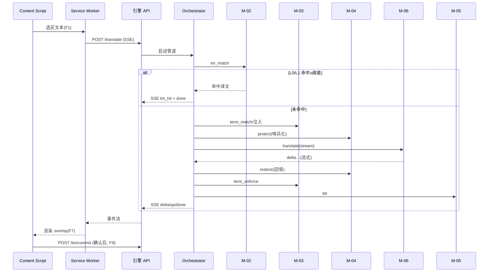

# OFCAT 模块设计书

**系统名称:** OFCAT — AI 增强型 CAT 浏览器工作台

---

## 文档管理信息

| 项目 | 内容 |
|---|---|
| 文档编号 | OFCAT-DD-M-001 |
| 文档名 | 模块设计书（详细设计 / 模块内部逻辑·算法） |
| 版本 | 第 1.0 版（草稿） |
| 创建日 | 2026-06-25 |
| 作者 | 架构师 |
| 状态 | 评审前草稿 |
| 密级 | 仅社内 |
| 上游文档 | [基础设计书 v1.0](../../02-基础设计/架构设计/OFCAT_基础设计书_v1.0.md) |

### 修订履历

| 版本 | 日期 | 修订者 | 修订内容 |
|---|---|---|---|
| 1.0 | 2026-06-25 | 架构师 | 初版。M-01~M-06 模块算法、参数、异常与复杂度 |

---

## 1. 前言

### 1.1 目的
定义本地引擎核心模块（承接基础设计 CMP-05~10）的**内部逻辑、算法、参数与异常处理**，作为实现依据。

### 1.2 模块一览

| 模块ID | 模块名 | 承接组件 | 关联功能 |
|---|---|---|---|
| M-01 | Orchestrator（编排） | CMP-05 | F2–F6 |
| M-02 | TM Service（记忆库匹配） | CMP-06 | F2,F9 |
| M-03 | Term Service（术语匹配/校验） | CMP-07 | F3,F4 |
| M-04 | Tag/Placeholder Protector（保护） | CMP-08 | F5 |
| M-05 | QA Service（质量校验） | CMP-09 | F4,F5 |
| M-06 | AI Gateway（模型网关/合规） | CMP-10 | F6,F10 |

### 1.3 全局参数（默认值，可在 settings 覆盖）

| 参数 | 默认 | 说明 |
|---|---|---|
| `FUZZY_THRESHOLD` | 85 | 模糊匹配采纳阈值（%） |
| `FUZZY_TOPK` | 5 | 模糊候选返回上限 |
| `LEN_WINDOW` | 0.30 | 候选长度窗口（±30%） |
| `VEC_TOPK` | 20 | 语义召回候选数 |
| `VEC_MIN_SCORE` | 0.80 | 语义召回最低余弦相似度 |
| `MODEL_TIMEOUT_S` | 20 | 单次模型调用超时（秒） |
| `MODEL_RETRY` | 2 | 失败重试次数 |
| `EMBED_DIM` | 1024 | bge-m3 向量维度 |

---

## 2. M-01 Orchestrator（编排）

### 2.1 状态对象（LangGraph State）
```python
class TransState(TypedDict):
    seg: str                 # 原文（含标签/占位符）
    src: str; tgt: str       # 语言对
    domain: str; project_id: int | None
    url: str; mode: str      # default | high_quality
    # 过程产物
    protected: str           # 哨兵化后的文本
    token_map: dict          # 哨兵 → 原标签/占位符
    tm_hit: dict | None      # {level, score, target}
    terms: list              # 命中术语约束
    draft: str               # 模型译文（哨兵态）
    restored: str            # 回填标签后的译文
    qa: dict                 # QA 结果
    result: dict             # 最终输出
```

### 2.2 节点流转
```
capture ─► tm_match ─┬─(L0 完全/L1 模糊≥阈值)─► respond
                     │
                     └─(miss)─► term_match ─► protect ─► translate
                                   ─► restore ─► term_enforce ─► qa ─► respond ─► persist
```
- `protect / restore / term_enforce / qa` 为**确定性节点**，不调用模型。
- `mode=high_quality` 时，`translate` 替换为多模型并行 + 评审子图（L3，后续实现），其余节点不变。

### 2.3 异常与中断
- 任一确定性节点抛错 → 进入 `respond` 并标记 `result.error`，不写回、不持久化。
- `translate` 节点的模型异常由 M-06 处理（重试/回退/合规阻断）。

---

## 3. M-02 TM Service（记忆库匹配）

### 3.1 文本规范化
```
normalize(text):
  t = NFKC(text)
  t = strip_outer_whitespace(t)
  t = collapse_internal_whitespace(t)   # 多空白→单空格
  return t
source_norm = normalize(seg)
source_hash = sha1(source_norm)         # 用于 L0
```
> 大小写：对 CJK 不折叠；对拉丁语种匹配时按 `case_insensitive` 设置另存 `source_norm_ci`（详见数据库设计）。

### 3.2 精确匹配（L0）
```
rows = SELECT target_text FROM translation_memory
       WHERE source_lang=:src AND target_lang=:tgt AND source_hash=:hash
       [AND domain=:domain] ORDER BY quality DESC, usage_count DESC LIMIT 1
若命中 → {level:'L0', score:100, target}
```
复杂度：O(1)（命中 `idx_tm_hash`）。

### 3.3 模糊匹配（L1）
```
1) 候选预过滤（SQL）：同语言对 + （可选 domain）
   AND source_len BETWEEN len*(1-LEN_WINDOW) AND len*(1+LEN_WINDOW)
2) 词面相似：对候选用 RapidFuzz token_sort_ratio(source_norm, cand_norm)
3) 语义召回（可选）：vec KNN top VEC_TOPK，过滤 cos≥VEC_MIN_SCORE，并入候选集
4) 综合分 = max(词面分, 语义分映射%)；取 ≥FUZZY_THRESHOLD 的前 FUZZY_TOPK
5) 命中最高分 → {level:'L1', score, target, diff}
   其中 diff = 原文与候选 source 的字符级差异（供 UI 高亮）
```
- 词面分为主排序依据（可解释）；语义分仅用于召回补充，不单独决定采纳。
- 复杂度：候选数 N → O(N) 词面计算 + O(log·)向量检索；N 受预过滤约束在百量级。

### 3.4 回存（F9）
```
commit(seg, target, langs, domain, project_id, origin='human'):
  norm = normalize(seg); h = sha1(norm)
  UPSERT by (source_lang,target_lang,domain,source_hash,project_id):
    存在 → 更新 target_text/quality/updated_at, usage_count+1
    不存在 → INSERT，并生成向量入 tm_vectors（异步）
  写 history(action='create'|'update')
```

---

## 4. M-03 Term Service（术语匹配/校验）

### 4.1 术语匹配（F3）
```
match_terms(seg_norm, src, tgt, domain, project_id):
  载入候选术语：同语言对 + (domain 或 domain='') + (project_id 或全局) + status='active'
  按 match_mode 匹配：
    - word：词边界匹配（CJK 用基于词典的 Aho-Corasick 多模式匹配）
    - substring：子串匹配
    - regex：正则匹配
  领域优先：同一 source_term 命中多条时，domain 精确 > 全局
  返回 [{source_term, target_term, forbidden, span}]
```
- 性能：术语集预构建 Aho-Corasick 自动机并缓存，单句匹配 O(len)。

### 4.2 术语注入
将命中术语整理为约束清单，交给 M-06 拼装进系统提示（见 §7.2）。注入只是“建议”，**强制性由 §4.3 保证**。

### 4.3 术语强制校验（F4）
```
enforce(translation, matched_terms):
  violations = []
  for t in matched_terms:
    if t.target_term not in translation:           # 约定译法缺失
        violations.append({term, type:'missing', suggest: t.target_term})
    for fb in t.forbidden:                          # 命中禁止译法
        if fb in translation:
            violations.append({term, type:'forbidden', found: fb, suggest: t.target_term})
  return violations
auto_fix（可选，仅 type='forbidden' 且唯一替换安全时）：
  translation.replace(fb, target_term)
```
- 上下文不可安全替换（多义/位置歧义）→ 仅标记，不自动改写（对应错误 E-05 同理的人工确认）。

---

## 5. M-04 Tag/Placeholder Protector（保护）

### 5.1 识别模式（优先级从上到下）
| 类型 | 正则（示意） |
|---|---|
| HTML/XML 标签 | `</?[a-zA-Z][^>]*>` |
| 双花括号变量 | `\{\{\s*[\w.]+\s*\}\}` |
| 单花括号占位 | `\{[\w.]+\}` |
| printf 占位 | `%(\d+\$)?[sdfx]` |
| 命名占位 | `%\w+%` / `:[a-zA-Z_]\w*` |

### 5.2 哨兵化与回填
```
protect(text):
  for each match m（按出现顺序）:
     ph = SENTINEL(i)              # 例 +index，PUA 区，模型极少改动
     token_map[ph] = m.text
     text = text.replace(m.text, ph, 1)
  return text, token_map

restore(translated, token_map):
  for ph, original in token_map:
     若 translated.count(ph) == 1 → 替换回 original
     否则 → 记 mismatch
  validate：所有哨兵均一对一回填，无残留、无丢失
  失败 → 抛 ProtectError（交 QA/编排，禁止写回）
```
- 位置可移动（语序差异），但**数量必须一致**；多语种顺序变化由 token 唯一性保证可回填。

---

## 6. M-05 QA Service（质量校验）

### 6.1 规则集

| 规则ID | 名称 | 判定 | 严重度 |
|---|---|---|---|
| QA-01 | 标签/占位符数量一致 | 原文与译文哨兵/标签计数相等 | 阻断 |
| QA-02 | 术语合规 | M-03 enforce 无 missing/forbidden | 阻断 |
| QA-03 | 数字一致 | 原文与译文数字多重集一致（允许本地化格式差异，可配置） | 警告 |
| QA-04 | 非空/长度 | 译文非空且长度比在合理区间（防截断/复读） | 警告 |
| QA-05 | 禁用字符 | 无控制字符、无残留哨兵 | 阻断 |

### 6.2 输出
```
qa = {pass: bool, blocks: [..], warns: [..]}
pass = (无 blocks)
```
- `blocks` 非空 → 编排标记 `result.qa_failed`，UI 标红并禁止自动写回（E-05）。

---

## 7. M-06 AI Gateway（模型网关 / 合规）

### 7.1 合规路由（F10，fail-closed）
```
route(url, project_id, settings):
  sensitive = is_sensitive(url, project_id, settings)   # 域名清单 + 项目标记（O6）
  if sensitive:
     ep = settings.local_endpoint
     if not healthy(ep): raise ComplianceBlocked  # 不回退云端
     return ep, settings.local_model
  else:
     return settings.cloud_endpoint, settings.cloud_model
```
- 判定优先级：项目标记 > 域名黑名单 > 域名白名单 > 默认策略。未知默认按设置（建议默认非敏感→可云端，敏感清单维护见 O6）。

### 7.2 提示拼装
```
system = [
  领域设定(domain),
  "必须保留所有形如 n 的占位标记，原样、数量不变。",
  术语约束清单：每条 "<source_term> 必须译为 <target_term>；禁止 <forbidden>",
  目标语言/风格,
]
user = protected_text
```
- 术语约束同时注入（建议）+ 译后强制校验（保证），双保险。

### 7.3 调用与回退
```
call(ep, model, messages, stream=True):
  for attempt in range(MODEL_RETRY+1):
     try: yield from litellm.completion(stream, timeout=MODEL_TIMEOUT_S, ...)
     except Timeout/Transient:
         若非敏感且有备用模型 → 切备用；否则继续重试
  超过重试 → raise ModelError
```
- 流式：首个 token 即经 SSE `delta` 透传给扩展（NFR-05）。
- 敏感路径**禁止**回退到云端备用（合规优先于可用）。

---

## 8. 模块间时序（选区翻译主流程）



---

## 9. 复杂度与性能要点

| 模块 | 关键路径复杂度 | 备注 |
|---|---|---|
| M-02 L0 | O(1) | 哈希索引 |
| M-02 L1 | O(N) 词面 + O(log) 向量 | N 受预过滤约束（百量级） |
| M-03 | O(len) | Aho-Corasick 缓存自动机 |
| M-04 | O(len) | 单遍正则扫描 |
| M-05 | O(len) | 计数/集合比较 |
| M-06 | 受模型 RTT 支配 | 流式首字 ~1s（NFR-05） |
