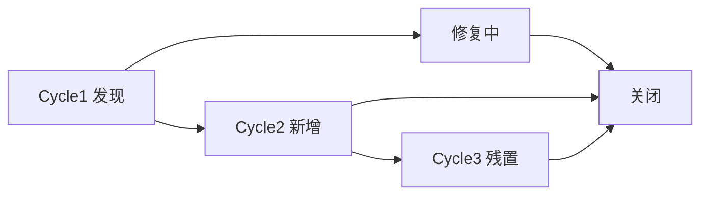

# CATs システムテスト報告 テンプレート v1.0

> **文档编号**：CATs-ST-REP-001
> **バージョン**：v1.0
> **作成日**：2026-08-26
> **作者**：架构师 + QA（worker 代签 per DEC-008）
> **タスク**：150 タスク #76-89 全体（P2 索引 #49）
> **触发节点**：M2 末
> **关联文档**：
>   - [CATs_需求规格说明书 v2.0 §5 RTM](../../01-需求/需求规格说明/CATs_需求规格说明书_v2.0.md)
>   - [CATs_测试设计书 v1.0](../../04-测试/测试设计书/CATs_测试设计书_v1.0.md)
>   - [CATs_ADR-001 微服务架构 v1.0](../../02-基础设计/决策/CATs_ADR-001_微服务架构_v1.0.md)
>   - [CATs_要件承認決議書 v1.0 §3.1 11 大功能基线](../../05-其他/评审记录/CATs_要件承認決議書_v1.0.md)

---

## 文档管理信息

### 审批栏

| 役割 | 氏名 | 承認 | 日付 | 備考 |
|------|------|------|------|------|
| 起案 | 架构师 + QA | ☑ | 2026-08-26 | worker 代签 per DEC-008 |
| レビュー | — | ☐ | — | 評価会前 |
| 承認 | — | ☐ | — | 評価会前 |

### 修订履历

| バージョン | 日付 | 改訂者 | 改訂内容 |
|------|------|--------|----------|
| **v1.0** | **2026-08-26** | **架构师 + QA** | **P2 索引 #49 模板落地：报告期 + 范围 + 用例执行 + 缺陷 + 覆盖率 + SLO + 出口准则 + 结论 + 签字** |

---

## 1. 报告期

| 項目 | 内容 |
|------|------|
| 报告编号 | CATs-ST-REP-{yyyyMMdd}-{NN} |
| 报告対象フェーズ | システムテスト（ST） |
| 报告期间 | {start_date} 〜 {end_date}（目安 4 週間） |
| テストサイクル | サイクル 1 / 2 / 3（回帰含む） |
| 環境 | ST 環境（本番同等の K3s クラスタ、性能検証は PT 環境） |
| 关联测试设计 | CATs_测试设计书 v1.0 |

---

## 2. テスト範囲

### 2.1 范围（In-Scope）

| # | 対象 | 詳細 |
|---|------|------|
| 1 | 機能テスト | F01~F11（需求规格说明书 v2.0 §3） |
| 2 | API テスト | gRPC + REST、IDL 契約 |
| 3 | UI テスト | Web / Tauri / Chrome 拡張 |
| 4 | データ整合性 | PG / Kafka / MinIO / Redis |
| 5 | セキュリティ | OWASP Top 10、認証 / 認可 / 暗号化 |
| 6 | 性能 / 負荷 | 別冊 PT レポート参照（任务 #80） |
| 7 | 障害注入 | 別冊 障害試験レポート参照（任务 #84） |
| 8 | セキュリティ専門 | 別冊 セキュリティ試験レポート参照（任务 #83） |
| 9 | 互換性 | ブラウザ / OS / ファイル形式 |
| 10 | インストール / アンインストール | Tauri / WXT / 拡張 |

### 2.2 范围外（Out-of-Scope）

| # | 項目 | 理由 |
|---|------|------|
| 1 | UAT | M3 フェーズで実施 |
| 2 | 本番性能 | PT 環境では検証、本番同等は PT レポートで扱う |
| 3 | 外部システム統合 | モックで代替 |
| 4 | データ移行 | 別冊（迁移要件 v1.0） |

### 2.3 RTM 整合

| 需求 ID | 需求名 | 测试级别 | 用例 ID 範囲 | 結果 |
|--------|--------|----------|--------------|------|
| F01 | 多租户与工作空间 | UT/IT/ST | TC-F01-001 ~ 050 | {Pass/Fail} |
| F02 | 极简客户端与采集 | UT/IT/ST | TC-F02-001 ~ 080 | {Pass/Fail} |
| F03 | 确定性 TM 与术语 | UT/IT/ST | TC-F03-001 ~ 120 | {Pass/Fail} |
| F04 | AI 多模型协同与合规 | IT/ST | TC-F04-001 ~ 060 | {Pass/Fail} |
| F05 | 音视频 ASR 与字幕 | IT/ST | TC-F05-001 ~ 050 | {Pass/Fail} |
| F06 | PDF 版面保留与 OCR | IT/ST | TC-F06-001 ~ 040 | {Pass/Fail} |
| F07 | Office 转换与回写 | IT/ST | TC-F07-001 ~ 060 | {Pass/Fail} |
| F08 | 游戏本地化引擎 | IT/ST | TC-F08-001 ~ 050 | {Pass/Fail} |
| F09 | 智能质量校验 QA | UT/IT/ST | TC-F09-001 ~ 080 | {Pass/Fail} |
| F10 | 交付物渲染与导出 | IT/ST | TC-F10-001 ~ 030 | {Pass/Fail} |
| F11 | 配额、审计与运维 | IT/ST | TC-F11-001 ~ 050 | {Pass/Fail} |

---

## 3. 用例执行统计

### 3.1 总体

| 項目 | 件数 | 比率 |
|------|-----:|-----:|
| 総用例数 | {N_total} | 100% |
| 実行済 | {N_executed} | {pct}% |
| 未実行 | {N_skipped} | {pct}% |
| 合格 | {N_pass} | {pct}% |
| 失敗 | {N_fail} | {pct}% |
| 阻塞 | {N_block} | {pct}% |
| 未実施 | {N_not_run} | {pct}% |

### 3.2 サイクル別

| サイクル | 期間 | 合格 | 失敗 | 阻塞 | 備考 |
|----------|------|-----:|-----:|-----:|------|
| Cycle 1 | {date} ~ {date} | {n} | {n} | {n} | 初期実行 |
| Cycle 2 | {date} ~ {date} | {n} | {n} | {n} | 1 回目回帰 |
| Cycle 3 | {date} ~ {date} | {n} | {n} | {n} | 最終回帰 |

### 3.3 重要度別

| 重要度 | 総数 | 合格 | 失敗 | 阻塞 | 通過率 |
|--------|-----:|-----:|-----:|-----:|-------:|
| Critical | {n} | {n} | {n} | {n} | {pct}% |
| High | {n} | {n} | {n} | {n} | {pct}% |
| Medium | {n} | {n} | {n} | {n} | {pct}% |
| Low | {n} | {n} | {n} | {n} | {pct}% |

---

## 4. 缺陷统计

### 4.1 缺陷総数と重要度

| 严重度 | 件数 | 未关闭 | 关闭 | 关闭率 |
|--------|-----:|------:|-----:|------:|
| **S1（致命）** | {n} | {n} | {n} | {pct}% |
| S2（严重） | {n} | {n} | {n} | {pct}% |
| S3（一般） | {n} | {n} | {n} | {pct}% |
| S4（提示） | {n} | {n} | {n} | {pct}% |
| **合計** | **{n}** | **{n}** | **{n}** | **{pct}%** |

### 4.2 缺陷密度

| 項目 | 値 |
|------|-----:|
| テスト対象 KLOC | {n} |
| 缺陷密度 | {n} / KLOC |
| 業界平均参考 | 0.5 ~ 1.5 / KLOC |

### 4.3 Top-5 缺陷（残置）

| # | 缺陷 ID | 概要 | 严重度 | 状态 | 责任 | 关闭期限 |
|---|---------|------|:------:|------|------|----------|
| 1 | {BUG-xxx} | {概要} | S1/S2 | Open/In-progress | {name} | {date} |
| 2 | ... | ... | ... | ... | ... | ... |
| 3 | ... | ... | ... | ... | ... | ... |
| 4 | ... | ... | ... | ... | ... | ... |
| 5 | ... | ... | ... | ... | ... | ... |

### 4.4 缺陷トレンド

> 推奨：Cycle3 終了時の S1/S2 残置 0 件が出口准则。

---

## 5. 覆盖率

### 5.1 テストカバレッジ

| 维度 | 目标 | 実測 | 判定 |
|------|-----:|-----:|:----:|
| 需求覆盖率（RTM） | 100% | {pct}% | ☐ / ✅ / ⚠️ |
| コード行カバレッジ | ≥ 80% | {pct}% | ☐ / ✅ / ⚠️ |
| コード分支カバレッジ | ≥ 70% | {pct}% | ☐ / ✅ / ⚠️ |
| API エンドポイント | 100% | {pct}% | ☐ / ✅ / ⚠️ |
| UI コンポーネント | ≥ 90% | {pct}% | ☐ / ✅ / ⚠️ |
| サービス間 gRPC | 100% | {pct}% | ☐ / ✅ / ⚠️ |
| Kafka topic | 100% | {pct}% | ☐ / ✅ / ⚠️ |
| DB スキーマ | 100% | {pct}% | ☐ / ✅ / ⚠️ |

### 5.2 未カバー項目

| # | 項目 | 理由 | 代替検証 |
|---|------|------|----------|
| 1 | {項目} | {理由} | {代替} |
| 2 | ... | ... | ... |

---

## 6. SLO 达成

引用：[CATs_需求规格说明书 v2.0 §4.1](../../01-需求/需求规格说明/CATs_需求规格说明书_v2.0.md)

| 指标 | 目标 | 実測 | 判定 | 备注 |
|------|-----:|-----:|:----:|------|
| TM 100% 精确匹配 P99 | ≤ 100 ms | {ms} | ☐ / ✅ / ⚠️ | ST 環境 |
| 向量检索 P95 | ≤ 50 ms | {ms} | ☐ / ✅ / ⚠️ | 100 万句段规模 |
| ASR 处理比 | ≤ 0.3x | {x} | ☐ / ✅ / ⚠️ | GPU 加速 |
| Web 首屏 LCP | ≤ 1.2 s | {s} | ☐ / ✅ / ⚠️ | 1Gbps |
| 并发用户 | 50~3000 | {n} | ☐ / ✅ / ⚠️ | 詳細は PT レポート |

> 詳細性能データは [CATs_性能試験（PT）レポート v1.0](./CATs_性能試験（PT）レポート_テンプレート_v1.0.md) を参照。

---

## 7. 出口准则核对

引用：[CATs_测试设计书 v1.0 §出口准则](../../04-测试/测试设计书/CATs_测试设计书_v1.0.md)

| # | 出口准则項目 | 阈值 | 実測 | 判定 |
|---|--------------|------|------|:----:|
| 1 | S1 缺陷残置 | 0 件 | {n} | ☐ / ✅ / ⚠️ |
| 2 | S2 缺陷残置 | 0 件（次フェーズ持ち越し 5 件以内承認） | {n} | ☐ / ✅ / ⚠️ |
| 3 | 需求 RTM 覆盖率 | 100% | {pct}% | ☐ / ✅ / ⚠️ |
| 4 | コードカバレッジ | 行 ≥ 80% | {pct}% | ☐ / ✅ / ⚠️ |
| 5 | 重要 NFR SLO | 全項目达成 | {n}/{N} | ☐ / ✅ / ⚠️ |
| 6 | セキュリティ重大脆弱性 | 0 件 | {n} | ☐ / ✅ / ⚠️ |
| 7 | 重大障害試験ケース | 全件 PASS | {n}/{N} | ☐ / ✅ / ⚠️ |
| 8 | 回帰テスト | 全件 PASS | {n}/{N} | ☐ / ✅ / ⚠️ |
| 9 | 客户 UAT 受入準備 | 整う | {bool} | ☐ / ✅ / ⚠️ |
| 10 | 文档完备（设计 / 手册 / Runbook） | 完備 | {bool} | ☐ / ✅ / ⚠️ |

> 出口准则未达成の項目は「8. 結論」の差し戻し判断材料とする。

---

## 8. 結論

### 8.1 总体评价

| 観点 | 评价 | 摘要 |
|------|:----:|------|
| 機能完成度 | ☐ / ✅ / ⚠️ | {summary} |
| 性能达成度 | ☐ / ✅ / ⚠️ | {summary} |
| 安定性 | ☐ / ✅ / ⚠️ | {summary} |
| セキュリティ | ☐ / ✅ / ⚠️ | 詳細：セキュリティ試験レポート参照 |
| 障害耐性 | ☐ / ✅ / ⚠️ | 詳細：障害試験レポート参照 |

### 8.2 リリース可否判定

| 判定 | 適用条件 |
|------|----------|
| ☐ **Go（条件付き）** | 出口准则 10/10 达成、且つ S1=0、S2≤5 の残置は計画化済 |
| ☐ **Go** | 出口准则全項目达成、残置 S2 = 0 |
| ☐ **No-Go** | 出口准则未达成、または S1 残置 > 0 |
| ☐ **Hold** | 重大障害あり、修正後に再判定 |

> **本回判定**：`{Go / Go（条件付き） / No-Go / Hold}`

### 8.3 残置リスクと対策

| リスク | 影響 | 対策 | 责任 | 期限 |
|--------|------|------|------|------|
| {risk} | {impact} | {mitigation} | {owner} | {date} |
| ... | ... | ... | ... | ... |

### 8.4 次フェーズへの引継ぎ

- UAT 開始日：{date}
- 残置 S2 修正計画：{plan}
- 性能チューニング継続：{plan}
- 文档 / Runbook 引継ぎ：{links}

---

## 9. 签字

| 役割 | 氏名 | 判定 | 签字 | 日付 |
|------|------|------|------|------|
| QA Lead | — | ☐ Go / ☐ No-Go / ☐ Hold | — | — |
| テストマネージャー | — | ☐ Go / ☐ No-Go / ☐ Hold | — | — |
| 架构师 | — | ☐ Go / ☐ No-Go / ☐ Hold | — | — |
| PM | — | ☐ Go / ☐ No-Go / ☐ Hold | — | — |
| SRE Lead | — | ☐ Go / ☐ No-Go / ☐ Hold | — | — |
| Sponsor | — | ☐ Go / ☐ No-Go / ☐ Hold | — | — |

> 6 / 6 同意、または Sponsor 1 票で最終決定。

---

## 10. 引用と関連

| ドキュメント | 引用点 |
|--------------|--------|
| CATs_需求规格说明书 v2.0 | §3 F01~F11、§4 NFR、§5 RTM |
| CATs_ADR-001 微服务架构 v1.0 | §3 15 服务 + 4 共享库 |
| CATs_ADR-002 gRPC 通信 v1.0 | §3 gRPC + Kafka |
| CATs_ADR-003 数据存储选型 v1.0 | §3 PG + pgvector |
| CATs_ADR-005 认证与多租户 v1.0 | §3 Keycloak + RBAC + ABAC |
| CATs_测试设计书 v1.0 | §出口准则 |
| CATs_要件承認決議書 v1.0 | §3.1 11 大功能基线 |
| CATs_性能試験（PT）レポート v1.0 | §6 SLO 詳細 |
| CATs_セキュリティ試験レポート v1.0 | §4 OWASP + §5 GDPR/PIPL |
| CATs_障害試験レポート v1.0 | §5 RTO/RPO 実測 |

---

## 11. 待办 / Open Items

| # | 項目 | 责任 | 期望关闭 |
|---|------|------|----------|
| OI-1 | サイクル3 終了時の S1 残置 0 化 | 開発 Lead | M2 末 |
| OI-2 | S2 残置 5 件以内の計画化 | QA + 開発 | M2 末 |
| OI-3 | PT / セキュリティ / 障害 各レポート完成 | 各 Lead | M2 末 |
| OI-4 | UAT 引き継ぎチェックリスト | QA | M3 初 |

---

**文档结束（v1.0 システムテスト報告 テンプレート）**
