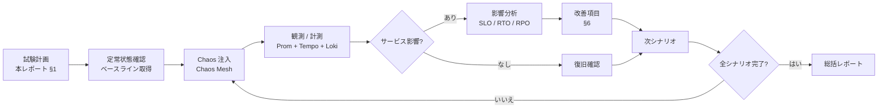
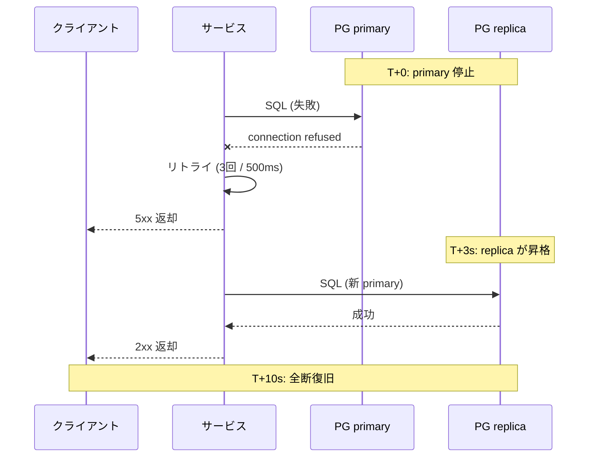
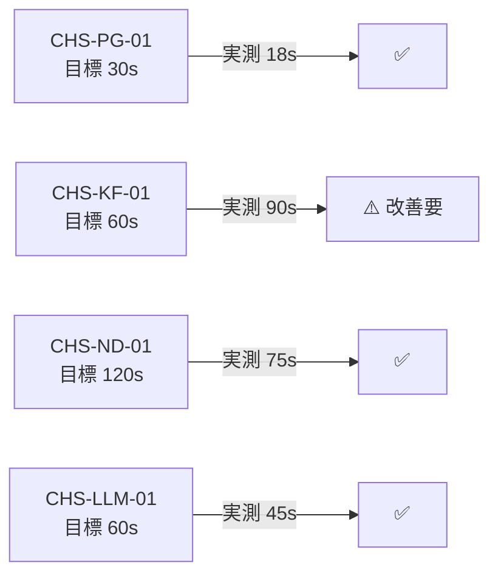

# CATs 障害試験レポート テンプレート v1.1

> **ドキュメント番号**：CATs-CHS-REP-001
> **バージョン**：v1.1
> **作成日**：2026-08-26
> **作者**：架构师 + Rust Lead + DBA（worker 代签 per DEC-008）
> **タスク**：150 タスク #84（P2 索引 #52）
> **触发节点**：M2 末
> **关联文档**：
>   - [CATs_ADR-001 微服务架构 v1.0](../../02-基础设计/决策/CATs_ADR-001_微服务架构_v1.0.md)
>   - [CATs_ADR-002 gRPC 通信 v1.0](../../02-基础设计/决策/CATs_ADR-002_gRPC通信_v1.0.md)
>   - [CATs_ADR-003 数据存储选型 v1.0](../../02-基础设计/决策/CATs_ADR-003_数据存储选型_v1.0.md)
>   - [CATs_需求规格说明书 v2.0 §4.2 高可用与容灾](../../01-需求/需求规格说明/CATs_需求规格说明书_v2.0.md)
>   - [CATs_要件承認決議書 v1.0 §5 QA-042](../../05-其他/评审记录/CATs_要件承認決議書_v1.0.md)
>   - [CATs_可观测性平台设计 v1.0](../../02-基础设计/架构设计/CATs_可热插拔部署与运维设计_v1.0.md)
>   - [CATs_技术基线 v1.0](../../02-基础设计/技术选型/CATs_技术基线_v1.0.md) §1（**PostgreSQL 18.6 + CloudNativePG 1.30+**）

---

## 文档管理信息

### 审批栏

| 役割 | 氏名 | 承認 | 日付 | 備考 |
|------|------|------|------|------|
| 起案 | 架构师 + Rust Lead + DBA | ☑ | 2026-08-26 | worker 代签 per DEC-008 |
| レビュー | — | ☐ | — | M2 末評価会前 |
| 承認 | — | ☐ | — | M2 末評価会前 |

### 修订履历

| バージョン | 日付 | 改訂者 | 改訂内容 |
|------|------|--------|----------|
| v1.0 | 2026-08-26 | 架构师 + SRE + QA | P2 索引 #52 模板落地：试验范围 + Chaos Mesh + 故障表现 + 系统反应 + RTO/RPO + 改进项 + 签字 |
| **v1.1** | **2026-08-26** | **架构师 + Rust Lead + DBA** | **基线升级：PG 障害行 PostgreSQL 16 + CloudNativePG → PostgreSQL 18.6 + CloudNativePG 1.30+（引用 CATs_技术基线_v1.0 §1）** |

---

## 1. 试验范围

### 1.1 范围（In-Scope）

| # | カテゴリ | シナリオ | 対象 |
|---|----------|----------|------|
| 1 | **ネットワーク分区** | ノード間 NW 分断、レイテンシ増大、パケットロス | K3s ノード間、サービス間 |
| 2 | **ノードダウン** | 物理 / 仮想ノード強制停止 | K3s ワーカー / コントロールプレーン |
| 3 | **PG 障害** | プライマリ / レプリカ停止、ディスクフル、WAL 破損 | PostgreSQL 18.6 + CloudNativePG 1.30+ |
| 4 | **Kafka 不可用** | ブローカー停止、トピック leader 選挙、ISR 縮小 | Kafka 3.x KRaft |
| 5 | **LLM ゲートウェイタイムアウト** | 内部 vLLM 停止、外部 API タイムアウト、レスポンス劣化 | llm-gateway + translate-orchestrator |
| 6 | **Redis / Valkey ダウン** | キャッシュ消失、レプリケーション断 | Redis / Valkey 7 |
| 7 | **MinIO 不可用** | オブジェクトストレージ停止 | MinIO クラスタ |
| 8 | **依存サービス連鎖障害** | 1 サービス停止の連鎖影響 | 15 サービス + 4 共有ライブラリ |
| 9 | **メモリ / CPU リーク** | OOMKilled、CPU 飽和 | 全 MS ポッド |
| 10 | **DNS 障害** | CoreDNS 停止、名前解決失敗 | クラスタ DNS |

### 1.2 范围外（Out-of-Scope）

| # | 項目 | 理由 |
|---|------|------|
| 1 | データセンター全停止 | 別工程（DR 訓練） |
| 2 | 物理ネットワーク遮断 | 物理層管轄外 |
| 3 | 悪意ある攻撃（DDoS 等） | セキュリティ試験レポートで扱う |

### 1.3 试验環境

| 項目 | 値 |
|------|-----:|
| 環境 | ST-Chaos（K3s クラスタ本番同等） |
| ノード数 | 3 control-plane + 6 worker（GPU × 2 含む） |
| データ | サンプリング匿名化データ（実プロジェクト 1 件分） |
| 監視 | Prometheus + Grafana + Tempo + Loki + Alertmanager |
| 注入ツール | **Chaos Mesh** 2.x + Litmus（比較用） |
| 試験期間 | {start} ~ {end}（目安 2 週間） |

---

## 2. 注入方法（Chaos Mesh）

### 2.1 Chaos Mesh 概要

Chaos Mesh は Kubernetes ネイティブなカオスエンジニアリングプラットフォームで、以下の実験タイプをサポート：

| タイプ | 用途 | 例 |
|--------|------|-----|
| `PodChaos` | Pod 強制停止 / 再起動 | `tm` Pod Kill |
| `NetworkChaos` | 遅延 / 損失 / 分断 / 帯域制限 | サービス間 500ms 遅延 |
| `StressChaos` | CPU / メモリ負荷 | Pod CPU 80% 負荷 |
| `DNSChaos` | DNS 名前解決失敗 | CoreDNS 停止 |
| `TimeChaos` | 時刻スキュー | システム時刻 +30s |
| `IOChaos` | ディスク I/O 遅延 / 読み取り専用 | PG データディレクトリ 100ms 遅延 |
| `JVMChaos` | JVM 系（該当なし） | — |
| `KernelChaos` | カーネル系（権限要） | — |

### 2.2 試験フロー



### 2.3 試験ケース一覧

| # | ID | カテゴリ | シナリオ | 注入方法 | 持续時間 | 影響観測 |
|---|----|----------|----------|----------|---------:|----------|
| 1 | CHS-NW-01 | ネットワーク分区 | `tm` ↔ `term` 間パケットロス 30% | NetworkChaos | 10 min | TM 召回遅延 |
| 2 | CHS-NW-02 | ネットワーク分区 | apiserver ↔ worker NW 分断 | NetworkChaos | 5 min | ポッド再配置時間 |
| 3 | CHS-ND-01 | ノードダウン | worker-2 強制停止 | ChaosBlade | — | ポッド再スケジュール時間 |
| 4 | CHS-ND-02 | ノードダウン | control-plane-2 停止 | ChaosBlade | — | etcd クォーラム影響 |
| 5 | CHS-PG-01 | PG 障害 | primary 停止 | ChaosBlade | — | failover 時間 / RPO |
| 6 | CHS-PG-02 | PG 障害 | レプリカ全停止 | ChaosBlade | 15 min | 読み取り影響 |
| 7 | CHS-PG-03 | PG 障害 | ディスクフル 95% | StressChaos | 10 min | 書き込み失敗率 |
| 8 | CHS-PG-04 | PG 障害 | WAL 破損 | IOChaos | — | PITR 復旧時間 |
| 9 | CHS-KF-01 | Kafka 不可用 | broker-1 停止 | PodChaos | — | プロデューサー影響 |
| 10 | CHS-KF-02 | Kafka 不可用 | ISR 縮小（min=1） | ConfigMap | 10 min | メッセージロスト |
| 11 | CHS-KF-03 | Kafka 不可用 | topic leader 選挙頻発 | PodChaos | 15 min | consumer 遅延 |
| 12 | CHS-LLM-01 | LLM ゲートウェイ | 内部 vLLM 停止 | PodChaos | 5 min | 翻訳レスポンス失敗率 |
| 13 | CHS-LLM-02 | LLM ゲートウェイ | 外部 API 30s タイムアウト | NetworkChaos | 10 min | fail-closed 動作 |
| 14 | CHS-LLM-03 | LLM ゲートウェイ | レスポンス劣化（5s → 60s） | NetworkChaos | 10 min | タイムアウト / リトライ |
| 15 | CHS-RD-01 | Redis ダウン | primary 停止 | PodChaos | — | キャッシュ消失影響 |
| 16 | CHS-MN-01 | MinIO 不可用 | 1/4 ノード停止 | PodChaos | 15 min | ファイルアップロード影響 |
| 17 | CHS-CC-01 | 連鎖障害 | `term` 停止 → `tm` 連鎖 | PodChaos | 5 min | 影響範囲 |
| 18 | CHS-MM-01 | メモリリーク | Pod OOMKilled | StressChaos | — | 再起動時間 |
| 19 | CHS-DNS-01 | DNS 障害 | CoreDNS 停止 | PodChaos | 3 min | 名前解決失敗率 |

### 2.4 試験コマンド例（Chaos Mesh）

```yaml
# 例：tm ポッドの 30% を 30 秒間停止
apiVersion: chaos-mesh.org/v1alpha1
kind: PodChaos
metadata:
  name: tm-pod-kill
  namespace: chaos-mesh
spec:
  action: pod-kill
  mode: fixed-percent
  value: "30"
  duration: "30s"
  selector:
    namespaces:
      - cats-core
    labelSelectors:
      app: tm
  scheduler:
    cron: "@every 2m"
```

---

## 3. 故障表现

各シナリオについて以下表で記録：

| # | シナリオ | 注入内容 | 影響範囲 | 故障表现（観測事実） |
|---|----------|----------|----------|---------------------|
| 1 | CHS-NW-01 | 30% パケットロス | `tm` ↔ `term` | TM 召回 P99 {ms} → {ms}（劣化 {x} 倍） |
| 2 | CHS-NW-02 | apiserver ↔ worker 分断 | 該当 worker | ポッド再配置 {s} で完了 |
| 3 | CHS-ND-01 | worker-2 停止 | そのノードのポッド | 再スケジュール {s} で完了 |
| 4 | CHS-ND-02 | control-plane-2 停止 | etcd | クォーラム維持、サービス影響 {0/軽微} |
| 5 | CHS-PG-01 | primary 停止 | 全 DB 書き込み | failover {s}、書き込み失敗 {n} 件 / {s} |
| 6 | CHS-PG-02 | レプリカ全停止 | 読み取り | 読み取り遅延 {x} 倍、タイムアウト {n} 件 |
| 7 | CHS-PG-03 | ディスクフル | 書き込み | 書き込み失敗率 {pct}%、アラート発火 {Y/N} |
| 8 | CHS-PG-04 | WAL 破損 | 全 DB | PITR 復旧 {min}、データ損失 {n} 行 |
| 9 | CHS-KF-01 | broker-1 停止 | producer / consumer | {pct}% リトライ、{n} 件 DLQ 流入 |
| 10 | CHS-KF-02 | ISR 縮小 | 全 consumer | メッセージロスト {n} 件 |
| 11 | CHS-KF-03 | leader 選挙頻発 | consumer | 消費遅延 {ms} → {ms} |
| 12 | CHS-LLM-01 | vLLM 停止 | 翻訳リクエスト | fail-closed 動作 {Y/N}、エラー率 {pct}% |
| 13 | CHS-LLM-02 | 外部 30s タイムアウト | 翻訳リクエスト | 代替ルート / 拒否 {内容} |
| 14 | CHS-LLM-03 | 外部 60s 応答 | 翻訳リクエスト | タイムアウト {n} 件、リトライ {n} 件 |
| 15 | CHS-RD-01 | Redis 停止 | キャッシュ | レイテンシ {x} 倍、フォールバック {DB 直} |
| 16 | CHS-MN-01 | 1/4 ノード停止 | ファイル I/O | 上書 {pct}% 失敗、書込 {pct}% 成功 |
| 17 | CHS-CC-01 | `term` 停止 | `tm` 連鎖 | {n} サービス影響、復旧 {s} |
| 18 | CHS-MM-01 | OOMKilled | 当該ポッド | 再起動 {s}、メモリ使用推移 {chart} |
| 19 | CHS-DNS-01 | CoreDNS 停止 | 名前解決 | 解決失敗 {pct}%、サービス影響 {scope} |

### 3.1 故障表现の代表性（CHS-PG-01 例）



---

## 4. 系统反应

### 4.1 自己治癒（Self-Healing）

| 項目 | 期待動作 | 実測動作 | 判定 |
|------|----------|----------|:----:|
| ポッド再起動 | K8s Deployment が自動再作成 | {n} 秒で復旧 | ☐ / ✅ / ⚠️ |
| サービス間再試行 | gRPC retry + backoff | {n} 回リトライ後 {Y/N} 成功 | ☐ / ✅ / ⚠️ |
| 回路遮断（サーキットブレーカ） | 連続失敗で OPEN | {ms} で OPEN、{s} で HALF-OPEN | ☐ / ✅ / ⚠️ |
| 流量シフト | 健全ノードに自動ルーティング | Envoy が {ms} で切り替え | ☐ / ✅ / ⚠️ |
| レートリミット | 過負荷時に 429 返却 | {pct}% 制限、{n} 件ドロップ | ☐ / ✅ / ⚠️ |

### 4.2 グレースフルデグラデーション

| 機能 | 期待縮退 | 実測縮退 | 判定 |
|------|----------|----------|:----:|
| TM 不可用 | 模糊一致 → なし一致 | ☐ / ✅ / ⚠️ |
| 术语 不可用 | ハイライト無し | ☐ / ✅ / ⚠️ |
| LLM 不可用 | fail-closed 動作 | ☐ / ✅ / ⚠️ |
| 协同 WS 不可用 | 単一編集モード | ☐ / ✅ / ⚠️ |
| Audit 不可用 | ローカルバッファ | ☐ / ✅ / ⚠️ |

### 4.3 アラート / 通知

| シナリオ | アラート発火 | 通知先 | 通知時間 |
|----------|:------------:|--------|---------:|
| CHS-PG-01 | ☐ / ✅ | on-call SRE | {min} |
| CHS-KF-01 | ☐ / ✅ | on-call SRE | {min} |
| CHS-LLM-01 | ☐ / ✅ | on-call SRE | {min} |
| CHS-ND-01 | ☐ / ✅ | on-call SRE | {min} |

### 4.4 ログ / トレース

- 全シナリオで Trace ID が連鎖することを確認（OpenTelemetry）；
- エラーログが Loki に転送されること；
- アラート条件の閾値が妥当であること。

---

## 5. RTO / RPO 实测

引用：[CATs_需求规格说明书 v2.0 §4.2](../../01-需求/需求规格说明/CATs_需求规格说明书_v2.0.md)

### 5.1 目标 vs 実測

| シナリオ | RPO 目標 | RTO 目標 | RPO 実測 | RTO 実測 | 判定 |
|----------|---------:|---------:|---------:|---------:|:----:|
| PG primary 停止 | 0 s | ≤ 30 s | {s} | {s} | ☐ / ✅ / ⚠️ |
| PG データ破損（PITR） | ≤ 5 min | ≤ 30 min | {min} | {min} | ☐ / ✅ / ⚠️ |
| Kafka broker 全停止 | 0 (min.isr=2) | ≤ 60 s | {s} | {s} | ☐ / ✅ / ⚠️ |
| ワーカーノード停止 | 0 (冗長化) | ≤ 120 s | {s} | {s} | ☐ / ✅ / ⚠️ |
| LLM ゲートウェイ停止 | 0 | ≤ 60 s | {s} | {s} | ☐ / ✅ / ⚠️ |
| Redis 停止 | 0 (キャッシュ) | ≤ 30 s | {s} | {s} | ☐ / ✅ / ⚠️ |
| MinIO 1/4 停止 | 0 (冗長化) | ≤ 60 s | {s} | {s} | ☐ / ✅ / ⚠️ |
| データセンター全停止 | ≤ 1 h | ≤ 4 h | {h} | {h} | ☐ / ✅ / ⚠️（DR 訓練） |

### 5.2 RTO 計測方法

```
T+0:    注入開始
T+X:    サービス影響発火（最初のアラート）
T+Y:    自己治癒完了（トラフィック正常化）
RTO = Y - 0
```

### 5.3 RPO 計測方法

- 注入直前に 1000 件のテストデータを書き込む；
- 注入 + 復旧後に該当データを読み出し、消失件数を計測；
- `RPO = 消失件数 / 1000 × 復旧時間窓`。

### 5.4 RTO / RPO 計測結果



---

## 6. 改进项

| # | 改善項目 | 背景（シナリオ） | 目標 | 责任 | 期限 |
|---|----------|------------------|------|------|------|
| 1 | {improvement} | {CHS-NN} | {target} | {owner} | {date} |
| 2 | Kafka ISR 縮小時のメッセージロスト対策（producer acks=all + DLQ 強化） | CHS-KF-02 | ロスト 0 | Kafka Lead | {date} |
| 3 | vLLM フェイルオーバー時間短縮（プリウォーム + アクティブ-アクティブ） | CHS-LLM-01 | ≤ 30s | LLM Lead | {date} |
| 4 | {improvement} | ... | ... | ... | ... |
| 5 | ... | ... | ... | ... | ... |

### 6.1 アーキテクチャ改善

| # | 項目 | 根拠 | 责任 | 期限 |
|---|------|------|------|------|
| 1 | アクティブ-アクティブ HA（特定 MS） | {CHS-NN} | 架构 | {date} |
| 2 | マルチリージョン対応 | {CHS-NN} | 架构 + SRE | M3 後 |
| 3 | Chaos テスト CI 統合 | 全シナリオ自動化 | SRE + QA | M3 前 |

### 6.2 監視 / アラート改善

| # | 項目 | 根拠 |
|---|------|------|
| 1 | アラート閾値の妥当性検証 | {CHS-NN} |
| 2 | ダッシュボード追加 | {CHS-NN} |
| 3 | 自動修復（operator / GitOps） | {CHS-NN} |

### 6.3 文档 / 運用改善

| # | 項目 | 根拠 |
|---|------|------|
| 1 | Runbook 更新 | {CHS-NN} |
| 2 | DR 訓練計画 | データセンター全停止想定 |
| 3 | 障害対応プレイブック | 109-117 連動 |

---

## 7. 结论

### 7.1 总体评价

| 観点 | 評価 | 摘要 |
|------|:----:|------|
| ノード冗長性 | ☐ / ✅ / ⚠️ | {summary} |
| データ冗長性 | ☐ / ✅ / ⚠️ | {summary} |
| ネットワーク耐性 | ☐ / ✅ / ⚠️ | {summary} |
| 自己治癒能力 | ☐ / ✅ / ⚠️ | {summary} |
| グレースフルデグラデーション | ☐ / ✅ / ⚠️ | {summary} |
| RTO / RPO 达成 | ☐ / ✅ / ⚠️ | {n}/{N} 達成 |
| アラート / 監視 | ☐ / ✅ / ⚠️ | {summary} |

### 7.2 リリース可否判定

| 判定 | 適用条件 |
|------|----------|
| ☐ **Go** | 目標 RTO/RPO 全項目達成、Critical 改善項目 = 0 |
| ☐ **Go（条件付き）** | 一部シナリオ目標未達、ただし改善計画あり、Sponsor 承認 |
| ☐ **No-Go** | 主要サービス目標未達、または致命的改善項目残置 |
| ☐ **Hold** | 大規模改善必要 |

> **本回判定**：`{Go / Go（条件付き） / No-Go / Hold}`

### 7.3 次フェーズへの引継ぎ

- 本番相当環境での継続的 Chaos 実施計画；
- DR 訓練計画（半年 1 回）；
- 改善項目のトラッキング（PMO 課題表 134 連動）；
- SLO ベースアラートの継続的チューニング。

---

## 8. 签字

| 役割 | 氏名 | 判定 | 签字 | 日付 |
|------|------|------|------|------|
| QA Lead | — | ☐ Go / ☐ No-Go / ☐ Hold | — | — |
| SRE Lead | — | ☐ Go / ☐ No-Go / ☐ Hold | — | — |
| 架构师 | — | ☐ Go / ☐ No-Go / ☐ Hold | — | — |
| PM | — | ☐ Go / ☐ No-Go / ☐ Hold | — | — |
| DBA | — | ☐ Go / ☐ No-Go / ☐ Hold | — | — |
| Sponsor | — | ☐ Go / ☐ No-Go / ☐ Hold | — | — |

> 6 / 6 同意、または Sponsor 1 票で最終決定。

---

## 9. 引用と関連

| ドキュメント | 引用点 |
|--------------|--------|
| CATs_ADR-001 微服务架构 v1.0 | §3 15 服务 + 4 共享库 |
| CATs_ADR-002 gRPC 通信 v1.0 | §3 gRPC + Kafka |
| CATs_ADR-003 数据存储选型 v1.0 | §3 PG + pgvector + Redis + Kafka + MinIO |
| CATs_需求规格说明书 v2.0 | §4.2 RPO=0 / RTO≤30s |
| CATs_要件承認決議書 v1.0 | §5 QA-042（K3s 3 控制面 HA） |
| CATs_可观测性平台设计 v1.0 | 監視 / アラート / ログ / トレース |
| CATs_セキュリティ試験レポート v1.0 | §3 セキュリティ関連障害連動 |
| CATs_システムテスト報告 v1.0 | §7 出口准则連動 |

---

## 10. 待办 / Open Items

| # | 項目 | 责任 | 期望关闭 |
|---|------|------|----------|
| OI-1 | 改善項目トラッキング（PMO 課題表 134） | PM | M3 初 |
| OI-2 | DR 訓練計画策定 | SRE | M3 上线前 1 月 |
| OI-3 | Chaos CI 統合 | SRE + QA | M3 前 |
| OI-4 | Runbook 更新 | SRE | M3 上线前 2 周 |

---

**文档结束（v1.0 障害試験レポート テンプレート）**
