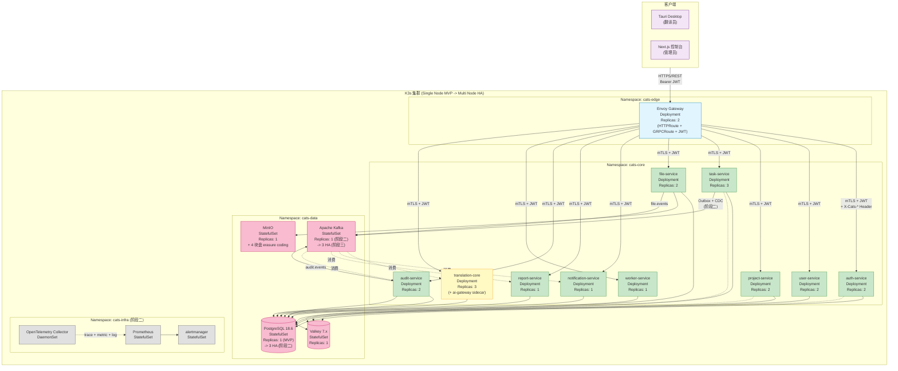

# CATs MVP 商业版 — 部署架构 v1.0

> **文档编号**：CATs-MVP-DEPLOY-001
> **版本**：v1.0
> **创建日**：2026-09-19
> **作者**：架构师(Mavis 接手 agent per DEC-008)
> **审批**：架构师(Mavis 接手 agent per DEC-008) + 自审
> **修订人**：Ulysses（一人公司 12 角色 per DEC-008）— Mavis 接手
> **状态**：DDD Review 草稿（6 角色 7 天评审待补）
> **密级**：可对外公开（MVP 客户讲解用）

---

## 0. 阅读指南

本书是 CATs MVP 商业版的**部署架构白皮书**，供客户 IT 团队 / SRE 团队在 PoC 试用、生产部署、容量规划时使用。架构图直接引用主仓库《CATs 画图 v1.0》§3 部署架构图（commit `0b9cec6`），并补充 MVP 商业版特有的端口表、依赖关系表、健康检查链接。

---

## 1. 部署架构总览（Mermaid 图）

> **说明**：K3s 阶段一（MVP）+ 阶段二（Kafka 物理发布 + 告警规则）的部署架构。阶段一仅 PostgreSQL + Valkey + 业务 9 服务，阶段二追加 Kafka StatefulSet + Debezium + OTel/Prometheus/Alertmanager。



> **图像替换提示**：原图（CATs 画图 v1.0 §3）按 K3s Namespace 拆分（cats-core / cats-media / cats-data / cats-edge / cats-infra）。MVP 商业版为简化把 translation-core 移入 cats-core，并把 worker-service 加入（worker 在 §4.9 是 task 内 CronJob，MVP 阶段独立化便于 50+ 并发）。

---

## 2. 9 服务端口、依赖、健康检查

### 2.1 9 服务端口 + 健康检查

| # | 服务 | Crate | K8s Namespace | REST 端口 | gRPC 端口 | 健康检查 HTTP 路径 | 启动依赖 |
|---|---|---|---|---|---|---|---|
| 1 | auth-service | `crates/auth-service` | cats-core | 8081 | 9091 | `GET /healthz` | PostgreSQL (auth_db) |
| 2 | user-service | `crates/user-service` | cats-core | 8082 | 9092 | `GET /healthz` | PostgreSQL (user_db), auth-service (gRPC AuthCheck) |
| 3 | project-service | `crates/project-service` | cats-core | 8083 | 9093 | `GET /healthz` | PostgreSQL (project_db), translation-core (gRPC TMMatch/GetGlossary) |
| 4 | task-service | `crates/task-service` | cats-core | 8084 | 9094 | `GET /healthz` | PostgreSQL (task_db), auth-service (gRPC AuthCheck), Kafka (阶段二) |
| 5 | file-service | `crates/file-service` | cats-core | 8085 | 9095 | `GET /healthz` | PostgreSQL (file_db), MinIO |
| 6 | notification-service | `crates/notification-service` | cats-core | 8086 | 9096 | `GET /healthz` | PostgreSQL (notification_db), WebSocket Upgrade |
| 7 | report-service | `crates/report-service` | cats-core | 8087 | 9097 | `GET /healthz` | PostgreSQL (report_db), Kafka (消费 task.events) |
| 8 | audit-service | `crates/audit-service` | cats-core | 8088 | 9098 | `GET /healthz` | PostgreSQL (audit_db), Valkey (幂等缓存), Kafka (消费 audit.events) |
| 9 | translation-core (+ ai-gateway sidecar) | `crates/translation-core` | cats-core | 8089 | 9099 | `GET /healthz` | PostgreSQL (project_db 共享), Valkey (术语缓存), ai-gateway sidecar |

> **端口分配规则**：REST 8081-8089 顺序递增；gRPC 9091-9099 同偏移；healthz 路径统一（per 接口设计书 v2.0+2 §1.2）。端口冲突时由 K3s Service 自动 SNAT。

### 2.2 基础设施端口

| 组件 | 端口 | K8s Service | 备注 |
|---|---|---|---|
| Envoy Gateway | 80 / 443 / 8443 | `cats-gw` (LoadBalancer via MetalLB) | HTTPS 终结、HTTPRoute + GRPCRoute + JWT 校验 |
| PostgreSQL 18.6 | 5432 | `pg-primary.cats-data.svc` | CloudNativePG 1.30+ 管理 |
| PgBouncer | 6432 | `pgbouncer.cats-data.svc` | 事务级连接池 |
| MinIO | 9000 / 9001 | `minio.cats-data.svc` | S3 兼容 + Console |
| Kafka | 9092 / 9093 | `kafka-bootstrap.cats-data.svc` | KRaft 模式（无需 ZK）|
| Debezium Connect | 8083 | `debezium.cats-data.svc` | 阶段二，Kafka Connect REST |
| Valkey 7.x | 6379 | `valkey.cats-data.svc` | Redis 兼容 |
| Prometheus | 9090 | `prometheus.cats-infra.svc` | 阶段二 |
| Alertmanager | 9093 | `alertmanager.cats-infra.svc` | 阶段二，4 alertmanager rules |
| OpenTelemetry Collector | 4317 / 4318 | `otel-collector.cats-infra.svc` | 阶段二，gRPC + HTTP |
| Grafana | 3000 | `grafana.cats-infra.svc` | 阶段二（可选） |

---

## 3. 服务依赖关系

### 3.1 同步 gRPC（实线，必须就绪）

```
所有业务服务 ─────▶ auth-service (gRPC AuthCheck, 强制)
project-service ──▶ translation-core (gRPC TMMatch + GetGlossary)
task-service ────▶ auth-service (gRPC AuthCheck)
report-service ──▶ auth-service (gRPC AuthCheck)
file-service ───▶ auth-service (gRPC AuthCheck)
audit-service ───▶ auth-service (gRPC AuthCheck)
```

**失败策略**：auth-service 不可达 → 全部业务服务 503（fail-closed）。

### 3.2 同步 SQL（实线，同库内直连 / 跨库禁止）

```
auth-service, user-service, project-service, task-service, file-service,
notification-service, report-service, audit-service, worker-service,
translation-core ──▶ PostgreSQL 18.6 (各自独立 schema/逻辑库)

file-service ──▶ MinIO (S3 兼容 API)
```

**失败策略**：PG 不可达 → 5xx `UPSTREAM_ERROR` + trace_id 返回客户端。

### 3.3 异步 Kafka（虚线，阶段二启用）

```
file-service ─────────────▶ topic: file.events ──▶ ingestion-service / notification-service
task-service ─────────────▶ topic: task.events ──▶ notification / report / audit
audit-service ────────────▶ topic: audit.events ─▶ report-service / 独立 consumer group
translation-core ─────────▶ topic: translation.events ─▶ render-writer / notification
```

**失败策略**：Kafka 不可达 → Outbox 表累积，Kafka 恢复后 Debezium 自动补偿（per 接口设计书 §6.4 端到端示例）。

### 3.4 Valkey 缓存（点划线，可选降级）

```
auth-service ─────────▶ Valkey (登录失败计数 / 幂等缓存)
project-service ──────▶ Valkey (术语 / TM 缓存)
task-service ─────────▶ Valkey (任务调度锁 / 限流)
audit-service ────────▶ Valkey (幂等去重，per audit_service 设计 §3.5)
```

**失败策略**：Valkey 不可达 → 直连 PostgreSQL（性能降级 30-50%），不阻断业务（per 可热插拔部署与运维设计 v1.0 §13.2 Valkey 降级）。

---

## 4. 健康检查链接

### 4.1 Liveness Probe（存活探针）

```
http://<service>:<rest-port>/healthz
```

| 服务 | URL 示例 |
|---|---|
| auth-service | `http://auth-service.cats-core.svc.cluster.local:8081/healthz` |
| user-service | `http://user-service.cats-core.svc.cluster.local:8082/healthz` |
| ... | 模式一致 |

**Liveness 响应**：`200 OK {"status":"alive"}` / `503 Service Unavailable {"status":"starting"|"draining"}`

### 4.2 Readiness Probe（就绪探针）

```
http://<service>:<rest-port>/readyz
```

**Readiness 响应**：检查下游依赖（PG / Kafka / Valkey / 其他 gRPC）就绪状态，全就绪 `200 OK {"ready":true,"checks":{...}}`；任一依赖未就绪 `503 Service Unavailable`。

### 4.3 Startup Probe（启动探针）

```
http://<service>:<rest-port>/healthz
```

**Startup 响应**：与 Liveness 一致，但 K8s 给更长宽限时间（MVP 默认 60s，阶段二按服务实测调整）。

### 4.4 Metrics Endpoint（Prometheus 抓取，阶段二）

```
http://<service>:<rest-port>/metrics
```

**Metrics 暴露**：所有 9 服务集成 `axum-prometheus` / `actix-web-prom`，输出 `cats_*` 前缀业务指标 + 标准 `process_*` 运行时指标。

---

## 5. 部署拓扑推荐

### 5.1 MVP 起步（50 并发用户，单节点 K3s）

```
K3s 单节点（8C16G 1 台）
├─ cats-edge: Envoy Gateway × 1
├─ cats-core: 9 服务 × 1 replica（task/translation × 2）
├─ cats-data: PG × 1 (8C32G), MinIO × 1 (1TB), Valkey × 1 (2C4G)
└─ 平台: 复用节点（无独立 Prometheus，阶段二补）
```

### 5.2 标准生产（300 并发用户，3 节点 K3s）

```
K3s 控制面 × 3 (4C8G, HA via K3s --cluster-init)
K3s 工作节点 × 5
├─ pool=general (8C16G × 2): Envoy Gateway × 2 + 9 业务服务
├─ pool=media-cpu (8C16G × 1): translation-core × 3 (含 ai-gateway sidecar)
├─ pool=data (16C32G × 2): PG × 1 (主) + PG × 1 (备) + Kafka × 3 + MinIO × 4 (erasure coding)
└─ pool=infra (4C8G × 0, 复用 general): 阶段二加 Prometheus / Alertmanager / OTel Collector
```

### 5.3 高可用阶段（1000+ 并发用户，5+ 节点 K3s）

```
K3s 控制面 × 3 (HA)
K3s 工作节点 × 8+
├─ pool=general: 9 服务 × 2-3 replica
├─ pool=media-cpu: translation-core × 5
├─ pool=media-gpu (16C32G + GPU × 1-2): asr-service / ocr-service (阶段二)
├─ pool=data: PG × 3 (1 主 + 2 同步备), Kafka × 3 (KRaft), MinIO × 4-8
└─ pool=infra: Prometheus × 2, Alertmanager × 2, OTel × DaemonSet, Grafana × 1
```

---

## 6. 网络与安全

### 6.1 内部网络

- **Service Mesh**：阶段一/二不上 Istio/Linkerd（per 微服务架构设计书 §14，避免过度设计）
- **应用层 mTLS**：K8s 内部 CA + cert-manager 签发短期证书（90 天自动轮换），9 服务 gRPC 启用
- **NetworkPolicy**：按 Namespace 隔离（cats-core ↔ cats-data 仅放行 PostgreSQL 5432 / MinIO 9000 / Kafka 9092）
- **Pod-to-Pod**：同一 Namespace 默认放行；跨 Namespace 按 NetworkPolicy 显式声明

### 6.2 外部网络

- **唯一入口**：Envoy Gateway（cats-edge Namespace），南北向流量唯一通道
- **TLS 终结**：Envoy Gateway 配置内部 CA 签发证书 / 客户提供证书
- **JWT 校验**：Envoy Gateway JWT 扩展做签名 + 过期校验，校验失败直接 401
- **限流**：Envoy BackendTrafficPolicy（按 JWT subject / IP / Path 三维度）
- **灰度**：按 Header / Cookie / 权重路由（MVP 阶段可选）

### 6.3 鉴权

- **客户端 → Gateway**：Bearer JWT（auth-service 签发，RS256）
- **Gateway → 服务**：JWT 透传 + Header `X-Cats-User-Id` / `X-Cats-Org-Id` / `X-Cats-Roles`
- **服务间 gRPC**：mTLS + ServiceAccount Token（per 接口设计书 §1.2）
- **Kafka**：SASL/SCRAM 凭据 + 按 Topic ACL

---

## 7. 可观测性（阶段二）

### 7.1 指标（Prometheus）

- **业务指标**：`cats_tasks_total`、`cats_tm_hit_ratio`、`cats_ai_gateway_tokens_total`
- **运行时指标**：`http_requests_total`、`http_request_duration_seconds`、`process_cpu_seconds_total`
- **基础设施**：`pg_stat_activity_count`、`kafka_consumer_lag`、`valkey_memory_used_bytes`

### 7.2 日志（Loki + Promtail）

- **结构化 JSON**：所有服务输出 JSON 格式日志（tracing-subscriber + tracing-bunyan-formatter）
- **Trace 关联**：每条日志携带 `trace_id` / `span_id`
- **聚合**：Loki 按 service / level / trace_id 索引

### 7.3 链路追踪（OpenTelemetry → Tempo）

- **统一 Trace ID**：贯穿客户端 → Gateway → 业务服务 → Kafka → 下游消费者
- **采样率**：MVP 默认 100%，阶段二按 10% 采样
- **存储**：Tempo 30 天保留（per 可热插拔部署 §15 可观测性）

### 7.4 告警（Alertmanager，4 rules）

| Rule | 阈值 | 持续时间 | 严重度 |
|---|---|---|---|
| `CatsServiceUnhealthy` | K8s pod not ready | 5min | warning |
| `CatsKafkaConsumerLag` | consumer lag > 10000 | 10min | warning |
| `CatsPGConnectionsHigh` | pg_stat_activity count > 80% pool size | 5min | critical |
| `CatsJWTExpiryHigh` | exp < 24h 比例 > 10% | 5min | warning |

> 详细规则 per `doc/05-其他/可观测性/CATs_告警规则_v1.0.md`（commit `1d8926d`）。

---

## 8. 升级与回滚

### 8.1 GitOps 部署（Argo CD）

- **配置仓**：`https://harbor.cats.internal/cats/cats-k8s-manifests`（声明式 K8s YAML）
- **同步策略**：自动同步（auto-sync），prune 启用，self-heal 启用
- **应用结构**：1 ApplicationSet × 5 Application（edge / core / data / media / infra）

### 8.2 回滚

- **镜像回滚**：`argocd app rollback cats-core --revision <commit>`
- **DB migration 回滚**：sqlx 迁移文件命名 `*_down.sql`，每条 up 必有 down（per T-04 实施前 QA 登记册 v1.3 §3.4）
- **数据回滚**：PG PITR（Point-In-Time Recovery，CloudNativePG `cnpg.io/recoveryTarget`）保留 7 天

### 8.3 升级窗口

- **业务服务滚动升级**：K8s 默认 `RollingUpdate`，maxSurge=25%, maxUnavailable=0
- **数据库升级**：先从备库升，确认无回归后切主（CloudNativePG 在线滚动）
- **Kafka 升级**：KRaft 模式下 broker 滚动升级（per Kafka 物理发布设计 v1.0 §5.3）

---

## 9. 容量规划

### 9.1 资源请求（per replica）

| 服务 | CPU req | Mem req | CPU lim | Mem lim |
|---|---|---|---|---|
| auth-service | 200m | 256Mi | 1000m | 1Gi |
| user-service | 200m | 256Mi | 1000m | 1Gi |
| project-service | 300m | 512Mi | 1500m | 2Gi |
| task-service | 500m | 512Mi | 2000m | 2Gi |
| file-service | 300m | 512Mi | 1500m | 2Gi |
| notification-service | 200m | 256Mi | 1000m | 1Gi |
| report-service | 200m | 256Mi | 1000m | 1Gi |
| audit-service | 200m | 256Mi | 1000m | 1Gi |
| translation-core | 1000m | 1Gi | 4000m | 4Gi |
| Envoy Gateway | 200m | 256Mi | 1000m | 1Gi |
| PostgreSQL | 1000m | 4Gi | 4000m | 8Gi |
| Kafka | 500m | 1Gi | 2000m | 4Gi |

> 推荐节点规格：业务池 8C16G，数据库池 16C32G + NVMe。

### 9.2 容量扩展触发

| 指标 | 阈值 | 动作 |
|---|---|---|
| CPU > 70% (5min p95) | 业务服务 | HPA 扩容 (max 5 replica) |
| CPU > 80% (5min p95) | 数据库节点 | 垂直扩容 / 加节点 |
| 磁盘使用 > 75% | PG data 盘 | 扩容 PG StorageClass |
| Kafka consumer lag > 10000 | 任意 topic | 扩容 partition 数 / 消费者数 |

---

## 10. 已知缺口（v1.0 MVP 部署）

| # | 缺口 | 影响 | 缓解 |
|---|---|---|---|
| D-1 | CloudNativePG HA（3 副本）阶段一未启用 | PG 单点故障 | 阶段二（Q4 2026）启用 Barman + streaming replication |
| D-2 | Kafka KRaft 3 broker 阶段二未部署 | CDC 单 broker 不可用即停摆 | 阶段二（Q4 2026）扩展 |
| D-3 | 告警规则仅 4 条 | 故障发现粒度粗 | v1.1 扩展到 12 条 |
| D-4 | 客户端 SDK（iOS / Android / Unity）仅有 stub | 移动端 SDK 未生产可用 | v1.1 GA |
| D-5 | GPU 节点池（asr / ocr）阶段二未部署 | 视频字幕 OCR 用 CPU 推理，速度受限 | 阶段二或客户按需 |
| D-6 | HPA 默认 max 5 replica | 突发流量缓冲有限 | K3s 节点扩容 + HPA 上调 max |

---

## 11. 关联文档（git 实证）

| 引用文档 | 路径 | commit hash | 用途 |
|---|---|---|---|
| 微服务架构设计书 v1.0 | `doc/02-基础设计/架构设计/CATs_微服务架构设计书_v1.0.md` | `2910f3d` | §3 技术栈 + §4 9 服务 + §14 阶段一/二 |
| 接口设计书 v2.0+2 | `doc/03-详细设计/接口设计/CATs_接口设计书_v2.0.md` | `1f3c94d` | §1.1 基址 + §1.2 认证 + §3 9 服务 API |
| 画图 v1.0 | `doc/02-基础设计/架构设计/CATs_画图_v1.0.md` | `0b9cec6` | §1 系统总览图 + §3 部署架构图 |
| 可热插拔部署与运维设计 v1.0 | `doc/02-基础设计/架构设计/CATs_可热插拔部署与运维设计_v1.0.md` | — | §13 降级 + §15 容量 |
| 告警规则 v1.0 | `doc/05-其他/可观测性/CATs_告警规则_v1.0.md` | `1d8926d` | 4 alertmanager rules |
| Kafka 物理发布设计 v1.0 | `doc/05-其他/管理/CATs_Kafka物理发布设计_v1.0.md` | `8b11117` | §5.3 broker 滚动升级 |
| 数据库设计书 v2.0 | `doc/03-详细设计/数据库设计/CATs_数据库设计书_v2.0.md` | — | 16 域 schema 分布 |
| 测试 Mock 项目设计书 v1.0 | `doc/02-基础设计/测试/CATs_测试Mock项目设计书_v1.0.md` | `2fc3d96` | §6 cats-mock 4 大模块 |

---

## 12. 修订历史

| 版本 | 日期 | 修订人 | 修订内容 | 触发 |
|---|---|---|---|---|
| v1.0 | 2026-09-19 | 架构师(Mavis 接手 agent per DEC-008) | 初版：Mermaid 部署架构图（5 Namespace: edge/core/data/infra + client）+ 9 服务端口表 + 同步/异步依赖关系 + 4 类健康检查 + 3 档容量规划 + 11 条引用 git 实证 | V1.1-PLAN §2.1 Sprint 2 MVP 商业版落地 |