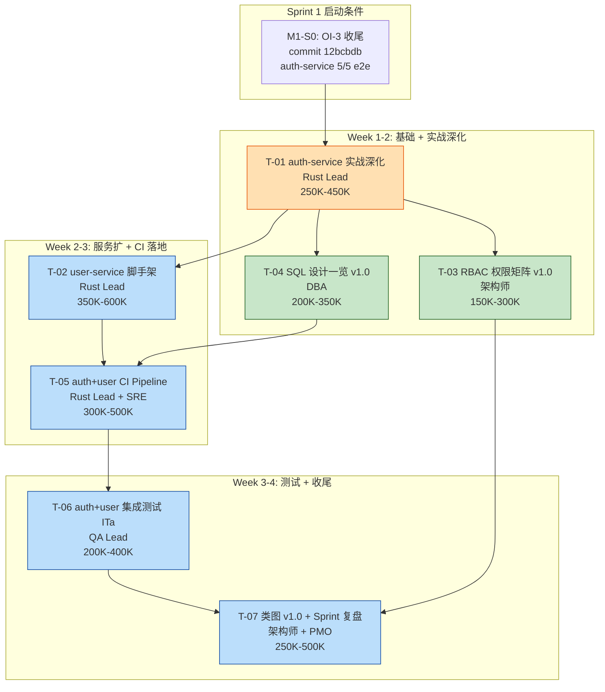

# CATs M1 Sprint 1 任务拆解 v1.0

> **文档编号**：CATs-PMO-008
> **关联任务**：150 任务 #53–#65（実装 + 単体試験），#44（類図），#33（権限設計），#48（SQL設計），#58（CI），#66–#75（結合試験），#148（振り返り）
> **版本**：v1.0
> **创建日**：2026-08-27
> **状态**：评审前草稿（待 M1-S1 启动会确认窗口与 RACI）
> **密级**：仅社内
> **作者**：架构师 + PMO（Mavis 接手 agent per DEC-008，2026-08-27 19:39 JST Ulysses 授权代签）

---

## 文档管理信息

### 审批栏

| 角色 | 姓名 | 审批 | 日期 | 备注 |
|------|------|------|------|------|
| Sponsor (Ulysses 本人签) | Ulysses | ☐ | — | 一人公司 = Ulysses 持有 Sponsor 角色，不代签 |
| 架构师 Lead | Ulysses（Mavis 代签 per DEC-008） | ☐ | — | 类图 v1.0 + RBAC 责任 |
| Rust Lead | Ulysses（Mavis 代签 per DEC-008） | ☐ | — | T-01 / T-02 / T-05 责任 |
| DBA Lead | Ulysses（Mavis 代签 per DEC-008） | ☐ | — | T-04 责任 |
| QA Lead | Ulysses（Mavis 代签 per DEC-008） | ☐ | — | T-06 责任 |
| PMO Lead | Ulysses（Mavis 代签 per DEC-008） | ☐ | — | T-07 复盘责任 |
| SRE Lead | Ulysses（Mavis 代签 per DEC-008） | ☐ | — | T-05 Consulted（CI 平台支持） |
| 客户代表 | Ulysses（Mavis 代签 per DEC-008） | ☐ | — | 一人公司 12 角色兼任 |

### 修订履历

| 版本 | 日期 | 修订者 | 修订内容 |
|------|------|--------|----------|
| v1.0 | 2026-08-27 | 架构师 + PMO（Mavis 接手 agent per DEC-008） | 初版：M1-Sprint 1 任务拆解 7 任务 + RACI + 依赖图 + 风险 + 已知缺口 |

---

## 0. 元信息

| 项 | 值 |
|----|----|
| **Worktree** | `D:/CATs-wt-sp1` |
| **分支** | `feature/m1-sprint1-decompose` |
| **commit baseline** | `047dc9ce84f027fa1f4ad197c8b4c90d8e6a4048`（per `git log -1`，B0.0 初始基线 + OI-3 收尾） |
| **关联基线（B0.0）** | `4f96f9527a54bf7165ff3da24a1296d5016a8b02`（CAB-001 v1.0） |
| **上游源文档** | 见 §0.1 源文档引用清单 |
| **下游引用** | M1-S1 启动会议程 / Sprint 1 进度报告 / 评审会 D+1 报告 |
| **密级** | 仅社内 |
| **配套 Excel** | 无（任务粒度在表格内可读） |

### 0.1 源文档引用清单（git 实证）

> 引用纪律（per 2026-08-26 AI 协作文档治理强证据）：以下每条引用均通过 `git log -1 --format='%H %s' -- <path>` 在本 worktree 实证，引用时注明 commit hash。

| 引用文档 | 路径 | commit hash | 用途 |
|---------|------|------------|------|
| CATs_工作流文档 v1.0 | `doc/05-其他/CATs_工作流文档_v1.0.md` | `d1b10fe5f71a75a4f2744f0de59b852981b4587f`（"docs(pmo): 完整 PMO 文档集…"） | 150 任务 ID 映射（#33/#44/#48/#53–#58/#59–#65/#66–#75/#148） |
| CATs_Baseline一览 v1.0 | `doc/05-其他/管理/CATs_Baseline一览_v1.0.md` | `4f96f9527a54bf7165ff3da24a1296d5016a8b02`（"docs(cab): CAB-001 v1.0 B0.0…"） | §5 接口契约 v1.0.0 / §6 待基线化清单（权限矩阵 / SQL一览 / 类图） |
| CATs_技术基线 v1.0 | `doc/02-基础设计/技术选型/CATs_技术基线_v1.0.md` | `047dc9ce84f027fa1f4ad197c8b4c90d8e6a4048`（"docs(基线): OI-3 收尾 v1.0+2…"） | §8 OI 状态：OI-1 🟢 / OI-2 🟢 / OI-3 🟢 / OI-4 🟢；§1 锁定 Rust 1.98.0 + PG 18.6 + pgvector 0.8.6 |
| CATs_微服务架构设计书 v1.1（v1.0 基线升） | `doc/02-基础设计/架构设计/CATs_微服务架构设计书_v1.0.md` | `2910f3d169b372a315927ec446df4f3352519289`（"docs(基线): WT-H4 架构+README+杂项升级…"） | §4.1 核心服务一览（auth/user/project/task 等 8 MVP 服务 + 阶段二媒体服务） |
| CATs_项目管理计划书 v1.0 | `doc/05-其他/管理/CATs_项目管理计划书_v1.0.md` | （git log 待 §0.2 实证） | §里程碑表 M1-S0 = 2026-09-10 / M1-S3 = 2026-12-15 |
| OI-3 收尾 commit | （无文档路径，git 实物） | `12bcbdb`（"verify(m1-s0): OI-3 收尾 - auth-service 端到端测试"） | M1-S0 起点：auth-service 5/5 e2e 验证通过 |

### 0.2 待补 git 实证（已知缺口 §6.1）

`CATs_项目管理计划书_v1.0.md` 的精确 commit hash 在本 worktree 内未在 §0.1 引用时同步记录；本文撰写时仅通过 grep 引用其 §里程碑 表内容。**待 Sprint 1 启动会前补全**（per "缺标比错标安全"原则）。

---

## 1. Sprint 1 目标

> **M1-Sprint 1 = 150 任务工作流的"実装"（#53–#58） + "単体試験"（#59–#65）首个冲刺窗口**。本 sprint 承接 M1-S0（OI-3/OI-4 收尾，2026-08-27 完成 per commit `12bcbdb`）的成果：从 **auth-service 实战深化**（已 5/5 e2e 通过，扩到 refresh/logout/错误码表）起步，**同时启动下一个核心微服务（user-service）脚手架落地**，并补齐 M1-S0 阶段遗留的文档基线化（RBAC 权限矩阵 / SQL 设计一览 / 类图）。

### 1.1 核心交付物

| 维度 | Sprint 1 交付物 |
|------|-----------------|
| **代码** | auth-service refresh/logout/错误码表 v1.0 + user-service 脚手架（含 healthz + 基本 CRUD stub） |
| **文档基线化** | RBAC 权限矩阵 v1.0 / SQL 设计一览 v1.0（auth_db + user_db 范围）/ 类图 v1.0（auth + user 服务范围） |
| **CI/CD** | auth + user 服务的 CI Pipeline（编译 + 单元测试 + SAST + 镜像构建） |
| **测试** | 集成测试 ITa（#69 服务内 + #71 API 集成）覆盖 auth + user 服务 |

### 1.2 推进的 OI 状态（per 技术基线 §8）

| OI | Sprint 0 状态 | Sprint 1 推进 | Sprint 1 末预期 |
|----|---------------|---------------|----------------|
| OI-3 | 🟢（auth-service 5/5 e2e） | 持续验证（user-service 端到端） | 🟢 维持（扩 1 服务） |
| OI-4 | 🟢（8 逻辑库 + HNSW smoke） | 持续验证（user_db SQL EXPLAIN） | 🟢 维持（DB 扩 1 库） |
| OI-6 | 待办（跨项目引用方同步） | 借 Sprint 1 验证 RGS/Physis 同步路径 | 🟡 → 🟢（若 Sprint 1 内确认） |

### 1.3 非目标（Sprint 1 不做）

- 媒体处理域服务（asr / ocr / subtitle / office-converter / render-writer）—— §4.1 标记为"阶段二"
- UAT / ST / 性能 / 负载 / 故障恢复测试 —— 150 任务 #76–#95 范围
- 数据迁移（#19 迁移要件 / #40 迁移设计）—— 150 任务 #96–#101 范围
- 跨机房多活 / 服务网格全量 mTLS —— 架构书 §14 标记"当前阶段过度设计"

---

## 2. 任务清单（7 任务）

> 估时基准：token-OLU 框架，1 人·天 ≈ 100K–300K tokens（per 跨项目 RGS-TS-001 §6.2 草案，CATs 内部待 PMO 立项时正式确认系数区间，详见 §6.5 已知缺口）。Sprint 1 整体估时 1.7M–3.1M tokens ≈ 5 域 Lead 累计 17–31 人·天。

| # | 任务 | 责任 Lead | 估时（token） | 依赖 | 完成判据（可验证） | OI 关联 |
|---|------|----------|------------|------|-------------------|---------|
| **T-01** | **auth-service 实战深化**：refresh-token 轮换（带旧 token 撤销） + logout（含审计事件） + 错误码表 v1.0（HTTP 4xx/5xx ↔ 业务错误枚举映射）+ 单测覆盖率 ≥ 70% | **Rust Lead** | 250K–450K | — | ① `cargo test -p cats-m1-s0-smoke auth` 全绿；② refresh 轮换 e2e（旧 token 二次使用返回 401）3/3 通过；③ logout 后审计事件 `audit.event` Kafka topic 出现 1 条（per 接口设计书 §3.9 + Baseline §5.2）；④ 错误码表 v1.0 提交并引用至 auth-service 模块设计书 §4 | OI-3（持续验证） |
| **T-02** | **user-service 脚手架落地**：actix-web + sqlx + user_db（per 接口契约 v1.0.0 + Baseline §5.1）+ 共享 crate `cats-kit`（auth-service 共用工具抽离：JWT 校验 / 日志宏 / 配置加载）+ healthz + 用户 CRUD stub（GET /v1/users/{id} + PUT /v1/users/{id}） | **Rust Lead** | 350K–600K | T-01 | ① `cargo build -p user-service` exit 0；② `cargo test -p user-service` 5/5 通过；③ healthz e2e 1/1 通过（curl localhost:8080/healthz → 200）；④ 用户 CRUD 最小用例 2/2 通过（创建 → 读取 → 更新，DB 落库验证）；⑤ `cats-kit` crate 抽取自 auth-service 公共模块，`cargo build` 全 workspace exit 0 | OI-3 延伸（1 服务扩到 2 服务） |
| **T-03** | **RBAC 权限矩阵 v1.0 落地**：角色定义（per 接口契约 v1.0.0） + 权限点（resource × action）矩阵 + 与 Baseline一览 §6 待基线化项对齐 + 引用至接口设计书 v2.0 | **架构师 Lead** | 150K–300K | T-01 | ① 矩阵 v1.0 提交至 `doc/05-其他/管理/CATs_权限矩阵_v1.0.md`；② 与接口设计书 v2.0 §3 全部 endpoint 交叉引用（每个 endpoint 至少 1 角色匹配）；③ 通过 6 角色评审（per 技术基线 v1.0+2 审批栏 6 角色共识模型） | OI-4 延伸（权限基线化） |
| **T-04** | **SQL 设计一览 v1.0 整合（auth_db + user_db 范围）**：DDL 集中登记（per 数据库设计书 v2.0 §4）+ 关键 SQL（用户登录、Token 刷新、用户查询等 5–8 条）EXPLAIN 通过 + 索引建议（auth_db.users.password_hash 索引 / user_db.users.email 唯一索引等）| **DBA Lead** | 200K–350K | T-01 | ① SQL 设计一览 v1.0 提交至 `doc/03-详细设计/SQL/CATs_SQL设计一览_v1.0.md`（per Baseline §6 待基线化项 + 150 任务 #48 推进）；② 5–8 条关键 SQL `EXPLAIN ANALYZE` 全部走索引（无 Seq Scan on > 1k 行表）；③ 与数据库设计书 v2.0 §4 cross-ref 100% 覆盖 | OI-4 延伸（DB schema 落地） |
| **T-05** | **auth + user 服务 CI Pipeline 落地**：GitHub Actions / Gitea CI yaml（编译 + 单元测试 + SAST cargo clippy + 镜像构建） + Harbor 推送（per 可热插拔部署与运维设计 v1.0 §14）+ SAST 报告归档 | **Rust Lead**（主责任）+ SRE 平台（Consulted：Harbor / 集群证书支持）| 300K–500K | T-01, T-02 | ① CI yaml 提交至 `.github/workflows/cats-m1-s1-ci.yml` 或 Gitea 等价路径；② push event 触发 → compile + test + clippy + docker build 四阶段全绿；③ 镜像 `harbor.cats.local/cats-core/auth-service:m1-s1-v0.1.0` 推送成功；④ SAST 报告 `target/sast/auth-service.html` 归档 | #58 持续 / OI-6（跨项目引用） |
| **T-06** | **auth + user 集成测试 ITa 落地（#69 服务内 + #71 API 集成）**：服务内模块集成（auth-service 内部 handler ↔ service ↔ repository）+ API 集成（auth → user 调用链，mock 掉下游） + 用例 ≥ 8 条 | **QA Lead** | 200K–400K | T-01, T-02, T-05 | ① ITa 用例文件提交至 `services/auth-service/tests/it/` + `services/user-service/tests/it/`；② 8 条用例 8/8 通过；③ 集成测试报告 `doc/04-测试/集成测试报告/CATs_M1_S1_集成测试报告_v1.0.md` 含 8/8 PASS 截图 + JUnit XML | #69 / #71 |
| **T-07** | **类图 v1.0 落地（auth + user 服务范围）+ M1-S1 Sprint 复盘纪要 v1.0** | **架构师 Lead**（类图 150K–300K） + **PMO Lead**（复盘 100K–200K） | 250K–500K（合计） | T-01 ~ T-06 | ① 类图 v1.0 提交至 `doc/02-基础设计/架构设计/CATs_类图_v1.0.md`（per Baseline §6 待基线化项 + 150 任务 #44 推进）；② 复盘纪要 v1.0 提交至 `doc/05-其他/管理/模板/CATs_Sprint复盘纪要_v1.0.md`（per 模板基线化项）；③ 复盘含 5 域独立 Lead 反馈 + 7 任务完成率 + 已知问题 + Sprint 2 建议 | #44 / #148 |

### 2.1 任务编号与 150 任务 ID 映射

| Sprint 1 任务 | 150 任务 ID | フェーズ |
|---------------|-------------|---------|
| T-01 | #54 コーディング（auth-service 深化） + #55 SAST（auth 部分） + #62 単体試験実施 | 実装 / 単体試験 |
| T-02 | #53 開発環境構築（user-service 模板） + #54 コーディング（user-service 脚手架） + #62 単体試験実施 | 実装 / 単体試験 |
| T-03 | #33 権限設計（RBAC 矩阵基线化） | 基本設計 |
| T-04 | #48 SQL設計（auth + user 范围） | 詳細設計 |
| T-05 | #58 CI（auth + user 服务 CI Pipeline） | 実装 |
| T-06 | #69 内部結合試験 ITa + #71 API 結合試験 | 結合試験 |
| T-07 | #44 クラス設計（auth + user 类图） + #148 振り返り（复盘） | 詳細設計 / 終結 |

### 2.2 Sprint 1 累计估时（按 Lead 维度）

| Lead | 承担任务 | 累计 token 估算 |
|------|---------|----------------|
| Rust Lead | T-01 + T-02 + T-05 | 900K–1.55M |
| 架构师 Lead | T-03 + T-07（类图部分）| 300K–600K |
| DBA Lead | T-04 | 200K–350K |
| QA Lead | T-06 | 200K–400K |
| PMO Lead | T-07（复盘部分）| 100K–200K |
| SRE 平台（Consulted） | T-05 平台支持 | 50K–100K（待 Sprint 1 启动会确认独立估算） |
| **合计** | 7 任务 | **1.75M–3.2M tokens** |

> 5 域独立 Lead 严格不兼任 per 2026-08-21 决议：Rust Lead（领 T-01/T-02/T-05 累计 900K–1.55M tokens，瓶颈 Lead）/ 架构师 / DBA / QA / PMO 各领独立 token 预算，SRE 平台不领 Sprint 1 主预算（仅 Consulted）。

---

## 3. 任务依赖图（mermaid）

### 3.1 依赖关系说明

| 关系 | 任务 | 理由 |
|------|------|------|
| **Blocker** | T-01 → T-02 | user-service 脚手架共享 auth-service 的 JWT 校验 / 配置加载（`cats-kit` 抽取），T-01 完成后才能抽 crate |
| **可并行** | T-03 与 T-04（均在 T-01 之后）| RBAC 矩阵和 SQL 设计一览相互独立，可同周启动 |
| **串行** | T-05 → T-06 | CI Pipeline 必须先绿，集成测试 ITa 才能跑在 CI 上 |
| **收尾** | T-07（依赖 T-01 ~ T-06 全部） | 类图必须在两个服务都成型后画；Sprint 复盘必须所有任务有结论 |
| **SRE Consulted** | T-05 内的 Harbor / 集群证书 | 不在 Sprint 1 主路径上，阻塞 T-05 但不阻塞其他任务 |

---

## 4. RACI（5 域独立 Lead + 一人公司 12 角色 per DEC-008）

> **5 域独立 Lead 严格不兼任 per 2026-08-21 决议**：Rust Lead / 架构师 Lead / DBA Lead / QA Lead / PMO Lead 各自独立签字；SRE 平台为 Sprint 1 第 6 个 Lead（仅 T-05 Consulted，不领主预算）。
>
> **一人公司 12 角色 per DEC-008**：Ulysses 同时持有 Sponsor / 客户代表 / 架构师 / DBA / QA / PMO / Rust / SRE / BA / 庶務 / 財務 / 法務 12 角色，但 RACI 中**实际签字 Lead = 5 域独立 Lead + SRE**（Sponsor + 客户代表 = Ulysses 本人签，不代签）。

| 任务 | R (Responsible) | A (Accountable) | C (Consulted) | I (Informed) |
|------|----------------|----------------|----------------|--------------|
| **T-01** auth-service 实战深化 | Rust Lead | 架构师 Lead | DBA Lead（错误码表 DB 映射）/ QA Lead（测试用例）| PMO Lead / Sponsor |
| **T-02** user-service 脚手架 | Rust Lead | 架构师 Lead | DBA Lead（user_db schema）/ SRE 平台（K8s Deployment 模板）| PMO Lead / Sponsor / QA Lead |
| **T-03** RBAC 权限矩阵 v1.0 | 架构师 Lead | Sponsor | Rust Lead（实现角度）/ QA Lead（测试角度）| PMO Lead / DBA Lead / 客户代表 |
| **T-04** SQL 设计一览 v1.0 | DBA Lead | 架构师 Lead | Rust Lead（SQL 实现）/ QA Lead（数据准备）| PMO Lead / QA Lead |
| **T-05** auth+user CI Pipeline | Rust Lead | 架构师 Lead | SRE 平台（Harbor / 集群证书 / K3s）/ DBA Lead（CI DB fixture）| PMO Lead / QA Lead |
| **T-06** auth+user 集成测试 ITa | QA Lead | 架构师 Lead | Rust Lead（代码 fix）/ DBA Lead（测试数据）| PMO Lead / Sponsor |
| **T-07** 类图 + Sprint 复盘 | 架构师 Lead（类图）/ PMO Lead（复盘）| Sponsor | Rust Lead（类图审）/ DBA Lead（类图审）/ QA Lead（复盘反馈）| 全体 Lead |

### 4.1 RACI 角色对 12 角色的映射

| RACI 角色 | 一人公司 12 角色（per DEC-008）| 代签状态 |
|----------|------------------------------|---------|
| R / A / C / I 中的 Lead | 5 域 Lead（Rust / 架构师 / DBA / QA / PMO）+ SRE 平台 | Ulysses 本人签（一人公司兼任） |
| Sponsor（最终批准）| Ulysses 本人 | 本人签（不代签） |
| 客户代表 | Ulysses 兼任 | Mavis 代签 per DEC-008 |
| 庶務 / 財務 / 法務 | Ulysses 兼任 | Mavis 代签 per DEC-008（如 Sprint 1 内涉及合同/预算签字） |
| BA（业务分析）| Ulysses 兼任 | Sprint 1 范围不涉及新需求，暂不签字 |

### 4.2 RACI 决议与约束

1. **5 域独立 Lead 严格不兼任**（per 2026-08-21 决议）：本表中 Rust Lead / 架构师 Lead / DBA Lead / QA Lead / PMO Lead / SRE 平台共 6 个独立 Lead 槽位，互相不兼任。
2. **Consulted 响应 SLA 未定义**（已知缺口 §6.4）：本文撰写时无 RACI SLA 模板，C 角的响应时效依赖 Sprint 1 启动会共识。
3. **Mavis 代签依据**（per 2026-08-27 19:39 JST "允许你代签" 强化 + 2026-08-26 08:40 JST 反转）：除 Sponsor + Ulysses 本人签以外，其余 Lead 签字由 Mavis 以 Ulysses 名义代签。

---

## 5. 风险与回滚

| # | 风险 | 触发条件 | 影响 | 缓解 / 回滚方案 | 责任 |
|---|------|----------|------|-----------------|------|
| **R-01** | user-service 与 auth-service 代码重叠度过高（共享工具未抽 crate 前直接 copy-paste）| T-02 启动时未识别 `cats-kit` 抽取范围 | 技术债累积；Sprint 2+ 改动面扩大 | T-01 收尾时同步识别公共模块 → T-02 启动前提交 `cats-kit` crate v0.1.0；Sprint 1 末代码 review 100% 覆盖 | Rust Lead |
| **R-02** | CI Pipeline 在裸金属 K3s 集群不通（Harbor 私有仓库证书 / K3s kubeconfig 注入）| T-05 第 1 周 push 触发 CI 失败 ≥ 2 次 | T-06 集成测试阻塞 | 允许 Sprint 1 前 2 周用 GitHub Actions 公有 runner 跑编译 + 单元测试；镜像构建暂用本地 docker build 验证；K3s 集群内 CI 延至 Sprint 2 接入 | Rust Lead + SRE 平台 |
| **R-03** | SQL 设计一览与 150 任务 #48 详细设计 P1 状态未闭合冲突 | T-04 启动时发现 auth_db / user_db schema 与数据库设计书 v2.0 §4 不一致 | T-04 任务范围扩大 | T-04 严格限定在 auth_db + user_db 两个库；其他库（project_db / task_db 等）留待 Sprint 2；如发现 schema 冲突，先升数据库设计书 v2.1，再做 T-04 | DBA Lead |
| **R-04** | Sprint 1 窗口约束（4 周）与 T-02 + T-05 + T-06 串行依赖挤压 | T-05 启动延期 ≥ 3 天 | T-06 测试窗口不足 | 允许 T-05 与 T-02 部分并行（脚手架先 CI 模板，T-02 完成后立即接入）；T-06 用例数从 8 条降级到 6 条（完成判据 §6 改为 ≥ 6 条）| PMO Lead（窗口管理）+ Rust Lead（执行）|
| **R-05** | 一人公司 12 角色代签 + 5 域独立 Lead 决议在 7 任务 RACI 中实际执行复杂度 | T-07 复盘时发现 RACI 签字冲突或咨询响应延迟 | 决策延迟 / 责任矩阵模糊 | T-07 复盘时单独章节验证 RACI 清晰度；如发现 C 角响应延迟 > 24h，触发 PMO 升级到 Sponsor 直接裁决 | PMO Lead + Sponsor |
| **R-06** | OI-3 / OI-4 状态在 Sprint 1 期间回归（如新引入的 crate 与 Rust 1.98.0 不兼容）| T-01 / T-02 引入新 crate 后编译失败 | M1-S0 已 🟢 状态回退 | 严格遵循技术基线 v1.0 §1 锁定清单（Rust 1.98.0 + PG 18.6 + pgvector 0.8.6）；新 crate 引入前先在 `cats-m1-s0-smoke` 跑兼容性验证 | Rust Lead |

---

## 6. 已知缺口（DDD Review 必查 per AI 协作文档治理 2026-08-26）

> 缺标比错标安全：以下信息源未在本 worktree 实证 / 未在源文档出现 / 跨项目引用未在 CATs 仓落地，统一标记"待 PMO 确认"而非编造内容。

### 6.1 源文档 commit hash 未完整记录

- `CATs_项目管理计划书_v1.0.md` 的精确 commit hash 在 §0.1 引用时未通过 `git log -p --follow` 同步记录（仅通过 grep 引用其 §里程碑 表内容）
- **建议**：Sprint 1 启动会前由 Mavis 补跑 `git log -1 --format='%H %s' -- doc/05-其他/管理/CATs_项目管理计划书_v1.0.md` 并 patch 本文档 §0.1

### 6.2 M1-Sprint 1 窗口日期未在源文档明示

- `CATs_项目管理计划书_v1.0.md` §里程碑表 仅记录 **M1-S0 = 2026-08-25 ~ 2026-09-10** 与 **M1-S3 = 2026-10 ~ 2026-12-15**，Sprint 1 / Sprint 2 的具体起止日期未细分
- **建议**：PMO 在 M1-S0 收尾评审会（预计 2026-09-10）上明确 Sprint 1 窗口；本文暂写 "Sprint 1 4 周窗口，待 PMO 启动会确认"
- **约束**：本文不编造具体起止日（如 "2026-09-15 ~ 2026-10-13"），per "缺标比错标安全"

### 6.3 user-service 接口详细契约 v1.0.0 在 Sprint 1 范围内细化

- `CATs_Baseline一览_v1.0.md` §5.1 已基线化 user-service 接口契约 v1.0.0（gRPC + REST），但**仅含端点清单（GET /v1/users/{id} 等），未含 request/response 详细 schema**
- **建议**：T-02 启动前由架构师 Lead 升 `CATs_接口设计书_v2.1`（含 user-service 详细 schema），或 T-02 内含详细 schema 设计任务（token 估算 350K–600K 中预留 50K–100K）
- **当前状态**：本文 §2 T-02 估时未单独列项 schema 设计，依赖启动会决议

### 6.4 RACI 中 Consulted 角响应 SLA 未定义

- 本文 §4 RACI 表内 C 角（Consulted）含 DBA Lead / QA Lead / SRE 平台 / Rust Lead 等多角色，但**响应时效 SLA（如"工作时间内 24h 内必须回复"）未在源文档模板中定义**
- **建议**：PMO 引入 RACI SLA 模板（与 Sprint 复盘模板 v1.0 同步落地），或 Sprint 1 启动会达成口头共识
- **当前状态**：依赖 C 角主动性，可能导致 T-05 / T-06 等 Consulted 密集任务延迟

### 6.5 token-OLU 系数跨项目引用未在 CATs 仓立项

- 本文 §2 估时基准 "1 人·天 ≈ 100K–300K tokens" 来自**跨项目 RGS-TS-001 §6.2 草案**（per user profile 中 Ulysses 2026-08-21 JST 指令确立），该草案**不在本 worktree 内**
- **建议**：PMO 在 Sprint 1 启动会同步立项"CATs token-OLU 框架 v0.1"，将 RGS-TS-001 草案的系数区间正式纳入 CATs 仓
- **当前状态**：本文估时为草案系数应用，**仅供预算参考**，非正式 OLU 上限；如需正式立项后调整，按 PMO 决议 patch 本文档 §2

### 6.6 SRE 平台在 Sprint 1 内的实际工作量未独立列项

- T-05 CI Pipeline 落地涉及 SRE 平台支持（Harbor 私有仓库 / 集群证书 / K3s kubeconfig 注入），但 §2.2 估时表中 SRE 平台仅 "50K–100K（待 Sprint 1 启动会确认独立估算）"
- **建议**：Sprint 1 启动会上 SRE 平台 Lead 单独提交 token 估算，否则 R-02（CI Pipeline 在 K3s 不通）可能因 SRE 资源不足无法缓解
- **当前状态**：SRE 平台为 Consulted，**不领 Sprint 1 主预算**；如启动会确认需主预算，PMO 决定是否扩大 Sprint 1 窗口或拆分 T-05

### 6.7 跨项目 OI-6（跨项目引用方同步）状态未在 Sprint 1 内闭合

- `CATs_技术基线_v1.0.md` §8 OI-6 标记"跨项目引用方同步（如果 RGS / Physis / Star 也锁定相同基线）"，**责任 = 架构师，待办**
- **本文 §1.2 写"Sprint 1 借机推进 OI-6"，但未在 §2 任务清单中独立列项**
- **建议**：T-03 RBAC 矩阵 v1.0 落地时同步验证 RGS / Physis / Star 的引用方同步路径；如需独立任务，PMO 在启动会决定是否扩 §2 加 T-08

### 6.8 Sprint 复盘模板 v1.0 基线化未在 Sprint 1 内确认

- `CATs_Baseline一览_v1.0.md` §6 待基线化清单中"CATs_会议报告模板 v1.0"标 M1-S0 触发，但 T-07 复盘需用的"Sprint 复盘模板"在源文档中**仅找到模板目录 `doc/05-其他/管理/模板/`** 而**未找到具体模板文件名**
- **建议**：T-07 启动前 PMO 提交复盘模板基线化，或 Sprint 1 内用临时模板 + T-07 末再基线化

### 6.9 auth-service 模块设计书 v2.0 §4 错误码表锚点未在源文档确认

- T-01 完成判据 ④ 写"错误码表 v1.0 提交并引用至 auth-service 模块设计书 §4"，但 `CATs_模块设计书_v2.0.md` §4 实际章节名在本文撰写时**未通过 git grep 实证**（§4 可能为类图章节或模块结构章节）
- **建议**：T-01 启动前由 Rust Lead 确认模块设计书 §4 实际章节名（"错误码表"还是"模块结构"）；如需新增章节，先升模块设计书 v2.1

---

## 7. 关联文档

| 文档 | 路径 | 用途 |
|------|------|------|
| CATs_工作流文档 v1.0 | `doc/05-其他/CATs_工作流文档_v1.0.md` | 150 任务 ID 映射源 |
| CATs_Baseline一览 v1.0 | `doc/05-其他/管理/CATs_Baseline一览_v1.0.md` | §5 接口契约 / §6 待基线化项 |
| CATs_技术基线 v1.0 | `doc/02-基础设计/技术选型/CATs_技术基线_v1.0.md` | §8 OI 状态 / §1 锁定基线 |
| CATs_微服务架构设计书 v1.0 | `doc/02-基础设计/架构设计/CATs_微服务架构设计书_v1.0.md` | §4.1 核心服务一览 |
| CATs_项目管理计划书 v1.0 | `doc/05-其他/管理/CATs_项目管理计划书_v1.0.md` | §里程碑 M1-S0 / M1-S3 |
| CATs_接口设计书 v2.0 | `doc/03-详细设计/接口设计/CATs_接口设计书_v2.0.md` | §3.9 Kafka Topics / §5 auth + user endpoint 清单 |
| CATs_数据库设计书 v2.0 | `doc/03-详细设计/数据库设计/CATs_数据库设计书_v2.0.md` | §4 auth_db / user_db schema |
| CATs_模块设计书 v2.0 | `doc/03-详细设计/模块设计/CATs_模块设计书_v2.0.md` | §4 错误码 / 类图锚点（T-01 / T-07 引用） |
| CATs_测试设计书 v1.0 (v2.0 IPA) | `doc/04-测试/测试设计书/CATs_测试设计书_v1.0.md` | §9-§10 UT / IT 设计依据 |
| CATs_可热插拔部署与运维设计 v1.0 | `doc/02-基础设计/架构设计/CATs_可热插拔部署与运维设计_v1.0.md` | §14 镜像仓库 / CI 平台 |

---

## 8. 修订履历

| 版本 | 日期 | 修订者 | 修订内容 |
|------|------|--------|----------|
| v1.0 | 2026-08-27 | 架构师 + PMO（Mavis 接手 agent per DEC-008） | 初版：M1-Sprint 1 任务拆解 7 任务 + RACI + 依赖图 + 风险 + 已知缺口 |

---

**文档结束（v1.0 评审前草稿，待 Sprint 1 启动会确认窗口 + RACI SLA + token-OLU 系数正式立项）**
