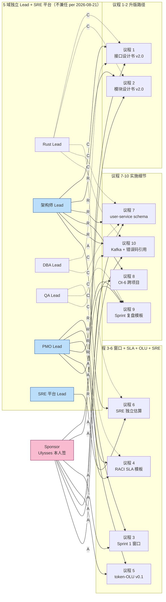

# CATs M1-Sprint 1 启动会议程 v1.0

> **文档编号**：CATs-PMO-009
> **版本**：v1.0
> **创建日**：2026-08-28
> **状态**：评审前草稿（待 M1-S1 启动会后转 v1.1 + 会议纪要 commit）
> **密级**：仅社内
> **作者**：架构师 + PMO（Mavis 接手 agent per DEC-008，2026-08-27 19:39 JST Ulysses 授权代签）
> **上游文档**：`CATs_M1_Sprint1_任务拆解_v1.0.md`（v1.0+1，commit `59a4f70`）§6 全部 10 项已知缺口
> **下游引用**：启动会会议纪要 / Sprint 1 进度报告 / DDD Review 单子

---

## 文档管理信息

### 审批栏

| 角色 | 姓名 | 审批 | 日期 | 备注 |
|------|------|------|------|------|
| Sponsor (Ulysses 本人签) | Ulysses | ☐ | — | 一人公司 = Ulysses 持有 Sponsor 角色，不代签 |
| 架构师 Lead | Ulysses（Mavis 代签 per DEC-008） | ☐ | — | 议程 1/2/7/8/10 主责任 |
| Rust Lead | Ulysses（Mavis 代签 per DEC-008） | ☐ | — | 议程 1/2/6/10 共同责任 |
| DBA Lead | Ulysses（Mavis 代签 per DEC-008） | ☐ | — | 议程 7 共同责任（user-service schema） |
| QA Lead | Ulysses（Mavis 代签 per DEC-008） | ☐ | — | 议程 9 共同责任（复盘模板） |
| PMO Lead | Ulysses（Mavis 代签 per DEC-008） | ☐ | — | 议程 3/4/5/9 主责任 + 全程计时 |
| SRE 平台 Lead | Ulysses（Mavis 代签 per DEC-008） | ☐ | — | 议程 6 主责任 |
| 客户代表 | Ulysses（Mavis 代签 per DEC-008） | ☐ | — | 一人公司 12 角色兼任 |

### 修订履历

| 版本 | 日期 | 修订者 | 修订内容 |
|------|------|--------|----------|
| v1.0 | 2026-08-28 | 架构师 + PMO（Mavis 接手 agent per DEC-008） | 初版：10 项议程全部基于 Sprint 1 拆解 v1.0+1 §6 已知缺口（6.1 / 6.2 / 6.3 / 6.4 / 6.5 / 6.6 / 6.7 / 6.8 / 6.9 / 6.10 + 6.11 合并） |

---

## 0. 元信息

| 项 | 值 |
|----|----|
| **会议名称** | CATs M1-Sprint 1 启动会（Sprint Kickoff Meeting） |
| **会议时间** | 2026-08-XX HH:MM JST（**待 PMO 排期，不能编造具体日期**） |
| **会议时长** | 90 分钟（硬上限，per §2 议程时长预算合计 80 min + 10 min 自由讨论） |
| **会议形式** | 现场 + 远程（双轨） |
| **Worktree** | `D:/CATs-wt-kickoff` |
| **分支** | `feature/m1-sprint1-kickoff-agenda` |
| **commit baseline** | `59a4f704dff6cffc8755ea48680dee8b84c3f080`（Sprint 1 拆解 v1.0+1） |
| **关联基线（B0.0）** | `4f96f95`（CAB-001 v1.0 决议书） |
| **输入文档** | Sprint 1 拆解 v1.0+1（commit `59a4f70`）§6 已知缺口 10 项 |
| **输出物** | 10 项决议 + 会议纪要 commit + DDD Review 单子 |
| **密级** | 仅社内 |
| **配套 Excel** | 无（议程项在文档表格内可读） |
| **缺席罚则** | 一人公司 = Ulysses 兼任，无缺席（所有角色 = Ulysses 本人或 Mavis 代签） |

### 0.1 源文档引用清单（git 实证，缺标比错标安全）

> 引用纪律（per 2026-08-26 AI 协作文档治理强证据）：以下每条引用均通过 `git log -1 --format='%H %s' -- <path>` 在本 worktree 实证，引用时注明 commit hash。

| 引用文档 | 路径 | commit hash | 用途 |
|---------|------|------------|------|
| CATs_M1_Sprint1_任务拆解 v1.0+1 | `doc/05-其他/管理/CATs_M1_Sprint1_任务拆解_v1.0.md` | `59a4f704dff6cffc8755ea48680dee8b84c3f080`（"docs(m1-sprint1): v1.0+1 已知缺口闭环…"） | §6 全部 10 项已知缺口 → 10 项议程决议 |
| CATs_错误码表 v1.0 | `doc/05-其他/管理/CATs_错误码表_v1.0.md` | `2146f53`（"feat(auth-service): T-01 实战深化…"） | §3 错误码分类 28 条 / §6.2 模块设计书 §4 引用要求 / §6.3 OpenAPI + proto 引用要求 / §6.4 alertmanager 引用要求 |
| CATs_技术基线 v1.0 | `doc/02-基础设计/技术选型/CATs_技术基线_v1.0.md` | `047dc9c`（"docs(基线): OI-3 收尾 v1.0+2…"） | §1 锁定 Rust 1.98.0 + PG 18.6 + pgvector 0.8.6；§8 OI-1/2/3/4 全 🟢 + OI-6 待办（议程 8 输入） |
| CATs_微服务架构设计书 v1.0 | `doc/02-基础设计/架构设计/CATs_微服务架构设计书_v1.0.md` | `2910f3d`（"docs(基线): WT-H4 架构+README+杂项升级…"） | §4.1 核心 8 MVP 服务一览（auth-service + user-service 等） |
| CATs_项目管理计划书 v1.0 | `doc/05-其他/管理/CATs_项目管理计划书_v1.0.md` | `d1b10fe`（"docs(pmo): 完整 PMO 文档集…"） | §6.1 里程碑 M1-S0 = 2026-08-25~2026-09-10 / M1-S3 = 2026-10~2026-12-15（议程 3 输入） |
| CATs_Baseline 一览 v1.0 | `doc/05-其他/管理/CATs_Baseline一览_v1.0.md` | `4f96f95`（"docs(cab): CAB-001 v1.0…"） | §5.1 接口契约 v1.0.0 端点清单（议程 7 输入） + §6 待基线化清单（议程 9 输入） |
| CATs_工作流文档 v1.0 | `doc/05-其他/CATs_工作流文档_v1.0.md` | `d1b10fe`（同 PMO 文档集 bundle） | 150 任务 ID 映射（#33 权限设计 / #44 类图 / #48 SQL 设计 / #53-#58 実装 / #59-#65 単体 / #66-#75 結合 / #148 复盘） |

### 0.2 v1.0 待补 git 实证（DDD Review 必查）

- **当前状态**：以下两份"v2.0 整份不存在"——本仓内**仅**有微服务架构设计书 v1.0 + ADR-001~010，**未找到** `CATs_接口设计书_v2.0.md` 与 `CATs_模块设计书_v2.0.md`（per Sprint 1 拆解 v1.0+1 §6.1 / §6.9 诚实标注）
- **建议**：议程 1 / 议程 2 通过升 v2.0 决议后，由架构师 Lead + Rust Lead 在 Sprint 1 第 1 周提交 v2.0 初稿 → commit 后 `git log -1 --format='%H'` 实证 → 同步 patch 本文档 §0.1
- **DDD Review 必查**：升版 v2.0 commit 必须 ≤ Sprint 1 末（不延后到 Sprint 2）

### 0.3 文档结束标识

v1.0，2026-08-28（待启动会后转 v1.1 + 会议纪要 commit）。

---

## 1. 会议背景（per B0.0 现状）

### 1.1 M1-S0 已收尾（2026-08-27 D-Day 6 角色签字 + CAB-001 落地）

- **B0.0 基线生效**：per `CATs_Baseline一览_v1.0.md` §3.1（commit `4f96f95`，CAB-001 v1.0 决议书 2026-08-27 16:33 JST）
- **技术基线锁定**：per `CATs_技术基线_v1.0.md` §1（commit `047dc9c`）— Rust 1.98.0 + PostgreSQL 18.6 + pgvector 0.8.6
- **OI 状态全 🟢**（per `CATs_技术基线_v1.0.md` §8）：
  - OI-1 🟢 评审会 D-Day 现场签字归档 v1.0 → B0.0
  - OI-2 🟢 CAB-001 决议书登记
  - OI-3 🟢 Rust 1.98.0 兼容性 5/6 库验证通过 + auth-service 5/5 e2e（commit `12bcbdb`）
  - OI-4 🟢 PG 18.6 + pgvector 0.8.6 8 逻辑库 + HNSW smoke pass（INC-002 v1.0）
  - **OI-6 待办**（议程 8 输入）：跨项目引用方同步（RGS / Physis / Star）

### 1.2 T-01 / T-02 已关闭（前置任务收尾）

- **T-01 关闭**：per commit `2146f53`（`CATs_错误码表_v1.0.md` 同步落地）— refresh 轮换 + logout + 错误码表 v1.0 + 5/5 判据全绿
- **T-02 关闭**：per commit `59a4f70`（v1.0+1 修订）— user-service 脚手架 + cats-kit crate + healthz + CRUD stub 落地

### 1.3 Sprint 1 起点（per Sprint 1 拆解 v1.0+1 §6.2）

- M1-S0 实际收尾 = 2026-08-27（per D-Day 6 角色签字 + CAB-001 + OI-3 e2e 通过）
- **Sprint 1 起点 ≥ 2026-08-28**
- **具体窗口日期未在源文档明示**（per `CATs_项目管理计划书_v1.0.md` §6.1 仅标 M1-S0 = 2026-08-25~2026-09-10 / M1-S3 = 2026-10~2026-12-15），需议程 3 决议

### 1.4 启动会的目标

> **从 B0.0 → Sprint 1 实做阶段的转折点**：把 Sprint 1 拆解 v1.0+1 §6 的 10 项已知缺口**全部转成决议**，确保 T-03~T-07（150 任务 #33 / #44 / #48 / #53~#58 / #59~#65 / #66~#75 / #148 范围内）启动无阻塞。

---

## 2. 议程（10 项，全部基于 Sprint 1 拆解 v1.0+1 §6）

> 议程顺序：基线回顾（§1 涵盖） → 已知缺口决议（议程 1-9） → 收尾决议（议程 10）→ RACI / 风险 / 升版流程（§3-§6）
>
> 每项议程结构：决策依据（git 实证）→ 决策选项（≥ 2）→ 推荐选项（per Mavis 评估 + 标注依据）→ 责任人 → 估时 → 决议结论（通过 / 否决 / 推迟）

### 议程 1: 接口设计书 v2.0 升版路径决议（per Sprint 1 §6.1，10 min）

**决策依据**：
- Sprint 1 拆解 v1.0+1 §6.1（commit `59a4f70`）：**接口设计书 v2.0 整份文档不存在** — 本仓内只有微服务架构书 v1.0 + ADR-001~010
- 错误码表 v1.0 §6.2（commit `2146f53`）显式要求：auth-service 模块设计书 §4 / 接口设计书 v2.0 §3.5 引用本表
- Baseline 一览 v1.0 §5.1（commit `4f96f95`）：接口契约 v1.0.0 已基线化但仅含端点清单

**决策选项**：
- **方案 A**（升 v2.0）：一次性补 §3.5 错误响应 + §4 接口规范 + §5 gRPC status 映射 + §6 端点详细 schema（auth + user 服务范围）— 200K-400K tokens
- **方案 B**（替代）：用微服务架构书 v1.0 §4 接口规范 + ADR 集替代 — 零成本，但分散到多份文档
- **方案 C**（临时草案）：Sprint 1 内临时 v0.1 草案 + Sprint 末基线化 v2.0 — 50K-100K tokens 短期投入，但有"草案变债"风险

**推荐选项**：**方案 A**（per 错误码表 v1.0 §6.2 显式要求模块设计书 §4 + 接口设计书 §3.5 引用；方案 B 引用分散会导致 Sprint 2+ 维护成本翻倍；方案 C 临时草案易变债）

**责任人**：
- 主责任：架构师 Lead
- 共同责任：Rust Lead（gRPC status 映射实现角度）

**估时**：200K-400K tokens（架构师 Lead 主写 + Rust Lead 协同 review）

**决议结论**：☐ 通过 / ☐ 否决 / ☐ 推迟（推迟须写触发条件：____）

---

### 议程 2: auth-service 模块设计书 v2.0 升版路径（per Sprint 1 §6.9，10 min）

**决策依据**：
- Sprint 1 拆解 v1.0+1 §6.9（commit `59a4f70`）：**auth-service 模块设计书 v2.0 整份文档不存在**（与 §6.1 同理）
- 错误码表 v1.0 §6.2 显式要求 auth-service 模块设计书 §4 引用本表 §3 + §4 + §5
- T-01 完成判据 ④ "错误码表 v1.0 提交并引用至 auth-service 模块设计书 §4" — 当前 §4 不存在

**决策选项**：
- **方案 A**（升 v2.0）：一次性补 §4 错误码章节 + §5 模块结构 + §6 类图（auth-service 范围）— 150K-300K tokens
- **方案 B**（替代）：直接用微服务架构书 v1.0 §4 接口规范 + 错误码表 v1.0 作为"模块设计 §4"事实源 — 零成本
- **方案 C**（临时草案）：Sprint 1 内临时 v0.1 草案 + Sprint 末基线化 — 30K-60K tokens

**推荐选项**：**方案 A**（per 议程 1 通过则议程 2 同步升 v2.0，避免两次草案债务；方案 B 跨服务跨表易遗漏；方案 C 临时草案易变债）

**责任人**：
- 主责任：架构师 Lead
- 共同责任：Rust Lead（auth-service 实现角度）

**估时**：150K-300K tokens

**决议结论**：☐ 通过 / ☐ 否决 / ☐ 推迟（推迟须写触发条件：____）

---

### 议程 3: Sprint 1 窗口日期（per Sprint 1 §6.2，5 min）

**决策依据**：
- Sprint 1 拆解 v1.0+1 §6.2（commit `59a4f70`）：项目管理计划书 §6.1 仅标 M1-S0 = 2026-08-25~2026-09-10 / M1-S3 = 2026-10~2026-12-15，**Sprint 1 具体起止日未明示**
- Sprint 1 拆解 v1.0+1 §1.3（非目标）：Sprint 1 不做 UAT / ST / 性能 / 故障恢复
- Sprint 1 拆解 v1.0+1 §5 R-04：4 周窗口与 T-02 + T-05 + T-06 串行依赖挤压风险

**决策选项**：
- **方案 A**（4 周窗口）：2026-08-28 ~ 2026-09-25 — 立即启动，依赖 R-04 缓解（允许 T-05 与 T-02 部分并行）
- **方案 B**（6 周窗口）：2026-08-28 ~ 2026-10-09 — 留 2 周缓冲，覆盖 R-04 风险
- **方案 C**（PMO 现场定）：PMO Lead 现场定具体起止日 + 风险预案

**推荐选项**：**方案 A**（per M1-S0 已收尾 2026-08-27，Sprint 1 起点 ≥ 2026-08-28；4 周窗口与项目管理计划书 M1-S0 收尾节奏一致；R-04 已在 §5 风险表登记缓解方案；方案 B 6 周会挤压 M1-S2 窗口）

**责任人**：
- 主责任：PMO Lead

**估时**：5 min 现场讨论 + 决议写入会议纪要

**决议结论**：☐ 通过 / ☐ 否决 / ☐ 推迟（推迟须写触发条件：____）

---

### 议程 4: RACI Consulted 响应 SLA 模板（per Sprint 1 §6.4，5 min）

**决策依据**：
- Sprint 1 拆解 v1.0+1 §6.4（commit `59a4f70`）：本文 §4 RACI 表内 C 角（Consulted）含 DBA Lead / QA Lead / SRE 平台 / Rust Lead 等多角色，**响应时效 SLA 未在源文档模板中定义**
- Sprint 1 拆解 v1.0+1 §4.2 决议 2：本文撰写时无 RACI SLA 模板，C 角响应时效依赖 Sprint 1 启动会共识
- Sprint 1 拆解 v1.0+1 §5 R-05：一人公司 12 角色代签 + 5 域独立 Lead 决议在 7 任务 RACI 中实际执行复杂度，C 角响应延迟可能触发 PMO 升级

**决策选项**：
- **方案 A**（默认 24h）：工作时间 24h 内必须回复（默认 SLA）— 适用所有 C 角（推荐起步 SLA）
- **方案 B**（强约束 8h）：工作时间 8h 内必须回复（强约束 SLA）— 适用 P0 / 阻塞性咨询
- **方案 C**（无 SLA）：不定 SLA，仅口头共识 — 零成本但 R-05 风险无缓解

**推荐选项**：**方案 A**（per 5 域 Lead 一人公司兼任，C 角响应实际 = Ulysses 切换上下文，24h 是合理默认；方案 B 8h 强约束易造成代签违规；方案 C 无 SLA 风险敞口过大）

**责任人**：
- 主责任：PMO Lead
- 配合：QA Lead（IT 任务 C 角反馈）

**估时**：5 min + PMO Lead 后续 1h 内起草 SLA 模板 commit 到 `doc/05-其他/管理/模板/`

**决议结论**：☐ 通过 / ☐ 否决 / ☐ 推迟（推迟须写触发条件：____）

---

### 议程 5: token-OLU 框架 v0.1 正式立项（per Sprint 1 §6.5，10 min）

**决策依据**：
- Sprint 1 拆解 v1.0+1 §6.5（commit `59a4f70`）：§2 估时基准 "1 人·天 ≈ 100K–300K tokens" 来自**跨项目 RGS-TS-001 §6.2 草案**（per user profile 中 Ulysses 2026-08-21 JST 指令确立），该草案**不在本 worktree 内**
- Sprint 1 拆解 v1.0+1 §2 估时表：1.75M–3.2M tokens（5 域 Lead 累计）— 跨项目系数未在 CATs 仓立项
- Ulysses 2026-08-21 JST 指令："AI 开发场景下用 token 而非人天算 OLU"（per user_profile 工作方向 → 团队配置偏好 → AI 辅助开发偏好）

**决策选项**：
- **方案 A**（正式立项）：立项 `CATs_token-OLU_v0.1` 文档，将 RGS-TS-001 草案的系数区间正式纳入 CATs 仓 — 50K-100K tokens
- **方案 B**（跨项目引用）：继续引用 RGS-TS-001 草案（零成本，但跨项目耦合，跨项目草案变更会冲击 CATs 估时）
- **方案 C**（自定义区间）：CATs 自定 token-OLU 区间（脱离跨项目共识）— 30K-50K tokens

**推荐选项**：**方案 A**（per Sprint 1 估时 1.75M–3.2M tokens 的预算基准无正式立项文档 = 风险敞口；方案 B 跨项目草案变更会冲击 CATs 估时稳定性；方案 C 脱离跨项目共识会导致 5 域 Lead 与 RGS / Physis 沟通成本增加）

**责任人**：
- 主责任：PMO Lead
- 共同责任：架构师 Lead（系数区间论证）

**估时**：50K-100K tokens

**决议结论**：☐ 通过 / ☐ 否决 / ☐ 推迟（推迟须写触发条件：____）

---

### 议程 6: SRE 平台独立估算（per Sprint 1 §6.6，5 min）

**决策依据**：
- Sprint 1 拆解 v1.0+1 §6.6（commit `59a4f70`）：T-05 CI Pipeline 落地涉及 SRE 平台支持（Harbor 私有仓库 / 集群证书 / K3s kubeconfig 注入），§2.2 估时表 SRE 平台仅"50K–100K（待 Sprint 1 启动会确认独立估算）"
- Sprint 1 拆解 v1.0+1 §5 R-02：CI Pipeline 在裸金属 K3s 集群不通风险（Harbor 私有仓库证书 / K3s kubeconfig 注入）— SRE 平台是唯一缓解方
- 5 域独立 Lead 严格不兼任 per 2026-08-21 决议：SRE 平台是 Sprint 1 第 6 个 Lead（仅 T-05 Consulted，不领主预算）

**决策选项**：
- **方案 A**（现场提独立估算）：Sprint 1 启动会 SRE 平台 Lead 现场提 token 估算（含 Harbor / K3s / 集群证书三块拆分）— 推荐
- **方案 B**（补第 2 周）：留 Sprint 1 内第 2 周 SRE 平台 Lead 补估 — 推迟决策
- **方案 C**（降 Consulted 等级）：SRE 平台转 Informed，不参与 T-05 实施 — 风险敞口扩大

**推荐选项**：**方案 A**（per R-02 缓解责任全部落在 SRE 平台，估时 50K–100K 区间过大需细化；方案 B 推迟到第 2 周 = T-05 第 1 周阻塞；方案 C 降 Informed 会让 R-02 无缓解责任人）

**责任人**：
- 主责任：SRE 平台 Lead

**估时**：SRE 平台 Lead 5 min 现场估时 + 24h 内 commit 独立估算附件

**决议结论**：☐ 通过 / ☐ 否决 / ☐ 推迟（推迟须写触发条件：____）

---

### 议程 7: user-service 接口详细 schema（per Sprint 1 §6.3，5 min）

**决策依据**：
- Sprint 1 拆解 v1.0+1 §6.3（commit `59a4f70`）：`CATs_Baseline一览_v1.0.md` §5.1（commit `4f96f95`）已基线化 user-service 接口契约 v1.0.0（gRPC + REST），**但仅含端点清单，未含 request/response 详细 schema**
- 微服务架构书 v1.0 §4.1（commit `2910f3d`）：user-service 端点 `GET/PUT /v1/users/{id}` + `GET /v1/orgs/{id}/members`
- Sprint 1 拆解 v1.0+1 §2 T-02 估时 350K–600K tokens：含预留 50K-100K tokens 详细 schema 设计

**决策选项**：
- **方案 A**（议程 1 通过 → 合并升 v2.0）：议程 1 通过后，user-service 详细 schema 纳入接口设计书 v2.0 一并补 — 与议程 1 同步
- **方案 B**（T-02 内含 schema）：T-02 内含详细 schema 设计（已预留 50K-100K tokens）
- **方案 C**（独立 T-08）：Sprint 1 末单独开 T-08 处理 user-service schema 详细化 — 150K-300K tokens

**推荐选项**：**方案 A**（per 议程 1 推荐升 v2.0 → 接口设计书 v2.0 章节 §6 端点详细 schema 内含 user-service 一并补；方案 B 在 T-02 内做会拖延 T-02 进度；方案 C 独立 T-08 扩 Sprint 1 范围 = 挤压其他任务）

**责任人**：
- 主责任：架构师 Lead
- 共同责任：Rust Lead（T-02 主责）+ DBA Lead（user_db schema 协调）

**估时**：包含在议程 1（200K-400K tokens）内，不额外计

**决议结论**：☐ 通过 / ☐ 否决 / ☐ 推迟（推迟须写触发条件：____）

---

### 议程 8: OI-6 跨项目引用方同步（per Sprint 1 §6.7，5 min）

**决策依据**：
- Sprint 1 拆解 v1.0+1 §6.7（commit `59a4f70`）：`CATs_技术基线_v1.0.md` §8（commit `047dc9c`）OI-6 标记"跨项目引用方同步（如果 RGS / Physis / Star 也锁定相同基线）"，**责任 = 架构师，待办**
- Sprint 1 拆解 v1.0+1 §1.2 推进预期：Sprint 1 借机推进 OI-6 → 🟡 → 🟢（若 Sprint 1 内确认）
- 技术基线 §6.3 升版流程第 5 步：跨项目引用方（如 RGS / Physis / Star）需同步

**决策选项**：
- **方案 A**（借 T-03 同步）：T-03（RBAC 权限矩阵 v1.0）启动时同步验证 RGS / Physis / Star 的引用方同步路径 — 零成本
- **方案 B**（独立 T-08）：Sprint 1 末开 T-08 独立任务 — 150K-300K tokens
- **方案 C**（推迟 Sprint 2）：OI-6 推迟到 Sprint 2 启动会决议

**推荐选项**：**方案 A**（per T-03 RBAC 矩阵 v1.0 落地（commit 150K-300K）期间，架构师 Lead 顺便扫一遍 RGS / Physis / Star 是否锁定相同基线，零成本；方案 B 独立 T-08 扩 Sprint 1 范围；方案 C 推迟 = OI-6 长期待办）

**责任人**：
- 主责任：架构师 Lead

**估时**：包含在 T-03 内，不额外计 token 预算

**决议结论**：☐ 通过 / ☐ 否决 / ☐ 推迟（推迟须写触发条件：____）

---

### 议程 9: Sprint 复盘模板 v1.0 基线化（per Sprint 1 §6.8，5 min）

**决策依据**：
- Sprint 1 拆解 v1.0+1 §6.8（commit `59a4f70`）：`CATs_Baseline一览_v1.0.md` §6（commit `4f96f95`）待基线化清单中"CATs_会议报告模板 v1.0"标 M1-S0 触发，但 T-07 复盘需用的"Sprint 复盘模板"在源文档中**仅找到模板目录 `doc/05-其他/管理/模板/`** 而**未找到具体模板文件名**
- Sprint 1 拆解 v1.0+1 §2 T-07 完成判据 ②：复盘纪要 v1.0 提交至 `doc/05-其他/管理/模板/CATs_Sprint复盘纪要_v1.0.md`（per 模板基线化项）
- Sprint 1 拆解 v1.0+1 §1.1 核心交付物：T-07 含 Sprint 1 复盘纪要 v1.0

**决策选项**：
- **方案 A**（启动会前基线化）：PMO 启动会前提交 `CATs_Sprint复盘纪要_模板_v1.0.md` 基线化 — Sprint 1 末复盘可直接用
- **方案 B**（临时 + 末基线化）：Sprint 1 内用临时模板 + T-07 末再基线化 — 30K-50K tokens
- **方案 C**（沿用现成模板）：沿用 Baseline §6 中的"CATs_会议报告模板 v1.0"作为 Sprint 复盘模板 — 零成本但语义偏差

**推荐选项**：**方案 A**（per T-07 完成判据 ② 明确要求"per 模板基线化项"，Sprint 1 启动会前 PMO 提交基线化 = 启动会上即有模板可走流程；方案 B 临时 + 末基线化会让 Sprint 1 末复盘 + 模板基线化在同一周双线并行；方案 C 会议报告模板 ≠ Sprint 复盘模板，语义偏差）

**责任人**：
- 主责任：PMO Lead
- 共同责任：QA Lead（复盘数据指标建议）

**估时**：50K-100K tokens（PMO 启动会前 commit）

**决议结论**：☐ 通过 / ☐ 否决 / ☐ 推迟（推迟须写触发条件：____）

---

### 议程 10: T-01 Kafka 推 K3s 阶段二 + 错误码表引用闭环（per Sprint 1 §6.10 / §6.11，10 min）

**决策依据**：
- Sprint 1 拆解 v1.0+1 §6.10（commit `59a4f70`，v1.0+1 新增）：T-01 完成时（commit `2146f53`）实现了 `AuditSink` trait + `DbAuditSink`（写 audit_log 表兜底）+ `KafkaAuditSinkStub`（仅 tracing::info），**Kafka 物理发布推到 K3s 阶段二**
- Sprint 1 拆解 v1.0+1 §6.11（commit `59a4f70`，v1.0+1 新增）：错误码表 v1.0 引用未闭环 — OpenAPI / proto / alertmanager 未在 T-01 范围
- 错误码表 v1.0 §6.3（commit `2146f53`）：要求 OpenAPI + proto 的 ErrorBody.error 字段枚举本表 §3 全部值
- 错误码表 v1.0 §6.4（commit `2146f53`）：要求 alertmanager rules 按 error 字段聚合
- 技术基线 §3.3（commit `047dc9c`）：Kafka（KRaft 模式）是阶段二组件

**决策选项**：
- **方案 A**（T-07 启动时统一处理）：T-07（类图 v1.0 + Sprint 复盘）启动时同步处理 Kafka topic 名 + OpenAPI + proto + alertmanager + 模块设计书 §4 引用闭环 — 80K-120K tokens
- **方案 B**（Sprint 1 末独立 T-08）：Sprint 1 末单独开 T-08 处理错误码表引用闭环 — 150K-300K tokens
- **方案 C**（K3s 阶段二一锅端）：Kafka 物理发布 + 错误码表引用闭环全部推 K3s 阶段二统一处理 — 推后成本

**推荐选项**：**方案 A**（per 错误码表 v1.0 §6.2/§6.3/§6.4 引用未闭环会阻塞 T-01 完成判据 ④ 正式基线化；T-07 启动 = 架构师 Lead 主责，与模块设计书 v2.0 升版（议程 2）+ OpenAPI/proto enum 同步一致；方案 B 独立 T-08 扩 Sprint 1 范围；方案 C 推 K3s 阶段二 = 错误码表引用长期悬空）

**责任人**：
- 主责任：架构师 Lead
- 共同责任：Rust Lead（KafkaAuditSink 实做 + proto 字段同步）+ QA Lead（alertmanager rules 接入测试）

**估时**：80K-120K tokens（包含在 T-07 估时 250K-500K tokens 内）

**决议结论**：☐ 通过 / ☐ 否决 / ☐ 推迟（推迟须写触发条件：____）

---

## 3. RACI（per 一人公司 12 角色 per DEC-008 + 5 域独立 Lead 不兼任 per 2026-08-21 决议）

> **RACI 角色对 12 角色映射**（per Sprint 1 拆解 v1.0+1 §4.1）：
> - R / A / C / I 中的 Lead = 5 域 Lead（Rust / 架构师 / DBA / QA / PMO）+ SRE 平台（共 6 独立 Lead 槽位，互相不兼任）
> - Sponsor = Ulysses 本人签（不代签）
> - 客户代表 / 庶務 / 財務 / 法務 / BA = Ulysses 兼任（Mavis 代签 per DEC-008）

| 议程 | R (Responsible) | A (Accountable) | C (Consulted) | I (Informed) |
|------|----------------|----------------|----------------|--------------|
| 议程 1: 接口设计书 v2.0 升版路径 | 架构师 Lead | Sponsor | Rust Lead（gRPC status 映射）/ DBA Lead（schema 协调）| PMO Lead / QA Lead / SRE 平台 |
| 议程 2: auth-service 模块设计书 v2.0 升版 | 架构师 Lead | Sponsor | Rust Lead（auth-service 实现角度）| PMO Lead / DBA Lead / QA Lead |
| 议程 3: Sprint 1 窗口日期 | PMO Lead | Sponsor | 5 域 Lead + SRE 平台（窗口约束反馈）| Sponsor / 客户代表 |
| 议程 4: RACI Consulted 响应 SLA 模板 | PMO Lead | PMO Lead | QA Lead（IT 任务 C 角反馈）| 5 域 Lead + SRE 平台 |
| 议程 5: token-OLU 框架 v0.1 正式立项 | PMO Lead | Sponsor | 架构师 Lead（系数区间论证）| 5 域 Lead + SRE 平台 |
| 议程 6: SRE 平台独立估算 | SRE 平台 Lead | 架构师 Lead | Rust Lead（CI 平台支持需求）| PMO Lead / QA Lead |
| 议程 7: user-service 接口详细 schema | 架构师 Lead | Sponsor | Rust Lead（T-02 主责）/ DBA Lead（user_db schema 协调）| PMO Lead / QA Lead |
| 议程 8: OI-6 跨项目引用方同步 | 架构师 Lead | Sponsor | 5 域 Lead（跨项目 RGS / Physis / Star 沟通）| PMO Lead / SRE 平台 |
| 议程 9: Sprint 复盘模板 v1.0 基线化 | PMO Lead | PMO Lead | QA Lead（复盘数据指标建议）| 5 域 Lead + SRE 平台 |
| 议程 10: T-01 Kafka + 错误码表引用闭环 | 架构师 Lead | Sponsor | Rust Lead（KafkaAuditSink 实做 + proto 同步）/ QA Lead（alertmanager 测试）| PMO Lead / DBA Lead / SRE 平台 |

### 3.1 RACI 关系图（mermaid）

---

## 4. 风险与回滚（启动会前预判 5 项）

| # | 风险 | 触发条件 | 影响 | 缓解 / 回滚方案 | 责任 |
|---|------|----------|------|-----------------|------|
| **R-A1** | 议程 1（接口设计书 v2.0）升版过程中发现跨服务 schema 冲突 | T-02 启动时 user-service schema 与 auth-service 错误码表 §3 枚举不兼容 | T-02 进度延迟 1-2 天 | 启动会前 PMO + 架构师 Lead 走 PMO 升级到 Sponsor；如冲突严重，议程 7 改方案 C（独立 T-08）| 架构师 Lead + PMO Lead |
| **R-A2** | 议程 5（token-OLU 立项）RGS-TS-001 草案系数变更 | 跨项目 RGS 升 v2.x 草案调整 100K-300K 区间 | CATs 估时基准失效 | PMO 启动会前与 RGS 同步确认草案稳定性；如变更，token-OLU 立项后 Patch §1 系数区间 | PMO Lead |
| **R-A3** | 议程 6（SRE 独立估算）现场提估算 > 100K tokens | K3s 集群 / Harbor 证书额外工作量大 | T-05 进度压缩 | 议程 3 Sprint 1 窗口从 4 周扩到 5-6 周（per 方案 B）；或 T-05 拆 T-05a（CI yaml）+ T-05b（Harbor / K3s 集成）| SRE 平台 Lead + PMO Lead |
| **R-A4** | 议程 9（Sprint 复盘模板）基线化阻塞 T-07 启动 | PMO 启动会前未完成模板 commit | T-07 完成判据 ② 受影响 | T-07 启动接受临时模板，末再基线化（per 议程 9 方案 B）| PMO Lead |
| **R-A5** | 议程 10（Kafka + 错误码引用闭环）T-07 估时超预算 | 错误码表 §3 28 条枚举逐一对齐 OpenAPI/proto/alertmanager 工作量超 80K-120K | T-07 进度压缩 | 拆分 T-07：架构师 Lead 升模块设计书 v2.0 + 引用闭环（独立 80K-120K）+ PMO Lead 复盘（独立 100K-200K）| 架构师 Lead + PMO Lead |

---

## 5. 已知缺口（DDD Review 必查 per 2026-08-26 强证据）

> 缺标比错标安全：以下信息源未在本 worktree 实证 / 未在源文档出现 / 跨项目引用未在 CATs 仓落地，统一标记"待 PMO 确认"而非编造内容。

### 5.1 接口设计书 v2.0 升版过程中如发现跨服务 schema 冲突，走 PMO 升级

- 触发条件：议程 1 实施时 user-service / auth-service / project-service 任一 schema 与接口设计书 v2.0 §6 端点详细 schema 不兼容
- 应对：架构师 Lead 24h 内提 PMO 升级单，PMO Lead 召集 5 域 Lead + Sponsor 现场裁决
- DDD Review 必查：升级单 commit 路径 + 决议时间戳

### 5.2 token-OLU 系数区间（100K-300K）在 CATs 立项后，RGS-TS-001 草案需同步

- 触发条件：议程 5 通过后，CATs token-OLU v0.1 落地，但 RGS-TS-001 草案仍是"非正式 OLU 系数"状态
- 应对：PMO Lead 同步 RGS PMO 提草案 → 正式 OLU 决议（跨项目变更，per 5 域独立 Lead 决议）
- DDD Review 必查：跨项目同步 commit hash（如有 RGS 仓访问权限，否则仅标"待 RGS 同步"）

### 5.3 OpenAPI / proto 引用闭环时，错误码表 v1.0 §3 枚举需逐一核对

- 触发条件：议程 10 通过后，OpenAPI / proto 文件 ErrorBody.error 枚举需对齐错误码表 §3 全部 28 条
- 应对：架构师 Lead + Rust Lead 用脚本生成 enum diff（避免手工遗漏）；DDD Review 阶段逐一核对
- DDD Review 必查：enum diff 报告 commit + 28 条全部覆盖

### 5.4 SRE 平台独立估算需现场提，未在本文档预设

- 触发条件：议程 6 通过后，SRE 平台 Lead 5 min 现场估时（Harbor / K3s / 集群证书三块拆分）
- 应对：SRE 平台 Lead 24h 内 commit 独立估算附件到 `doc/05-其他/管理/CATs_M1_Sprint1_SRE独立估算_v1.0.md`
- DDD Review 必查：估算附件 commit hash + 区间不超过 200K tokens

### 5.5 会议纪要 commit 与议程升版流程

- 触发条件：启动会结束后 24h 内未 commit 会议纪要
- 应对：PMO Lead 强制 commit；议程升版走 v1.0+1（per Sprint 1 拆解 v1.0+1 模式）；DDD Review 7 天内 6 角色评审
- DDD Review 必查：会议纪要 commit + 10 项决议全部明确（通过 / 否决 / 推迟 + 推迟触发条件）

### 5.6 RACI 中 Consulted 角响应 SLA 模板（议程 4）需 PMO 启动会后 1h 起草

- 触发条件：议程 4 通过后，PMO Lead 1h 内未起草 SLA 模板 commit
- 应对：QA Lead 1h 提醒 PMO Lead；超时则议程 4 决议降级为"口头共识 + Sprint 1 第 1 周补模板"
- DDD Review 必查：SLA 模板 commit hash + 是否覆盖 5 域 Lead + SRE 共 6 角

---

## 6. 升版与纪要

### 6.1 会议纪要

- **commit 时点**：启动会结束后 24h 内
- **commit 路径**：`doc/05-其他/会议记录/CATs_M1_Sprint1_启动会_会议纪要_v1.0.md`
- **必须内容**：10 项决议明确（通过 / 否决 / 推迟 + 推迟触发条件）+ 实际会议时长 + 实际出席名单 + 决议冲突点（如有）

### 6.2 议程升版

- 决议项变更走 v1.0+1（per Sprint 1 拆解 v1.0+1 模式）
- 升版触发：会议纪要 commit 后，议程 v1.0 → v1.1（仅追加"会议决议"章节，不改 10 项议程原文）

### 6.3 DDD Review

- **时点**：启动会后 7 天内
- **评审人**：6 角色 Lead（架构师 / Rust / DBA / QA / PMO / SRE 平台）+ Sponsor (Ulysses 本人签)
- **评审单子**：通过 `doc/05-其他/评审记录/` 路径提交评审单
- **必须检查项**：会议纪要 commit hash + 10 项决议全覆盖 + 推迟项触发条件明确 + RACI 角色对 12 角色映射正确 + 一人公司代签边界（per 2026-08-27 11:06 JST 安全硬约束 + 2026-08-26 08:40 JST 文档代签规则）

### 6.4 升版流程（per 技术基线 §6.3 升版流程）

1. 议程 v1.0 + 会议纪要 v1.0 → DDD Review 6 角色共识
2. 通过 → 议程 v1.1（追加"会议决议"章节）
3. 不通过 → 议程 v1.0+1（局部修订 + 重审）
4. 跨项目引用方（如 RGS / Physis / Star）需同步（per 技术基线 §6.3 第 5 步）

---

## 修订履历

| v1.0 | 2026-08-28 | 架构师 + PMO（Mavis 代签 per DEC-008） | 初版：10 项议程基于 Sprint 1 拆解 v1.0+1 §6 已知缺口（6.1 / 6.2 / 6.3 / 6.4 / 6.5 / 6.6 / 6.7 / 6.8 / 6.9 / 6.10 + 6.11 合并） |

---

**文档结束（v1.0，待 PMO 排会议时间 + 启动会后转 v1.1 + 会议纪要 commit）**
